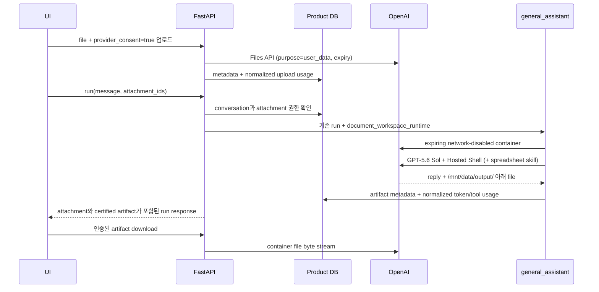

# OpenAI hosted document workspace

[English](../en/25-openai-document-workspace.md) | 한국어

## 상태와 범위

승인된 일반 계정이 명시적으로 선택해 쓰는 conversation 기능입니다. Render의 CPU/RAM으로 office file editing을 처리하지 않고, 무거운 문서 분석과 spreadsheet 생성을 OpenAI에 위임합니다. Deep Agents, 두 번째 assistant, 영구 file storage, guest access는 추가하지 않습니다.

일반 chat은 기존 `ChatOpenAI` provider를 그대로 사용합니다. 첨부가 있는 turn만 좁은 OpenAI SDK adapter를 사용합니다. 현재 `ChatOpenAI` surface가 Files, Containers, Hosted Shell, Skills API를 모두 노출하지 않기 때문입니다.

## Lifecycle

Product DB에는 file metadata, run association, workspace metadata, artifact metadata, immutable normalized usage event만 저장합니다. Response usage event는 input, cached-input, output, reasoning token을 구분하고 Hosted Shell 실행 여부를 기록합니다. 업로드하거나 생성한 file byte는 저장하지 않습니다. 기본값으로 OpenAI file은 한 시간 뒤, hosted container는 20분 idle 뒤 만료됩니다. 만료된 metadata는 UI가 상태를 정직하게 표시하고 usage를 감사하는 데 남습니다.

## Public API 계약

- `GET /capabilities/document-workspace`: 실제 enable 상태, account eligibility, format registry, limit, retention.
- `POST /conversations/{conversation_id}/attachments`: multipart `file`과 필수 `provider_consent=true`.
- `GET /conversations/{conversation_id}/attachments`: attachment metadata와 expiry 상태.
- `DELETE /conversations/{conversation_id}/attachments/{attachment_id}`: 남아 있는 provider file을 지우고 metadata를 deleted로 변경.
- `POST /conversations/{conversation_id}/runs`: additive `attachment_ids` list를 받음.
- `GET /conversations/{conversation_id}/artifacts`: 생성된 artifact metadata.
- `GET /conversations/{conversation_id}/artifacts/{artifact_id}/download`: active provider container에서 인증된 byte stream을 proxy.

Run response에는 `attachments`와 `artifacts`가 추가됩니다. Display-safe persisted event enum에는 `attachments_ready`, `document_workspace_started`, `artifact_created`가 추가되며, payload는 count, provider가 제공한 경우의 byte size, filename, content type, ID, expiry timestamp만 노출합니다.

## Format과 output certification

Analysis allowlist는 `my_agents/document_workspace/formats.py`에서 versioning하며 2026-08-09에 확인한 OpenAI File Inputs의 PDF, spreadsheet, rich-document, presentation, text/code extension family를 반영합니다. Video와 임의 binary는 범위 밖입니다. Frontend가 목록을 hardcode하지 않도록 capability endpoint가 실제 registry를 제공합니다.

분석 가능 범위와 output 인증 범위는 다릅니다. `/mnt/data/output/` 아래의 `.xlsx`, `.csv`, `.tsv`, `.docx`, `.pptx`, `.pdf`, `.md`, `.markdown`, `.html`, `.htm` 결과는 downloadable artifact가 됩니다. 다른 허용 input도 분석할 수 있지만 assistant는 downloadable edited document를 만들었다고 주장하면 안 됩니다. 여기서 인증은 Hosted Shell 결과를 인식하고 만료되는 artifact metadata로 보관해 authenticated download path로 제공한다는 뜻입니다. 모든 office application에서 pixel-perfect fidelity를 보장한다는 뜻은 아니므로, 사용자는 생성된 file을 실제 용도에 쓰기 전에 검토해야 합니다.

## Security와 경제성 경계

- 기본 disabled이며 guest principal을 거부합니다.
- 매 upload마다 provider 전송 동의가 필요합니다.
- Provider 실행과 download 전에 conversation ownership과 attachment ownership을 확인합니다.
- Hosted container network는 disabled입니다.
- Upload file, retrieved KB snippet, memory snippet은 provider instruction에서 untrusted data로 취급합니다.
- Provider trace, shell command, stdout, prompt, credential, hidden reasoning은 public event에 들어가지 않습니다.
- Usage event는 input/output/cached token, file-input byte, container start, hosted-shell call 같은 provider-neutral unit을 기록합니다. Unique idempotency key가 중복 기록을 막으므로, 이후 credit settlement는 Langfuse나 특정 model vendor와 독립적으로 설계할 수 있습니다.

## 보류한 확장: attachment 없는 artifact 생성

현재 구현은 run에 `attachment_id`가 하나 이상 있을 때만 `document_workspace_runtime`을 만듭니다. 따라서 “이 개념을 HTML file로 설명해 줘” 같은 요청은 지금은 일반 chat response로 남습니다. Downloadable extension allowlist를 넓히는 것만으로 Hosted Shell이 실행되지는 않습니다.

향후 milestone에서는 General Assistant가 소유하는 typed `create_artifact` capability를 추가할 수 있습니다. RAG Agent는 output file 생성이 아니라 retrieval 판단을 계속 소유해야 합니다. 사용자가 downloadable result를 명시적으로 요청하면 General Assistant가 server-approved output format을 고르고, attachment가 없거나 여러 개 있는 상태로 기존 document-workspace adapter를 호출할 수 있습니다. Attachment가 없다면 adapter는 비어 있는 expiring network-disabled hosted container를 만들고, 생성된 file은 기존 artifact metadata, event, expiry, authorization, usage accounting, authenticated download path를 재사용합니다.

이 확장은 의도적으로 보류했으며 immediate next task가 아닙니다. 구현 전에 다음을 결정해야 합니다.

- Natural-language intent만으로 충분한지, frontend에 명시적인 file-format control도 제공할지
- Downloadable HTML/Markdown과 chat 안의 code block을 구분하려면 요청이 얼마나 명시적이어야 하는지
- Model이 closed output-format enum에서 고를지, client가 format을 직접 요청할 수 있는지
- User file 전송이 없는 Hosted Shell 실행에 어떤 account credit과 limit을 적용할지
- Artifact 생성 요청에서는 tool choice를 optional로 두지 않고 Hosted Shell을 필수로 할지

User byte가 browser 밖으로 나가지 않으면 provider-transfer consent는 필요하지 않지만, feature eligibility, guest restriction, cost accounting, output allowlist, safe event disclosure는 그대로 적용합니다. 이 경로는 client에 arbitrary shell access, provider trace, unrestricted filename을 노출하면 안 됩니다.

## 배포

Flag를 켜기 전에 Alembic revision `20260809_0030`을 적용합니다. `OPENAI_API_KEY`와 `MY_AGENTS_DOCUMENT_WORKSPACE_ENABLED=true`를 설정하고, 문서화된 `MY_AGENTS_DOCUMENT_WORKSPACE_*` 환경 변수로 제한을 조정합니다. 이 경로를 위해 Render process에 local office suite, code sandbox, high-memory parser를 추가하지 않습니다.

Test suite는 provider boundary를 offline fake로 교체합니다. Credential을 쓰는 live smoke는 OpenAI file, container, model token, Hosted Shell 비용이 발생할 수 있으므로 operator가 명시적으로 실행하는 단계로 남깁니다.
