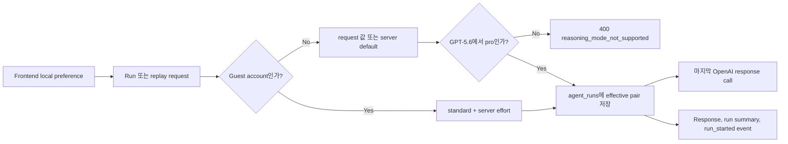

# Run reasoning 설정 계약

[English](../en/26-run-reasoning-preferences.md)

## 목적

Frontend는 일반 계정 사용자의 OpenAI reasoning 설정을 browser local storage에 보관하고 conversation run마다 보낼 수 있습니다. 최종 권한은 backend에 있습니다. Backend는 model 호환성을 검증하고, guest 비용 정책을 강제하고, 실제 적용한 값을 저장한 뒤 그 값만 마지막 OpenAI 응답 호출에 전달합니다.



## API 계약

`POST /conversations/{conversation_id}/runs`, streaming variant, 두 replay endpoint는 다음 top-level field를 선택적으로 받습니다.

```json
{
  "message": "이 migration 계획을 검토해줘",
  "reasoning_mode": "pro",
  "reasoning_effort": "high"
}
```

- `reasoning_mode`: `standard | pro`; 생략하면 `standard`.
- `reasoning_effort`: `none | minimal | low | medium | high | xhigh | max`; 생략하면 `MY_AGENTS_OPENAI_REASONING_EFFORT`이며 repository 기본값은 `medium`.
- Mode와 effort는 서로 독립적입니다.
- `pro`는 해당 run이 선택하는 model이 GPT-5.6 family일 때만 허용합니다. 그렇지 않으면 user message나 run을 저장하기 전에 HTTP 400, `code=reasoning_mode_not_supported`로 실패합니다.

Completed run response, run-detail response, run summary, display-safe `run_started` event는 실제 적용한 `reasoning_mode`와 `reasoning_effort`를 반환합니다. Replay에 값을 명시하면 그 값을 쓰고, 생략하면 original run의 effective pair를 이어받습니다. 기존 row와 event는 `standard`와 `medium`으로 호환됩니다.

## Capability discovery와 guest 정책

인증된 client는 `GET /capabilities/reasoning`을 호출할 수 있습니다. Stable option list, active default effort, chat/document-workspace surface의 `pro` 지원 여부, 현재 principal의 `customizable` 값을 반환합니다. Client에는 capability flag만 필요하고 deployment inventory는 필요하지 않으므로 raw provider model identifier는 의도적으로 제외합니다.

Guest는 두 값을 올리거나 내릴 수 없습니다. Guest가 다른 값을 보내도 backend가 무시하고 `standard`와 `MY_AGENTS_OPENAI_REASONING_EFFORT`를 강제합니다. 이는 frontend control을 disable하는 정도가 아니라 authorization 및 cost policy입니다. Frontend는 `customizable=false`일 때 control을 숨길 수 있습니다.

## Provider 경계

Effective pair는 마지막 answer generation call에 적용합니다.

- 일반 chat은 Responses API를 쓰는 `ChatOpenAI`의 request-level `reasoning` object로 전달합니다.
- Attachment turn은 같은 object를 isolated document-workspace adapter를 통해 GPT-5.6 Sol에 전달합니다.
- 내부 source-selection gate는 browser preference가 routing behavior나 routing cost를 바꾸지 못하도록 `standard`와 server-default effort로 고정합니다.

Raw chain-of-thought는 요청하거나 저장하거나 반환하지 않습니다. 이 설정은 provider computation만 조절합니다. OpenAI 문서상 `pro`는 더 많은 model work를 수행하므로 latency와 token usage가 늘 수 있습니다. Product credit enforcement는 별도의 usage-ledger 책임입니다.

## 다음 즉시 수행할 task: 동적 reasoning summary

정적인 reasoning preference만으로는 원하는 product UX를 제공할 수 없습니다. 다음 backend
task는 retrieval planning의 Luna와 answer synthesis의 Sol이 선택한 접근을 요청별로 설명하는
model-authored summary를 추가하는 것입니다. 이 summary는 raw chain-of-thought 및 verified
`agent_trace`와 구분하고, nullable/bounded/model-generated contract로 다루며 final answer text에
합치지 않습니다.

필요성, proposed schema/SSE event, safety boundary, 구현 순서, 완료 정의는
[동적 reasoning summary 계약](./28-dynamic-reasoning-summary-contract.md)을 기준으로 합니다.

Reasoning token은 기존 output limit(`MY_AGENTS_OPENAI_MAX_OUTPUT_TOKENS`, `MY_AGENTS_DOCUMENT_WORKSPACE_MAX_OUTPUT_TOKENS`) 안에 포함됩니다. 높은 effort를 골라도 limit을 자동으로 늘리지 않으므로, operator는 `max`가 항상 더 긴 visible answer를 만든다고 가정하지 말고 실제 latency, incomplete response, cost 관측값을 보고 limit을 조정해야 합니다.
