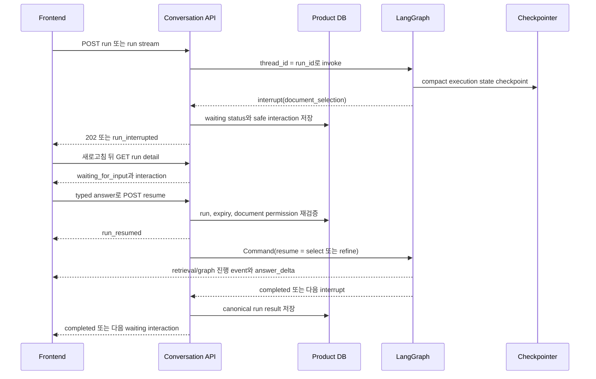
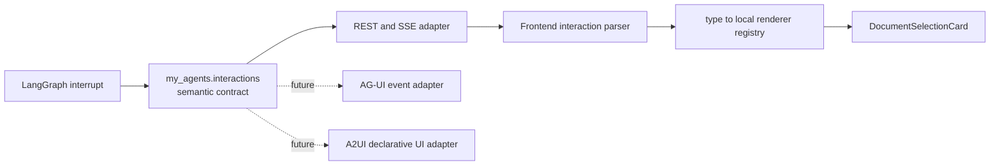

# Agent와 frontend 사이의 interaction 계약

[English](../en/27-agent-frontend-interaction-contract.md) | 한국어

## 상태와 목적

이 문서는 agent run이 계속 실행되기 전에 사용자 입력이 필요할 때 적용하는 현재
architecture 계약입니다. 첫 구현은 새로고침 뒤에도 복구되는 document source
selection입니다. 앞으로 다른 interaction을 추가할 때도 일회성 response field, SSE
event shape, frontend run-loop 분기를 직접 늘리지 말고 이 계약을 확장해야 합니다.

같은 `document_selection` type이 일반적인 ambiguous document 질문과 명시적인 문서 전체
검토 요청을 모두 처리합니다. Whole-document retrieval을 위해 새 interaction type을
추가하거나 internal continuation cursor를 frontend에 노출하지 않습니다.

계약은 특정 protocol에 종속되지 않습니다. Backend는 **어떤 입력이 필요한지**를
설명하고 frontend는 **어떻게 보여 주고 입력받을지**를 결정합니다. 지금은 AG-UI나
A2UI dependency를 추가하지 않습니다.

## 반드시 지켜야 하는 경계

- Backend interaction은 semantic, versioned, JSON-serializable, display-safe해야 합니다.
- Backend payload는 React component, layout, color, control, CSS 이름을 전달하지 않습니다.
- Ambient system knowledge는 서버가 자동으로 주입하는 context이지 사용자가 고르는
  source axis가 아닙니다. System KB와 document는 option에 노출하지 않고, 이를 지정한
  forged resume answer도 거절합니다.
- Frontend는 local interaction renderer registry로 component를 선택합니다.
- Activity event는 pending interaction state를 대신하지 않습니다.
- Product DB run detail이 새로고침 가능한 public source of truth이고, LangGraph
  checkpoint는 run 범위의 비공개 실행 상태로만 남습니다.
- 원본 prompt, provider trace, credential, chain-of-thought, 검토하지 않은 임의의
  dictionary는 interaction payload에 넣지 않습니다.

## V2 wire 계약과 V1 호환성

모든 interaction 요청과 답변은 semantic type과 schema version을 함께 전달합니다. 새
interaction은 V2를 쓰며, 시도마다 새 UUID를 발급하되 run, 선택된 KB 범위, 최초 만료
시각은 유지합니다.

```json
{
  "schema_version": 2,
  "interaction_id": "<attempt UUID>",
  "type": "document_selection",
  "reason_code": "ambiguous_document_reference | unresolved_document_reference",
  "message_key": "clarification.document_scope.select_source",
  "expires_at": "2026-08-18T00:00:00Z",
  "option_count": 2,
  "library_count": 4000,
  "options": [
    {
      "document_id": "...",
      "title": "Architecture notes",
      "source_filename": "architecture.pdf",
      "knowledge_base_id": "...",
      "knowledge_base_name": "Personal knowledge",
      "match_confidence": "high | medium | low",
      "match_reason_code": "exact_title | exact_filename | partial_title | partial_filename | metadata_overlap"
    }
  ],
  "next_cursor": null,
  "refinement": {
    "allowed": true,
    "attempts_used": 0,
    "attempts_max": 2,
    "max_length": 120
  },
  "browse": {"allowed": false, "cursor": null}
}
```

Resume request는 닫힌 type-specific union입니다. 선택과 사람의 추가 단서 모두 같은
checkpoint를 재개하며, 추가 단서는 chat message로 저장하지 않습니다.

```json
{
  "schema_version": 2,
  "interaction_id": "<attempt UUID>",
  "type": "document_selection",
  "kind": "select",
  "document_id": "..."
}
```

```json
{
  "schema_version": 2,
  "interaction_id": "<attempt UUID>",
  "type": "document_selection",
  "kind": "refine",
  "text": "Pydantic Annotated Literal.md"
}
```

두 번의 추가 단서로도 해결하지 못하면 `browse.allowed=true`가 되고, 그때만 options
endpoint가 opaque cursor 기반의 전체 authorized library를 반환합니다. V1은 이미 대기
중인 checkpoint를 위해 계속 허용하며 기존 `<run_id>:document_selection` identity와
`{document_id}` resume body를 유지합니다.

## Lifecycle과 durability

기본 chat source mode는 계속 모든 authorized personal/group KB와 ambient system
knowledge입니다. 이 interaction은 새로운 필수 KB picker가 아닙니다. 먼저 현재 권한이
있는 metadata 범위를 다시 확인한 뒤, 고유한 exact filename/title은 자동 결정하고, 그
외에는 안정적으로 정렬한 최대 5개 후보만 보여 줍니다. 사용자는 최대 두 번, 120자 한
줄 filename 단서를 줄 수 있고 그 뒤에만 전체 목록 탐색을 엽니다. Client가 KB subset을
명시적으로 골랐다면 모든 단계가 그 범위로 제한됩니다.

명시적인 문서 전체 검토 요청에서 title/source filename 하나로 target을 결정할 수 없고
eligible document가 여러 개여도 같은 interaction을 사용합니다. Resume 뒤 graph는
full-document target resolution으로 돌아가 선택한 document가 지금도 user-controllable하고
authorized인지 다시 검사한 후 bounded text를 읽습니다. System KB/document는 자동 target
resolution과 option 양쪽에서 제외하고 forged system-document answer도 거절합니다.



만료되지 않은 waiting run은 해당 conversation의 active run입니다. 새 run 요청은 HTTP
`409`, `code=conversation_run_already_active`로 거절됩니다. Frontend는 이 응답을 일반적인
stream backpressure처럼 재시도하지 말고 interaction이 끝날 때까지 queued message를
보류해야 합니다.

Option을 선택하는 즉시 suspended presentation은 끝납니다. Streaming resume endpoint는
run을 atomic하게 claim하고 `run_resumed`를 먼저 보낸 뒤 checkpoint가 계속 실행되는 동안
실제 LangGraph 진행 event와 answer delta를 전송합니다. Frontend는 resume이 실패하거나
run이 다시 interrupt된 경우에만 interaction을 복원하며, 재개 중인 답변 위에 frozen choice
card를 유지하면 안 됩니다. Non-streaming resume endpoint도 같은 authorization/atomic-claim
boundary를 사용하지만 기존처럼 완료 결과를 반환합니다.

`GET /conversations/{conversation_id}/runs/{run_id}`로 새로고침 뒤 interaction을 복구할 수
있습니다. SSE는 state 전환 신호이지 유일한 state 사본이 아닙니다. Shortlist는 새로고침
때 권한을 다시 거르고, broad option은 목록 조회 때 거르며, resume 때 선택한 document의
현재 권한도 다시 검사합니다. Option
boundary는 retrieval보다 좁아서 사용자가 통제하는 personal/group document만 포함합니다.
Ambient system knowledge는 visible provenance나 선택 control 없이 계속 자동 주입됩니다.

`document_coverage`와 `full_document_read`는 완료 결과/audit 계약이지 pending interaction이
아닙니다. 완료 후 `complete|partial` character coverage를 알릴 뿐 사용자에게 다시 질문하는
UI로 처리하면 안 됩니다. 큰 문서 continuation은 future internal workflow이며 V2 resume
answer field가 아닙니다.

## 취소와 문서 선택 없이 계속하기

Owner는 2026-09-05에 현재 동작을 유지하기로 했습니다. 사용자가 응답하지 않으면 답변을
받거나 취소되거나 만료될 때까지 실행을 멈춘 상태로 둡니다. 침묵을 승인으로 해석하거나
필수적인 사람의 결정을 건너뛰거나 추정한 답으로 대신하면 안 됩니다.

아직 `waiting_for_input`인 run에 `POST /conversations/{conversation_id}/runs/{run_id}/cancel`을
호출하면 HTTP 200과 `status=cancelled`를 반환합니다. `run_cancelled` event를 저장하고
interaction과 checkpoint를 정리하지만 graph를 재개하거나 assistant message를 만들지는
않습니다. 따라서 transcript가 user message로 끝나더라도 run/event 기록에는 취소가 남습니다.
실행 중인 답변의 취소는 먼저 `status=cancelling`을 반환할 수 있습니다. HTTP 성공만으로
실행이 이미 종료되었다고 판단하면 안 됩니다.

Frontend는 cancelled run과 assistant answer의 부재를 바탕으로 취소 안내를 표시할 수
있습니다. 이는 저장된 상태를 보여 주는 것이며 model answer를 만들어 넣는 것이 아닙니다.
나중에 계속하기 기능이 생겨도 실제 취소의 안내는 유지하고, 실제 답변과 중복 표시하지 않습니다.

“문서를 선택하지 않고 계속하기”는 별도 제안이며 아직 구현하지 않았습니다. 채택한다면
Cancel을 재사용하지 않고 명시적인 semantic resume answer와 계속 진행한다는 UI가 필요합니다.
일반 지식으로 답하거나 부족한 근거를 설명하는 정상 assistant message를 저장할 수 있지만,
선택하지 않은 문서를 검토했다고 주장하거나 사용자의 source scope를 조용히 넓히면 안 됩니다.
구현 전에 model 비용, eligibility와 versioned answer 계약을 결정해야 합니다. 기존 frontend
안내를 위해 정적인 확인 문구를 assistant message로 추가 저장할 필요는 없습니다.
Owner가 이 기능을 보류했으므로 명시적으로 요청할 때만 다시 검토합니다.
[canonical deferred 항목](../../implementation-tracking.md#deferred-continue-without-document-selection)을 따릅니다.

## Version과 호환성

- `schema_version=2`가 현재 document-selection 계약이고 V1은 resume-only 호환성입니다.
- 기존 envelope을 지키는 새 interaction type은 V2에 additive하게 추가할 수 있습니다.
- Display-safe optional field는 version을 올리지 않고 추가할 수 있습니다.
- Field 제거, 의미 변경, validation 의미 변경에는 새 schema version이 필요합니다.
- Backend request schema는 closed contract로 유지하고 알 수 없는 field를 거절합니다.
- Frontend는 지원하는 type/version을 엄격히 처리하되, 모르는 값에는 refresh와 cancel을
  제공하는 unsupported fallback을 렌더링해야 합니다. Raw JSON은 표시하지 않습니다.

## 내부 계약과 adapter 경계



[AG-UI](https://docs.ag-ui.com/)는 interoperable agent lifecycle/event transport가 실제로
필요할 때 검토할 future boundary입니다. [A2UI](https://a2ui.org/)는 관리 중인 renderer
catalog를 넘어 agent가 dynamic declarative UI를 설명해야 할 때만 검토합니다. 어느
protocol도 Product DB domain model이 되어서는 안 됩니다. Adapter는 transport 또는
presentation edge에서 변환하고 authorization, redaction, version, localization,
accessibility 규칙을 그대로 지켜야 합니다.

## 새 interaction type을 추가하는 절차

1. `my_agents/interactions/` 아래에 `extra="forbid"`인 typed semantic model을 정의합니다.
2. `PendingInteraction` extension point에 추가하고 type-specific answer를 정의합니다.
3. Public-safe interaction만 Product DB에 저장하고 framework checkpoint state는 비공개로
   둡니다.
4. Resume 때 authorization, expiry, 현재 resource state와 함께 ambient system knowledge가
   아닌 user-controllable source인지 다시 검증합니다.
5. OpenAPI, REST/SSE event, stable error-code coverage를 확장합니다.
6. Frontend parser member, registry entry, localized copy, accessible renderer, unsupported
   fallback test를 함께 추가합니다.
7. Interrupt, reload recovery, pagination, resume, repeated interrupt, cancel, expiry, denial,
   double submit, feature-disabled parity를 검증합니다.
8. 이 영문/한글 계약과 두 repository의 간결한 agent rule을 함께 갱신합니다.

## 현재 rollout gate

다음 조건이 모두 충족되기 전에는 shared environment에서 checkpointer interaction을
켜지 않습니다.

1. Alembic release head `20260905_0034` 적용 (persistence metadata와 citation migration 포함)
2. `python -m scripts.langgraph_persistence setup`으로 LangGraph Postgres schema 초기화
3. 대상 사용자에게 experimental memory를 열기 전에 memory-store reconciliation zero drift 확인
4. V1/V2 parsing, ranked choice, bounded refinement, broad fallback, refresh recovery,
   resume route, held-queue behavior를 포함한 frontend 배포

Comprehensive-document path는 explicit intent에 대한 baseline 동작이므로 document selection이
필요할 수 있는 모든 환경에 이 interaction rollout이 준비된 뒤 배포합니다. Single-target 자동
resolution도 authorization과 system-KB exclusion 규칙을 완화하지 않습니다.

Interaction layer 자체는 새 DB migration을 추가하지 않습니다. `schema_version`은 기존
public interaction JSON에 저장합니다.
