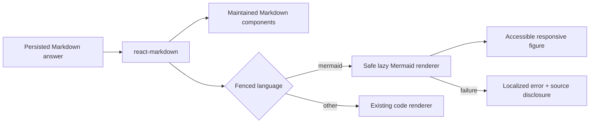
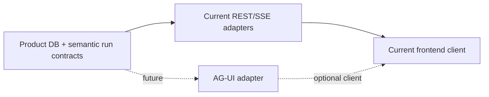

# Rich response rendering과 future agent-UI boundary

[English](../en/30-rich-response-rendering-and-agent-ui-boundaries.md) | 한국어

상태: **Mermaid baseline은 frontend release `9c8e365`에 포함됨; AG-UI/A2UI는 후속 adapter입니다.**
통합 근거와 남은 운영·접근성·stress 검증은 [완료 기록](../../completed/mermaid-rendering.md)을
따릅니다. Heecheon은 구현 당시 수동 테스트 완료를 보고했습니다. 이 문서는 renderer 계약과
최초 계획을 보존하며, 실제 frontend 구현과 검증은 해당 repo의 `docs/mermaid-rendering.md`에 있습니다.

## 필요한 이유

Assistant answer는 `react-markdown`으로 Markdown을 렌더합니다. 이 milestone 이전에는
fenced `mermaid` block이 diagram이 아니라 source code로 남았습니다. 구현된 renderer는 이제
diagram을 지원하면서, 지원하지 않거나 잘못된 입력에는 source/error fallback을 유지합니다.

Immediate goal은 unrestricted generative UI가 아닙니다. 알려진 answer part를 maintained, secure,
accessible component로 렌더하고 모든 enhancement가 durable text fallback을 가지는 renderer
catalog를 만드는 것입니다.

## Milestone 1: Markdown answer 안의 Mermaid

### Rendering contract

- 기존 `react-markdown` component boundary에서 normalized language가 `mermaid`인 fenced code
  block을 감지합니다. 다른 code block은 현재 renderer를 유지합니다.
- Closing fence가 도착한 뒤 또는 answer가 settle된 뒤에만 렌더합니다. 매 token마다 incomplete
  Mermaid syntax를 반복 parse하지 않습니다.
- Diagram이 있는 answer에서만 Mermaid를 lazy load하고 dependency를 채택하기 전에 production
  bundle impact를 기록합니다.
- Application boundary에서 `startOnLoad=false`, `securityLevel="strict"`로 initialize합니다.
  Model-authored content에 `loose`/`antiscript`, click handler, secure site config override를 허용하지
  않습니다.
- Source length, edge, render-time, rendered-size limit를 둡니다. Malformed/expensive diagram 하나가
  주변 answer를 잃게 하면 안 됩니다.
- Collision-safe render ID를 만들고 streamed content, theme, route, message identity가 바뀌면 stale
  render를 cancel합니다.

### User experience

- Fence는 완성됐지만 rendering 중이면 주변 answer를 크게 움직이지 않는 compact skeleton을
  보여 줍니다.
- 성공하면 message width에 맞는 responsive `figure`를 렌더하고, mobile evidence가 필요성을
  증명할 때만 zoom/open affordance를 추가합니다.
- Accessible name과 text alternative 또는 source-code disclosure를 제공합니다. SVG만으로는 screen
  reader, copy, print, failed-render path를 충족하지 못합니다.
- Parse/render 실패 시 localized failure copy와 original fenced source disclosure를 보여 줍니다. Raw
  Mermaid error HTML이나 stack trace를 표시하지 않습니다.
- Answer copy는 generated SVG markup이 아니라 Markdown source를 유지합니다.
- Product theme 변경 시 theme-safe Mermaid variable로 다시 렌더하고 390, 768, 1280px에서 contrast를
  검증합니다.

### Security와 quality caveat

- Model-generated diagram source는 우리 model에서 왔어도 untrusted content입니다.
- Mermaid default `strict` security level은 HTML label을 encode하고 click을 막습니다. 이를 약화하면
  별도 security review가 필요합니다.
- Syntax가 맞아도 diagram 내용은 틀리거나 너무 복잡할 수 있습니다. Rendering은 model claim을
  검증하지 않습니다.
- Mermaid distribution은 initial JavaScript에 큰 영향을 줄 수 있습니다. Product가 약속할 diagram
  type을 기준으로 full Mermaid, Mermaid Tiny, route-local dynamic import를 비교합니다.
- 첫 slice는 SSR이 필요하지 않습니다. Browser-only rendering을 가장 작은 client component에 두고
  주변 Markdown hydration을 바꾸지 않습니다.

## Renderer architecture

Persisted assistant Markdown가 durable source of truth입니다. Rendered SVG, component state, zoom
state는 derived frontend artifact이며 Product DB에 저장하지 않습니다.

## Future AG-UI integration boundary

AG-UI는 streamed text, tool call, lifecycle, state snapshot/delta, activity update, attachment,
human interaction을 다루는 event-based agent-to-application protocol입니다. Interoperability나 더
풍부한 bidirectional agent event가 product need가 되면 현재 REST/SSE transport edge에 adapter를
추가합니다.

Adapter는 기존 run, message, trace, reasoning-summary, tool, artifact, interaction semantic을 map해야
합니다. Product DB transcript/audit를 대체하거나 authorization/redaction을 약화하거나 AG-UI event
state를 persistence model로 만들거나 Mermaid milestone에 transport 변경을 강요하면 안 됩니다.
Adoption에는 written mapping과 replay/resume/cancellation parity test가 필요합니다.

## Future A2UI integration boundary

A2UI는 structure와 data를 분리한 streamed declarative JSON message로 UI를 설명합니다. Maintained
renderer catalog를 넘어 model-selected interactive component가 필요한 경우에만 검토합니다. 예를
들어 control이 있는 comparison table, review form, artifact inspection surface입니다.

A2UI slice는 다음을 지켜야 합니다.

- versioned closed application-owned component catalog;
- 모든 component, property, binding, action, data update의 render 전 validation;
- arbitrary HTML, JavaScript, URL, event handler, style injection, backend authority claim 차단;
- user action을 normal authorization/confirmation을 거치는 typed application command로 mapping;
- unsupported client, refresh, export, audit, accessibility를 위한 Markdown/text fallback;
- Product DB conversation/HITL domain model이 아닌 adapter/presentation artifact.

AG-UI와 A2UI는 다른 layer를 해결합니다. AG-UI는 agent/application event를 표준화하고 A2UI는
constrained generated surface를 설명합니다. 나중에 함께 쓸 수 있지만 Mermaid rendering에는 둘 다
필요하지 않습니다.

## 구현 순서

1. 현재 assistant Markdown renderer, streaming, sanitization, copy action, theme token, code-block test를
   audit합니다.
2. Dependency/bundle comparison을 기록하고 Mermaid loading strategy 하나를 승인합니다.
3. Strict security, bounded rendering, cancellation, theme, accessible fallback, error isolation을 갖춘 leaf
   Mermaid component를 구현합니다.
4. 완료된 `mermaid` fence만 current Markdown code-block component에서 route합니다.
5. Supported/invalid/oversized fixture unit test와 streaming, theme, resize, copy, print/fallback, mobile
   overflow browser test를 추가합니다.
6. Future maintained answer component를 위한 renderer registry seam을 문서화합니다.
7. Transport interoperability가 approved milestone이 될 때만 AG-UI mapping을 작성하고 구현은 별도
   승인합니다.
8. Markdown/Mermaid가 해결할 수 없는 concrete interactive use case가 생길 때만 A2UI catalog/security
   proposal을 작성하고 구현은 별도 승인합니다.

## 완료 정의

- Valid flowchart, sequence, state, entity-relationship fixture가 closing fence 뒤 diagram으로 렌더됩니다.
- Invalid, unsupported, oversized, timed-out diagram이 answer를 읽을 수 있게 유지하고 safe source
  fallback을 제공합니다.
- Model-authored Mermaid가 HTML label, link, callback, script, insecure config를 켤 수 없습니다.
- Streaming Markdown이 flicker, 반복 parse error, auto-scroll intent 손실을 만들지 않습니다.
- Light/dark theme, reduced motion, keyboard, screen reader, narrow mobile, answer copy, refresh, replay를
  검증합니다.
- Non-Mermaid Markdown behavior는 바뀌지 않습니다.
- Bundle cost와 lazy-loading behavior를 측정하고 기록합니다.
- AG-UI/A2UI는 implied dependency가 아니라 explicit adoption gate를 가진 optional future adapter로
  남습니다.

Reference: [react-markdown component override](https://github.com/remarkjs/react-markdown),
[Mermaid usage와 security](https://mermaid.js.org/config/usage),
[AG-UI overview](https://docs.ag-ui.com/), [A2UI concepts](https://a2ui.org/concepts/overview/).

## 범위를 정한 구현 계획 — 2026-09-05

최초 구현은 Codex가 frontend `feature/chat-mermaid-rendering`에서 맡았고, Claude가 통합과
배포를 수행했습니다. 아래는 원래 계획을 보존한 것이며 현재 미완료 작업이 아닙니다.
기존 메시지 간격, 색상, 테두리와 disclosure를 재사용했으며, 이후 별도 interaction 설계가
필요하면 frontend와 협의합니다.

1. `ChatTranscript → MessageBubble → AgentMessageRenderer → AgentMarkdown`에 streaming/settled
   상태를 전달합니다. 첫 구현은 streaming 동안 source를 보여 주고 답변이 끝난 후 렌더합니다.
   Refresh와 replay도 동일하게 처리하며 불완전한 fence를 허용하는 parser에서 닫힘을 추측하지 않습니다.
2. Assistant answer에서만 Mermaid를 켭니다. 같은 `AgentMarkdown`을 쓰는 source preview,
   publication review와 user message는 기존 동작을 유지합니다.
3. Mermaid block의 `pre`를 figure로 교체합니다. figure를 `pre/code` 안에 넣지 않습니다.
   일반 code, inline code, 안전한 link, Markdown 복사와 기존 artifact 경계는 유지합니다.
4. Browser-only leaf와 shared lazy loader를 추가합니다. Full Mermaid dynamic import와 Tiny를
   실제 build/network로 비교하고 flowchart, sequence, state, ER, class 지원과 loading 비용으로
   선택합니다. Dependency와 lockfile은 frontend package manager로 관리합니다.
5. Strict 설정은 application이 소유합니다. HTML label/click binding을 끄고 설정을 바꾸는
   directive/frontmatter를 거부합니다. 최종 SVG의 script, foreignObject, 외부 요청과 active
   link를 검증하며 Markdown raw HTML을 활성화하지 않습니다.
6. 초기 제한은 source 10,000자와 `maxEdges=200`입니다. 렌더를 직렬화하고 stale 결과를 버리며
   cache 크기를 제한합니다. Promise timeout은 synchronous layout을 중단하지 못하므로
   입력 제한과 stress fixture로 대응하고 이 한계를 명시합니다.
7. 기존 theme에 맞춘 localized loading/error/source control, accessible figure와 source
   disclosure를 제공합니다. 좁은 화면은 block 내부 overflow로 처리하고 zoom은 필요성이
   확인된 경우에만 추가합니다.

검증은 실제 Mermaid로 다섯 diagram family, malformed/oversized 입력, config/link/HTML/script
공격 입력, 여러 diagram, theme, stream/replay/refresh, keyboard, reduced motion, copy/print와
390/768/1280 너비를 포함합니다. 사용자가 위로 스크롤한 상태를 강제로 바꾸지 않아야 합니다.
Diagram 없는 chat의 Mermaid network 요청 부재, bundle 변화, 최초 렌더 지연과 큰 입력의
반응성을 기록합니다. Frontend lint/typecheck/unit/browser/build를 실행하고 기존 실패는 분리합니다.

Backend schema, persistence, provider prompt, artifact download나 AG-UI/A2UI 변경은 없습니다.
완료 전에 fence를 렌더하는 최적화는 이후 UX 증거가 필요할 때 검토합니다.
상세 파일 경계와 acceptance는 [영문 구현 계획](../en/30-rich-response-rendering-and-agent-ui-boundaries.md#scoped-implementation-plan--2026-09-05)을 따릅니다.
