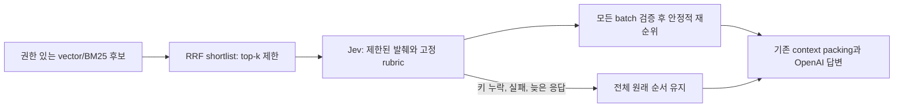

# Jev 검색 근거 재순위

[English](../en/37-jev-evidence-reranking.md)

ContextForge의 second-stage reranker 기본값은 Jev입니다. 권한 필터, vector/BM25 검색,
RRF fusion, context packing, OpenAI 답변과 citation은 기존 역할을 유지합니다. Jev는 이미
승인된 후보 순서만 바꾸며 권한을 부여하거나 후보를 만들거나 제거할 수 없습니다.
`cross_encoder`, `deterministic`은 대안으로 유지하며 두 모델을 연속 실행하지 않습니다.

## 설정과 전송 범위

| 설정 | 기본값 | 의미 |
| --- | --- | --- |
| `MY_AGENTS_RERANKER_MODE` | `jev` | `jev`, `deterministic`, `cross_encoder` 중 선택 |
| `MY_AGENTS_RERANKER_TOP_K` | `40` | 재순위 전 기존 후보 제한 |
| `MY_AGENTS_JEV_RERANKER_BATCH_SIZE` | `8` | 요청당 최대 후보, 1–40 |
| `MY_AGENTS_JEV_RERANKER_MAX_INPUT_BYTES` | `24000` | 전체 JSON 요청 UTF-8 예산, 4096–24000 |
| `MY_AGENTS_JEV_RERANKER_MAX_EXCERPT_BYTES` | `3000` | 후보 발췌 UTF-8 예산, 256–8000 |
| `MY_AGENTS_JEV_TIMEOUT_SECONDS` | `10` | 재순위 batch 전체가 공유하는 경과 시간 예산 |

로컬에 `OPENROUTER_API_KEY`를 설정합니다. `MY_AGENTS_DECISION_PROVIDER`는 이 설정과
독립적입니다. 기존 명시적 reranker 환경값은 기본값보다 우선합니다. Deterministic response
mode는 Jev 대신 offline reranker를 구성합니다. 명시적 cross-encoder는 기존 lazy load를
유지합니다. 새 dependency나 DB migration은 없습니다.

`my_agents/decisions.py`의 score adapter가 `/api/alpha/decisions`에 고정 모델
`typesafe/jev-1.13`을 사용합니다. 공통 state에는 rewritten query, 임시 후보 ID, 권한 있는
발췌와 잘림 여부만 넣고 후보별 score question의 instruction에 ID를 명시합니다. 앱 ID,
filename, title, KB identity, 대화, summary, file note, 장기 memory는 추가하지 않습니다.
발췌 자체에는 민감한 문서 내용이 있을 수 있으며 이번 경로에서 OpenRouter/TypeSafe로 전송됩니다.

## 점수와 fallback

고정 rubric은 무관한 근거(`0`)부터 질문의 identifier와 조건에 맞는 직접 근거(`4`)까지
다섯 단계이며 소수점 점수도 허용합니다. 점수는 재순위 신호이고 confidence, retrieval
similarity, 권한 증명이 아닙니다. 동일 점수는 원래 순서를 유지합니다. 원본 chunk, citation,
retrieval score는 보존하고 answer-mode threshold도 기존 retrieval score를 사용합니다.
잘린 후보에는 `jev:excerpt_truncated` 표시를 남깁니다.

Batch는 전체 요청 UTF-8 예산에 맞게 줄입니다. 질문이 4096 bytes보다 길거나 단일 후보도
예산에 들어가지 못하면 전체 fallback합니다. Byte 제한은 tokenizer window가 아니므로
잘린 뒤쪽의 유용한 근거를 평가하지 못할 수 있습니다.

모든 응답은 요청한 ID와 정확히 일치하고 유한한 숫자 `0..4`를 반환해야 합니다. 키 누락,
잘못된 응답, HTTP/provider 오류, deadline 초과 시 부분 점수를 모두 버리고 전체 원래 순서를
유지합니다. 재시도나 자동 cross-encoder 다운로드는 없습니다. 각 HTTP phase는 남은 timeout을
사용하고 늦게 끝난 응답은 버립니다. 진행 중인 동기 HTTP 요청을 강제로 중단하는 hard limit은
아닙니다. 로그에는 안전한 이유와 exception class만 남깁니다.

기존 evidence/timing은 `jev` 또는 `jev_fallback_deterministic`을 기록하며 요청 간 진단
상태는 섞이지 않습니다. Frontend 계약이나 preference API는 바꾸지 않습니다.

## 로컬 콘솔 비교

Console에서 재순위 전후를 비교하려면 `MY_AGENTS_DEPLOYMENT_ENVIRONMENT=local`과
`MY_AGENTS_DEBUG_KNOWLEDGE_CONTEXT_LOGGING=true`를 사용합니다. 각 순서의 상위 10개 후보에
대해 rank, document/chunk 위치, RRF/reranker 점수와 짧은 발췌를 표시하며 Jev fallback도
구분합니다. Preview/production에서는 이 flag를 켜도 해당 표를 출력하지 않습니다.

## 검증 한계

`tests/test_jev_reranking.py`는 fake key와 mocked HTTP로 wire contract, 순서와 원본 보존,
Unicode/요청 예산, 부분 실패, deadline, 재시도 없음, offline 경로, 안전한 로그와 권한 확인 후
후보 전달을 검증합니다. 기존 permission-aware 테스트도 full offline suite에서 유지합니다.
실제 Jev의 품질, latency/cost, batch 간 일관성이나 cross-encoder 대비 우월성은 측정하지
않았습니다. 한국어, 영어, code, identifier/date/version 조건과 발췌 뒤쪽의 근거를 별도 평가해야 합니다.

Provider 계약: [Jev decision types](https://openrouter.ai/blog/insights/what-is-jev/).
