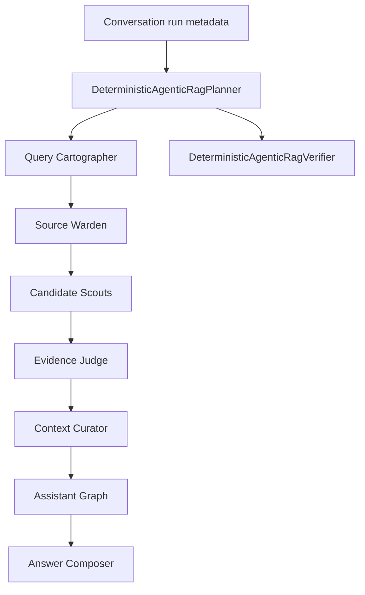

# Agentic RAG workflow

[English](./README.en.md) | 한국어

`agentic_rag`는 문서 기반 conversation run을 위한 production-facing workflow contract입니다. ContextForge를 대체하지 않고, ContextForge를 Retrieval Agent로 명명한 뒤 frontend가 표시할 compact trace state를 deterministic planner/verifier로 관리합니다.

## 현재 역할

- Query Cartographer, Source Warden, Candidate Scouts, Evidence Judge, Context Curator, Assistant Graph, Answer Composer 단계 contract를 정의합니다.
- 이미 redacted된 service-layer count로 stage status를 계획합니다.
- stage 순서, 한/영 copy, ContextForge retrieval ownership, redacted evidence key를 검증합니다.
- database retrieval, authorization, ingestion, reranking, LLM call, provider reasoning은 수행하지 않습니다.

## 파일 구조

| 파일 | 책임 |
| --- | --- |
| `contracts.py` | dataclass contract, stage identifier, role name, expected stage order. |
| `planner.py` | compact run trace를 위한 deterministic stage planner. |
| `verifier.py` | trace contract의 shape/safety를 검증하는 deterministic verifier. |
| `README.md` / `README.en.md` | 한국어/영어 behavior 및 boundary 문서. |
| `CHANGELOG.md` | agent folder 변경 이유 기록. |

## Graph 또는 실행 흐름

## Route/tool/state 의미

- Retrieval-agent stage는 `ContextForge`가 소유합니다.
- Assistant stage는 `GeneralAssistantGraph`가 소유합니다.
- `completed`, `skipped`, `waiting`은 frontend trace state이며 hidden chain-of-thought가 아닙니다.
- Evidence는 count, label, boolean 중심입니다. Raw prompt, snippet, provider error, message content는 verifier가 거부합니다.

## Capability / boundary metadata

이 패키지는 deterministic production contract layer입니다. Autonomous agent runtime이 아니며 provider credential이나 external side effect가 없습니다.

## Service layer와의 관계

API/conversation service가 이미 authorization을 통과한 count와 route metadata를 이 패키지에 전달합니다. Authorization, source selection, retrieval SQL, ingestion, persistence, citation, provider execution은 기존 service module에 남습니다.

## 확장 가이드

새 workflow stage는 redacted evidence와 test로 frontend에 안전하게 노출할 수 있을 때만 추가합니다. ContextForge retrieval internals, permission logic, provider-secret handling을 이 패키지로 옮기지 마세요.

## 변경 체크리스트

- Contract 변경 시 `tests/test_agentic_rag_contracts.py`를 업데이트합니다.
- Trace payload 변경 시 conversation API 테스트를 실행합니다.
- README pair와 `CHANGELOG.md`를 함께 유지합니다.
