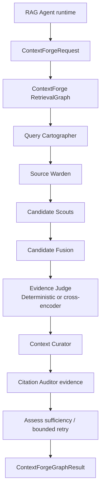

# ContextForge agent suite

[한국어](./README.md) | English

`context_forge` is the internal retrieval-engine package for document-grounded answering. The public assistant-facing retrieval boundary now belongs to `rag_agent`; behind that boundary, ContextForge plans retrieval, enforces source-boundary handoff, gathers authorized candidates, packs answer-ready context, and emits redacted evidence. The RAG Agent contract consumes that redacted evidence for trace/grounding checks before and after the assistant writes final prose.

## Current role

- Production-surface retrieval orchestration for conversation runs.
- Conversation runs enter the RAG Agent runtime through the `retrieve_rag_context` node in the `general_assistant` graph; the RAG Agent then calls the thin ContextForge LangGraph retrieval wrapper internally.
- Multi-role structure implemented as testable Python classes, not as separate hosted agents.
- Keeps hard document and knowledge-base authorization inside `RetrievalService` and existing source-selection helpers.
- Uses deterministic offline behavior by default; cross-encoder reranking is an optional second-stage seam enabled with `MY_AGENTS_RERANKER_MODE=cross_encoder`.
- Favors high-recall context for critical RAG quality, while keeping explicit candidate/context budgets.
- For `clarification_required`, the API layer returns a language-neutral `clarification` payload instead of static English prose so a human can choose the document scope.

## Role flow



## File responsibilities

| File | Responsibility |
| --- | --- |
| `contracts.py` | Dataclass contracts for requests, plans, candidates, evidence, and results |
| `planner.py` | Query Cartographer deterministic intent and structured-entity planning |
| `source_policy.py` | Source Warden adapter around resolved KB boundaries |
| `candidates.py` | Candidate Scouts for authorized chunk and structured-entity retrieval |
| `debug.py` | Opt-in Rich print trace for role handoffs |
| `fusion.py` | Candidate dedupe and source evidence preservation |
| `reranking.py` | Deterministic reranker, optional cross-encoder reranker, and settings-based factory |
| `packing.py` | Context Curator high-recall packing under explicit budgets |
| `observability.py` | Citation Auditor redacted evidence payloads |
| `service.py` | Main `ContextForgeService.retrieve(...)` orchestration boundary |
| `graph.py` | Thin LangGraph retrieval wrapper around `ContextForgeService.retrieve(...)`, bounded required-evidence retry, and sufficiency assessment |

## Document metadata retrieval

ContextForge Candidate Scouts search authorized document `title` and `source_filename`
metadata as well as body chunks. If a user refers to an upload by a filename such as
`NCT06159946_Prot_000` and that string is not present in the extracted PDF/text body, the
metadata match still promotes chunks from that document as `document_metadata` candidates.
This path only considers documents that already passed the existing KB/source authorization
boundary.

Ingestion also creates a generated document metadata profile with a search-oriented title,
description, summary, keywords, topics, entities, and a profile embedding. Candidate Scouts
search those profiles as `document_metadata_profile` candidates. The profile text is optimized
for vector searchability: likely user terms, aliases, abbreviations, multilingual hints, and
domain vocabulary. When a profile matches, ContextForge treats it as a document locator and
expands it into the strongest body/source chunks from that same authorized document. That keeps
title/header-only profile hits from starving facts buried deeper in the document, while final
answers and citations remain grounded in source text rather than generated metadata.

## Structured retrieval

ContextForge can route enumeration-style questions such as “list API endpoints” to structured entities extracted during ingestion. The first structured entity types are:

- `api_endpoint`
- `config_key`
- `command`
- `error_code`
- `database_table`

Structured entities preserve document, chunk, extraction-run, page, offset, confidence, and JSON attributes so citations still point to authorized source material.

## Cross-encoder reranking

The default `MY_AGENTS_RERANKER_MODE=deterministic` keeps fused-score ordering stable so offline tests and credential-free smoke checks remain cheap. In runtimes where retrieval precision matters more, install the optional `sentence-transformers` package and enable:

```bash
MY_AGENTS_RERANKER_MODE=cross_encoder
MY_AGENTS_RERANKER_TOP_K=40
MY_AGENTS_CROSS_ENCODER_MODEL=cross-encoder/ms-marco-MiniLM-L-6-v2
MY_AGENTS_CROSS_ENCODER_BATCH_SIZE=16
# MY_AGENTS_CROSS_ENCODER_DEVICE=mps
```

The cross-encoder only scores already-authorized top-k candidates from `MY_AGENTS_RERANKER_TOP_K` (`40` by default) as query/document pairs. It does not replace first-stage retrieval, and authorization always completes before reranking.

## Rich debug trace

Enable `MY_AGENTS_DEBUG_KNOWLEDGE_CONTEXT_LOGGING=true` to Rich-print ContextForge role handoffs. The trace shows which role sends which message/payload to the next role, such as `ConversationRun -> QueryCartographer`, `CandidateFusion -> EvidenceJudge`, and `ContextCurator -> ConversationRun`. These traces can include sensitive retrieval context such as queries, chunk IDs, and snippets, so keep them limited to local debugging.

## Security boundary

Even as the delegated engine behind the RAG Agent, ContextForge must never make authorization prompt-dependent. Candidate generation starts from the existing resolved `KnowledgeBaseSelectionContext` and low-level retrieval SQL filters. The LangGraph wrapper orchestrates service calls and sufficiency state; it does not authorize sources, query storage directly, or expose hidden scratchpads. Deterministic/cross-encoder reranking, packing, RAG Agent trace state, graph input, citations, and events only receive authorized candidates.
When an ambiguous document reference spans multiple authorized documents, the run stops with a `message_key`/`input_slot` clarification contract instead of broadly searching every accessible document or generating backend-authored English text.

## RetrievalGraph / tool seam

`graph.py` exposes `invoke_context_forge_graph(...)`. Current conversation runs use this graph through `rag_agent.retrieval`, so the assistant-facing public seam is the RAG Agent and the ContextForge graph is the internal implementation seam. The graph state returns:

- the underlying `ContextForgeResult`;
- bounded `retrieval_attempt_count`;
- `insufficient_evidence` for required-document fallback handling.

Future agents should call the RAG Agent public runtime, not ContextForge directly, when they need an evidence-retrieval tool that returns authorized context and redacted evidence. Final answer
composition, citations, run events, and persistence stay in the conversation/assistant
layers.

Persistence guardrail: `ContextForgeGraphState` is runtime-only. Do not compile this
retrieval wrapper with a checkpointer or persist raw graph state unless the state is first
compacted/redacted into an explicit product-owned artifact. Retrieval source truth remains
with the knowledge tables, citations, and conversation run/event records.

## Tests

Relevant tests:

```bash
uv run pytest -q tests/test_context_forge_contracts.py
uv run pytest -q tests/test_context_forge_reranking.py
uv run pytest -q tests/test_context_forge_structured_retrieval.py
uv run pytest -q tests/test_permission_aware_rag.py tests/test_retrieval_routing.py
```

When this package changes, also run the full offline suite plus Ruff checks before claiming completion.
