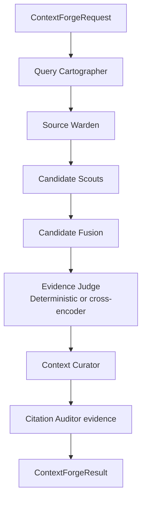

# ContextForge 에이전트 스위트

한국어 | [English](./README.en.md)

`context_forge`는 문서 근거 답변을 위한 전용 검색 계층 패키지입니다. `general_assistant` 및 `rag_agent`와 분리되어 있으며, ContextForge는 검색 계획, 소스 경계 전달, 승인된 후보 수집, 답변용 컨텍스트 패킹, redacted evidence 생성을 담당합니다. RAG Agent contract는 assistant가 최종 prose를 쓰기 전후에 이 redacted evidence를 trace/grounding check에 사용합니다.

## 현재 역할

- 대화 실행(conversation run)을 위한 production-surface 검색 오케스트레이션입니다.
- 여러 역할 구조는 독립 hosted agent가 아니라 테스트 가능한 Python 클래스로 구현되어 있습니다.
- 문서/지식베이스 권한의 hard boundary는 기존 `RetrievalService`와 source-selection helper 안에 유지합니다.
- 기본 동작은 오프라인 테스트 가능한 deterministic 방식입니다. Cross-encoder reranking은 `MY_AGENTS_RERANKER_MODE=cross_encoder`로 켜는 optional second-stage seam입니다.
- RAG 품질이 중요한 경로이므로 token 절약보다 high-recall 컨텍스트를 우선하되, 후보/context budget은 명시합니다.
- `clarification_required` route에서는 정적 영어 답변을 만들지 않고 API layer가 language-neutral `clarification` payload를 반환해 사람이 문서 범위를 지정하도록 합니다.

## 역할 흐름



## 파일 책임

| 파일 | 책임 |
| --- | --- |
| `contracts.py` | request, plan, candidate, evidence, result dataclass contract |
| `planner.py` | Query Cartographer의 deterministic intent 및 structured-entity planning |
| `source_policy.py` | resolved KB boundary를 다루는 Source Warden adapter |
| `candidates.py` | authorized chunk와 structured entity retrieval 후보 수집 |
| `debug.py` | opt-in Rich print 역할 handoff trace |
| `fusion.py` | 후보 dedupe 및 source evidence 보존 |
| `reranking.py` | deterministic reranker, optional cross-encoder reranker, settings 기반 factory |
| `packing.py` | 명시적 budget 기반 high-recall context packing |
| `observability.py` | Citation Auditor용 redacted evidence payload |
| `service.py` | `ContextForgeService.retrieve(...)` 메인 orchestration boundary |
| `graph.py` | 미래 LangGraph role-node orchestration seam |

## 문서 metadata 검색

ContextForge Candidate Scouts는 본문 chunk뿐 아니라 권한이 확인된 document `title`과
`source_filename`도 검색합니다. 사용자가 `NCT06159946_Prot_000` 같은 업로드 파일명으로
문서를 지칭했는데 그 문자열이 PDF/text 본문에는 없는 경우에도, metadata match가 matching
document의 chunk를 `document_metadata` 후보로 올립니다. 이 경로도 기존 KB/source 권한 경계를
먼저 통과한 문서만 대상으로 합니다.

Ingestion은 검색 친화적인 generated document metadata profile도 생성합니다. 이 profile에는 title,
description, summary, keywords, topics, entities와 profile embedding이 포함됩니다. Candidate Scouts는
이 profile을 `document_metadata_profile` 후보로 검색합니다. profile text는 vector searchability를 위해
사용자가 입력할 법한 term, alias, abbreviation, multilingual hint, domain vocabulary 중심으로 생성됩니다.
profile이 match하더라도 ContextForge는 원문 document chunk를 주입하므로 최종 답변과 citation은 생성 metadata가
아니라 source text에 grounded됩니다.

## 구조화 검색

ContextForge는 “API endpoints를 나열해줘” 같은 enumeration 질문을 ingestion 시 추출한 structured entity로 라우팅할 수 있습니다. 첫 structured entity 타입은 다음과 같습니다.

- `api_endpoint`
- `config_key`
- `command`
- `error_code`
- `database_table`

Structured entity는 document, chunk, extraction run, page, offset, confidence, JSON attributes를 보존하므로 citation은 계속 승인된 원본 자료를 가리킵니다.

## Cross-encoder reranking

기본 `MY_AGENTS_RERANKER_MODE=deterministic`은 fused score order를 안정적으로 유지하므로 offline test와 credential-free smoke check가 깨지지 않습니다. RAG 품질이 더 중요한 runtime에서는 optional `sentence-transformers` package를 설치한 뒤 다음처럼 켤 수 있습니다.

```bash
MY_AGENTS_RERANKER_MODE=cross_encoder
MY_AGENTS_CROSS_ENCODER_MODEL=cross-encoder/ms-marco-MiniLM-L-6-v2
MY_AGENTS_CROSS_ENCODER_BATCH_SIZE=16
# MY_AGENTS_CROSS_ENCODER_DEVICE=mps
```

Cross-encoder는 이미 승인된 top-k 후보(`CandidateLimits.rerank_limit`)만 query/document pair로 점수화합니다. 후보 검색 전체를 cross-encoder로 대체하지 않으며, 권한 필터링은 항상 reranking 전에 끝납니다.

## Rich debug trace

`MY_AGENTS_DEBUG_KNOWLEDGE_CONTEXT_LOGGING=true`를 켜면 ContextForge의 역할 handoff가 Rich print로 출력됩니다. 예를 들어 `ConversationRun -> QueryCartographer`, `CandidateFusion -> EvidenceJudge`, `ContextCurator -> ConversationRun`처럼 어느 역할이 어떤 message/payload를 다음 역할로 넘겼는지 확인할 수 있습니다. 이 trace는 chunk ID, query, snippet 등 민감할 수 있는 검색 context를 포함하므로 로컬 디버깅에서만 사용합니다.

## 보안 경계

ContextForge는 권한 판단을 prompt에 맡기지 않습니다. 후보 생성은 기존 resolved `KnowledgeBaseSelectionContext`와 low-level retrieval SQL filter에서 시작합니다. Deterministic/cross-encoder reranking, packing, RAG Agent trace state, graph input, citation, event는 승인된 후보만 받습니다.
모호한 문서 참조가 여러 승인 문서에 걸릴 때는 무리하게 전체 문서를 검색하지 않고, 정적 assistant 문장 없이 `message_key`/`input_slot` 기반 clarification contract로 멈춥니다.

## 테스트

관련 테스트:

```bash
uv run pytest -q tests/test_context_forge_contracts.py
uv run pytest -q tests/test_context_forge_reranking.py
uv run pytest -q tests/test_context_forge_structured_retrieval.py
uv run pytest -q tests/test_permission_aware_rag.py tests/test_retrieval_routing.py
```

이 패키지를 수정하면 완료를 주장하기 전에 전체 offline suite와 Ruff check도 실행해야 합니다.
