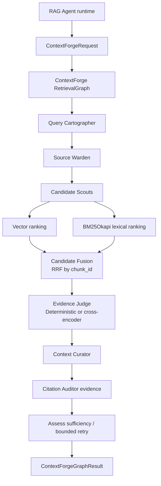

# ContextForge agent suite

[한국어](./README.ko.md) | English

`context_forge` is the internal retrieval-engine package for document-grounded answering. The public assistant-facing retrieval boundary now belongs to `rag_agent`; behind that boundary, ContextForge plans retrieval, enforces source-boundary handoff, gathers authorized candidates, packs answer-ready context, and emits redacted evidence. The RAG Agent contract consumes that redacted evidence for trace/grounding checks before and after the assistant writes final prose.

## Current role

- Production-surface retrieval orchestration for conversation runs.
- Conversation runs enter the RAG Agent runtime through the `retrieve_rag_context` node in the `general_assistant` graph; the RAG Agent then calls the thin ContextForge LangGraph retrieval wrapper internally.
- Multi-role structure implemented as testable Python classes, not as separate hosted agents.
- Keeps hard document and knowledge-base authorization inside `RetrievalService` and existing source-selection helpers.
- Defaults to Jev rubric reranking over authorized excerpts; deterministic offline mode and cross-encoder reranking remain alternatives.
- Favors high-recall context for critical RAG quality, while keeping explicit candidate/context budgets.
- For `clarification_required`, the API layer returns a language-neutral `clarification` payload instead of static English prose so a human can choose the document scope.

## Role flow


```mermaid
flowchart TD
    RAG["RAG Agent runtime"] --> Request[ContextForgeRequest]
    Request --> Graph["ContextForge RetrievalGraph"]
    Graph --> Planner[Query Cartographer]
    Planner --> Warden[Source Warden]
    Warden --> Scouts[Candidate Scouts]
    Scouts --> Vector["Vector ranking"]
    Scouts --> Lexical["BM25Okapi lexical ranking"]
    Vector --> Fusion["Candidate Fusion\nRRF by chunk_id"]
    Lexical --> Fusion
    Fusion --> Judge[Evidence Judge\nDeterministic or cross-encoder]
    Judge --> Curator[Context Curator]
    Curator --> Auditor[Citation Auditor evidence]
    Auditor --> Assess[Assess sufficiency / bounded retry]
    Assess --> Result[ContextForgeGraphResult]
```

## File responsibilities

| File | Responsibility |
| --- | --- |
| `contracts.py` | Dataclass contracts for requests, plans, candidates, evidence, and results |
| `planner.py` | Query Cartographer Jev intent classification and deterministic structured-entity planning |
| `source_policy.py` | Source Warden adapter around resolved KB boundaries |
| `candidates.py` | Candidate Scouts for authorized vector/lexical chunks and structured-entity retrieval |
| `debug.py` | Opt-in Rich print trace for role handoffs |
| `fusion.py` | RRF candidate fusion by `chunk_id` and source evidence preservation |
| `reranking.py` | Jev rubric reranker, deterministic/cross-encoder alternatives, and settings-based factory |
| `packing.py` | Context Curator high-recall packing under explicit budgets |
| `observability.py` | Citation Auditor redacted evidence payloads |
| `service.py` | Main `ContextForgeService.retrieve(...)` orchestration boundary |
| `graph.py` | Thin LangGraph retrieval wrapper around `ContextForgeService.retrieve(...)`, bounded required-evidence retry, and sufficiency assessment |

## Default hybrid retrieval and RRF

ContextForge's default first stage builds separate vector and request-local `BM25Okapi`
lexical rankings inside the authorized scope. Candidate Fusion converts each source rank
to `1 / (60 + rank)` and accumulates contributions for the same `chunk_id`. A chunk found
by both retrievers is therefore promoted consistently without directly mixing incompatible
raw score scales.

The lexical lane first applies the existing authorization filters to the full chunk corpus,
tokenizes it with the current basic Latin/digit/Korean tokenizer, and scores it with
`rank-bm25`'s `BM25Okapi` for each retrieval attempt. The corpus query selects only
`chunk_id`, `document_id`, `ordinal`, and chunk text, then hydrates full retrieval models
only for BM25 top-k rows so unused embedding/full-document payloads are not transferred
repeatedly. It reuses existing chunks, so no dedicated database index or schema migration
is required. The `keyword_match` source label remains for event/citation compatibility.
The BM25 corpus/index is currently request-local with no persistent cache. This keeps
permission and ingestion invalidation simple, but large corpora must be measured before
adding a Postgres full-text index or a safe revision-keyed cache.

## Document metadata retrieval

ContextForge Candidate Scouts search authorized document `title` and `source_filename`
metadata as well as body chunks. If a user refers to an upload by a filename such as
`NCT06159946_Prot_000` and that string is not present in the extracted PDF/text body, the
metadata match still promotes chunks from that document as `document_metadata` candidates.
This path only considers documents that already passed the existing KB/source authorization
boundary.

Ingestion also creates a generated document metadata profile with a search-oriented title,
description, summary, keywords, topics, entities, and a profile embedding. Candidate Scouts
search those profiles as `document_metadata_profile` candidates. The profile text is optimized
for vector searchability: likely user terms, aliases, abbreviations, multilingual hints, and
domain vocabulary. When a profile matches, ContextForge treats it as a document locator and
expands it into the strongest body/source chunks from that same authorized document. That keeps
title/header-only profile hits from starving facts buried deeper in the document, while final
answers and citations remain grounded in source text rather than generated metadata.

## Structured retrieval

ContextForge can route enumeration-style questions such as “list API endpoints” to structured entities extracted during ingestion. The first structured entity types are:

- `api_endpoint`
- `config_key`
- `command`
- `error_code`
- `database_table`

Structured entities preserve document, chunk, extraction-run, page, offset, confidence, and JSON attributes so citations still point to authorized source material.

## Cross-encoder reranking

Use `MY_AGENTS_RERANKER_MODE=deterministic` for fused-score ordering. As an alternative to default Jev ranking, the existing cross-encoder path loads `sentence-transformers` lazily:

```bash
MY_AGENTS_RERANKER_MODE=cross_encoder
MY_AGENTS_RERANKER_TOP_K=40
MY_AGENTS_CROSS_ENCODER_MODEL=BAAI/bge-reranker-v2-m3
MY_AGENTS_CROSS_ENCODER_BATCH_SIZE=16
# MY_AGENTS_CROSS_ENCODER_DEVICE=mps
```

The cross-encoder only scores already-authorized top-k candidates from `MY_AGENTS_RERANKER_TOP_K` (`40` by default) as query/document pairs. It does not replace first-stage retrieval, and authorization always completes before reranking. The model is loaded lazily on the first non-empty rerank call, so routes that skip document candidate scoring do not pay the cross-encoder cold-start cost.

## Rich debug trace

Enable `MY_AGENTS_DEBUG_KNOWLEDGE_CONTEXT_LOGGING=true` to Rich-print ContextForge role handoffs. The trace shows which role sends which message/payload to the next role, such as `ConversationRun -> QueryCartographer`, `CandidateFusion -> EvidenceJudge`, and `ContextCurator -> ConversationRun`. These traces can include sensitive retrieval context such as queries, chunk IDs, and snippets, so keep them limited to local debugging.

Enable `MY_AGENTS_DEBUG_RETRIEVAL_TIMING_LOGGING=true` when local retrieval is too slow and you need a per-run breakdown. This prints a human-readable Rich panel for each ContextForge retrieval attempt with total time plus phase timings for `authorized_document_count`, `query_planning`, `candidate_gather`, `candidate_fusion`, `reranking`, and `context_pack`. While candidate gathering runs, existing retrieval/embedding spans are forwarded into the same panel as `candidate_gather.*` rows, including metadata matching, query embedding, vector SQL, JSON fallback, entity expansion, and overview supplement work. The timing panel is redacted: it prints counts, route/intent metadata, and milliseconds, not raw prompts or document text.

## Security boundary

Even as the delegated engine behind the RAG Agent, ContextForge must never make authorization prompt-dependent. Candidate generation starts from the existing resolved `KnowledgeBaseSelectionContext` and low-level retrieval SQL filters. The LangGraph wrapper orchestrates service calls and sufficiency state; it does not authorize sources, query storage directly, or expose hidden scratchpads. Jev/deterministic/cross-encoder reranking, packing, RAG Agent trace state, graph input, citations, and events only receive authorized candidates.
When an ambiguous document reference spans multiple authorized documents, the run stops with a `message_key`/`input_slot` clarification contract instead of broadly searching every accessible document or generating backend-authored English text.

## RetrievalGraph / tool seam

`graph.py` exposes `invoke_context_forge_graph(...)`. Current conversation runs use this graph through `rag_agent.retrieval`, so the assistant-facing public seam is the RAG Agent and the ContextForge graph is the internal implementation seam. The graph state returns:

- the underlying `ContextForgeResult`;
- bounded `retrieval_attempt_count`;
- `insufficient_evidence` for required-document fallback handling.

Future agents should call the RAG Agent public runtime, not ContextForge directly, when they need an evidence-retrieval tool that returns authorized context and redacted evidence. Final answer
composition, citations, run events, and persistence stay in the conversation/assistant
layers.

Persistence guardrail: `ContextForgeGraphState` is runtime-only. Do not compile this
retrieval wrapper with a checkpointer or persist raw graph state unless the state is first
compacted/redacted into an explicit product-owned artifact. Retrieval source truth remains
with the knowledge tables, citations, and conversation run/event records.

## Tests

Relevant tests:

```bash
uv run pytest -q tests/test_context_forge_contracts.py
uv run pytest -q tests/test_context_forge_reranking.py
uv run pytest -q tests/test_context_forge_structured_retrieval.py
uv run pytest -q tests/test_permission_aware_rag.py tests/test_retrieval_routing.py
```

When this package changes, also run the full offline suite plus Ruff checks before claiming completion.

## Jev decision configuration

Source selection, focused/comprehensive retrieval selection, and ContextForge intent use `typesafe/jev-1.13` through OpenRouter by default. Set `OPENROUTER_API_KEY` locally. `MY_AGENTS_DECISION_PROVIDER=deterministic` uses local rules; `openai` restores the previous source/tool models and local ContextForge intent. `MY_AGENTS_RESPONSE_MODE=deterministic` always disables provider decisions. Missing credentials, invalid output, and provider errors fall back to local rules. Requests use a 10-second timeout without retries (`MY_AGENTS_JEV_TIMEOUT_SECONDS`). Routing decisions send only bounded recent conversation text and source-selection counts/mode; credentials and responses are not checkpointed. Answer generation and metadata enrichment remain OpenAI-backed. Confidence is not an authorization signal; no uncalibrated confidence threshold is imposed. See `tests/test_jev_decisions.py`.

ContextForge reranking separately defaults to `MY_AGENTS_RERANKER_MODE=jev`. It sends only
the query and bounded authorized excerpts to the same Decisions API, with synthetic candidate IDs.
It never sends summary, file-note, or memory channels. Routing-provider selection does not change
this mode. Any failed batch preserves the entire fused shortlist; offline response mode suppresses
Jev calls. See the [reranking contract](../../../docs/product-chat-service/37-jev-evidence-reranking.md).

For a readable before/after console comparison, enable
`MY_AGENTS_DEBUG_KNOWLEDGE_CONTEXT_LOGGING=true` with
`MY_AGENTS_DEPLOYMENT_ENVIRONMENT=local`. The table shows ranks, document/chunk locations,
RRF/reranker scores, and bounded excerpts for the top 10 of each order. It reports the effective
mode, including Jev fallback, and never prints in preview/production even with the flag enabled.
