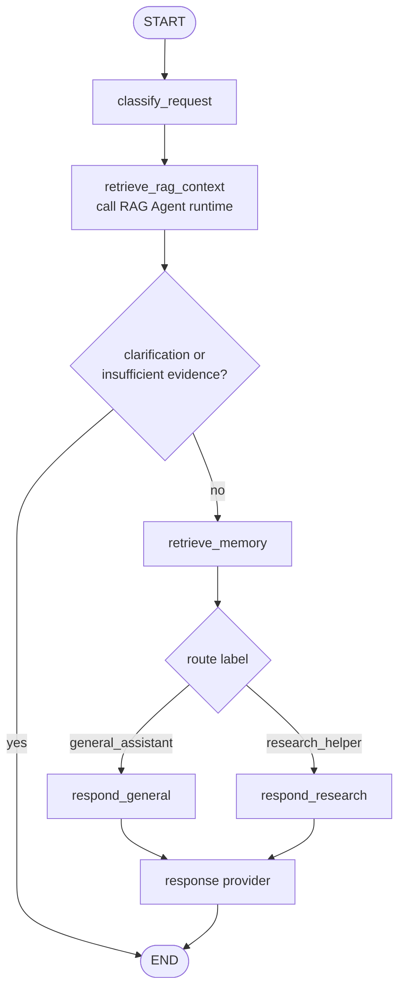
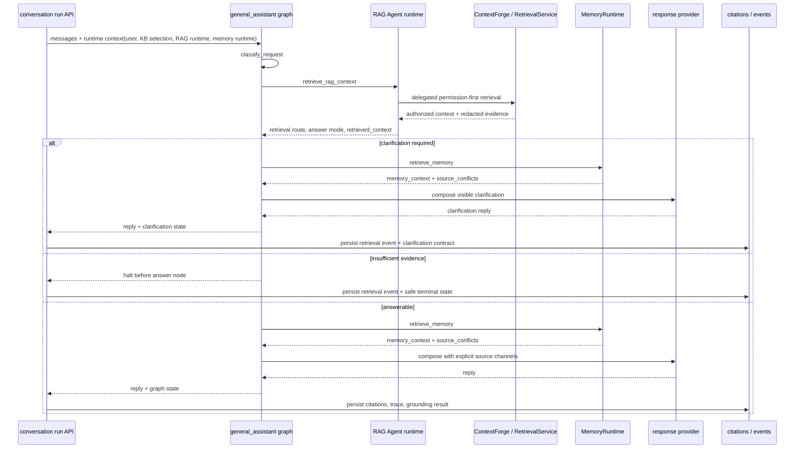

# general_assistant agent

[한국어](./README.md) | English

`general_assistant` is the default LangGraph assistant/controller in this repository. It classifies the user's message into a route label, optionally calls the RAG Agent inside the graph to retrieve authorized document context, recalls opt-in memory, and then lets the selected response node compose a reply through the shared response provider.

## Current role

- `build_graph()` is the retrieval-enabled product graph used by conversation runs.
- `build_legacy_chat_graph()` is the no-KB graph used by legacy FastAPI `/assistant/chat` and the terminal CLI.
- In product conversation runs it acts as the top-level controller and calls the `rag_agent` retrieval runtime through the `retrieve_rag_context` node.
- Route labels are metadata for choosing response behavior.
- Route labels are paired with `AgentCapability` metadata so replies can honestly reflect available tools, data sources, and side effects.
- Current route-specific response nodes do not mean separate hosted specialist agents executed.
- OpenAI reply generation goes through `langchain-openai` `ChatOpenAI`.
- deterministic mode remains available for tests and offline smoke checks.

## File structure

| File | Responsibility |
| --- | --- |
| `graph.py` | LangGraph `StateGraph`, RAG/memory/response nodes, conditional routing, graph state definition |
| `classifier.py` | Reads LangChain messages and produces deterministic `RouteDecision` values |
| `rag_retrieval.py` | Graph-owned RAG Agent invocation node; converts RAG results into assistant state and decides halt behavior |
| `memory_recall.py` | Graph-owned memory recall node helpers and source-conflict detection |
| `context.py` | Assembles explicit provider source context from Product DB conversation messages, authorized document context, stored memory context, and material source conflicts |
| `responders.py` | deterministic/OpenAI response providers, OpenAI call boundary, future hosted tool policy location |
| `__init__.py` | Package boundary |

## Graph flow

## Route label meaning

| Label | Current meaning |
| --- | --- |
| `general_assistant` | General requests, organization, learning/planning/career help, practical next-step suggestions |
| `research_helper` | Research questions, source discovery, source-oriented answer direction |

## Capability metadata

`my_agents/agents/capabilities.py` records the route capability name, purpose, tools, data sources, and side effects. The graph attaches this metadata after classification, and `responders.py` includes it in deterministic replies and OpenAI prompts.

This keeps the API honest: `research_helper` may use hosted `web_search` in OpenAI mode, while `general_assistant` does not claim task-database or external project-management side effects.

## Relationship to the product service layer

The `general_assistant` folder owns the graph/classifier/RAG invocation/memory recall/responder boundary. Auth, group/document permissions, server-owned conversations, knowledge ingestion, source selection, citations, and agent-event persistence are owned by service-layer modules such as `my_agents/api/`, `my_agents/knowledge/`, and `my_agents/conversations/`.

Product conversation runs pass a DB-backed `SqlAlchemyRagAgentRuntime` and resolved `KnowledgeBaseSelectionContext` through LangGraph runtime context. Before writing prose, `general_assistant` invokes the RAG Agent inside the graph. The RAG Agent is the public retrieval boundary; ContextForge is the internal delegated retrieval engine. If the RAG result is `clarification_required`, the graph continues to memory/response composition so the assistant can ask a visible clarification question while the API persists the structured clarification contract. If required retrieval has insufficient evidence, the graph still stops before answer nodes and the API layer persists the safe insufficient-evidence reply. Otherwise, the graph runs its own `retrieve_memory` node and then calls the response provider.

The authorized document context may include ambient system/project knowledge that is public to authenticated chat users; it is still retrieval context, not user memory. The memory node receives a runtime-only `MemoryRuntime` adapter through LangGraph `context`, searches active user-scoped memory after opt-in/governance filtering, and writes compact `memory_context` plus `source_conflicts` into graph state. Provider prompt construction goes through an explicit `SourceContextBundle`: recent Product DB conversation messages, opt-in stored memory, authorized document context, and material source conflicts are separate channels instead of an implicit hidden message slice. Permission decisions remain inside RetrievalService/ContextForge/API layers; memory governance remains under `my_agents/memory/`.

This separation matters for the product: LangGraph shows assistant control flow, the RAG Agent shows the assistant-callable retrieval boundary, and ContextForge/RetrievalService/API layers show production auth, permission, and provenance boundaries. Ingestion (upload/parse/chunk/embed) remains a separate pipeline from retrieval routing.

## Conversation and source context assembly

`context.py` keeps provider context selection explicit. Product conversation runs load the server-owned SQL transcript before graph invocation, but the provider receives a bounded recent conversation window through `SourceContextBundle` rather than directly depending on a hidden `messages[-6:]` slice in prompt construction.

Current channels are:

| Channel | Current source | Notes |
| --- | --- | --- |
| recent conversation | Product DB transcript passed into graph state | Product DB remains the visible transcript source of truth |
| authorized documents | graph-owned `retrieve_rag_context` call into the RAG Agent runtime | Prompt-safe context that already passed ContextForge/RetrievalService permission filtering; can include ambient system/project knowledge for authenticated users. |
| stored memory | graph-owned `retrieve_memory` node using runtime `MemoryRuntime` | Disabled, sensitive, stale, inactive, deleted, invalid stable-preference-shaped, and query-irrelevant non-preference memories are excluded by the current Product DB-backed adapter |
| material conflicts | graph-owned `source_conflicts` from `memory_recall.py` | Recent conversation is preferred over conflicting stored memory; authorized documents are preferred for document-grounded claims |

The memory service lives outside this agent folder under `my_agents/memory/` and `my_agents/api/memories.py`. Public memory writes do not accept client-asserted provenance IDs; service-owned paths must provide provenance when they create document-derived memories. The agent graph owns recall orchestration, but persistence/governance still stays behind `MemoryRuntime`; graph state receives only serialized active memory context and conflict metadata, with memory/document snippets encoded as untrusted JSON prompt data. Replay/regeneration uses current active memory context rather than historical memory content. Completed and failed runs can retain an internal redacted memory-source audit snapshot, but frontend-visible run events expose only memory counts/categories/provenance types.

See [`docs/product-chat-service/en/19-langgraph-native-memory-migration.md`](../../../docs/product-chat-service/en/19-langgraph-native-memory-migration.md) for the LangGraph-native memory migration. Checkpointers should be run-scoped execution/HITL state, not conversation history or long-term memory.

## Where to add OpenAI hosted tools

OpenAI Responses API built-in tools such as `web_search` should be added at the **OpenAI provider boundary in `responders.py`, not directly inside graph nodes**.

Reasons:

- `graph.py` can stay focused on route decisions, RAG/memory orchestration, and flow control.
- Nodes such as `respond_general` and `respond_research` do not need to know provider-specific details.
- OpenAI-specific behavior stays inside `OpenAIResponseProvider`, making replacement and testing easier.
- route-specific tool policy can be tested in one place.

## Draft web search policy

This is not implemented yet. When implemented, start with a small step.

| Route | Default web search policy |
| --- | --- |
| `general_assistant` | Allow only when the user asks for current/recent/source-backed/web-searched information or current facts are required |
| `research_helper` | Allow by default |

The first implementation milestone should verify tool binding inside the provider without changing the API response schema. Add citations and tool metadata to `ChatResponse` only after confirming the real response shape.

## Change checklist

- If graph flow changes, check `tests/test_graph.py`.
- If the RAG retrieval boundary changes, check `tests/test_conversations_api.py`, `tests/test_permission_aware_rag.py`, and `tests/test_rag_agent_contracts.py`.
- If routing keywords change, check `tests/test_classifier.py` and representative prompt fixtures.
- If response provider behavior changes, check `tests/test_responders.py`.
- OpenAI mode must remain testable without a real API key.
- When updating this README, update [`README.md`](./README.md) and this English file together.
