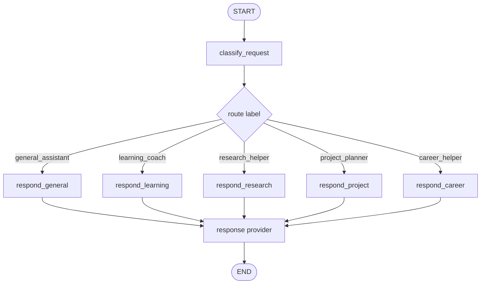
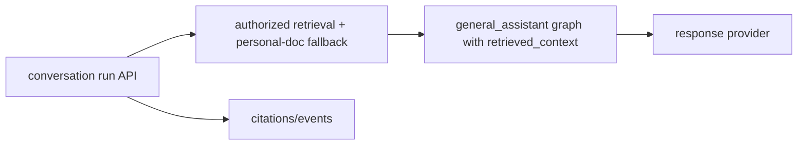

# general_assistant agent

[한국어](./README.md) | English

`general_assistant` is the current default LangGraph assistant/router implementation in this repository. It classifies the user's message into a deterministic route label, then the selected response node composes a reply through a shared response provider.

## Current role

- It is the single LangGraph reply path invoked by legacy FastAPI `/assistant/chat`, the terminal CLI, and product conversation runs.
- Route labels are metadata for choosing response behavior.
- Route labels are paired with `AgentCapability` metadata so replies can distinguish real-world prototype behavior from simulation-only placeholders.
- Current route-specific nodes do not mean separate specialized agents executed.
- OpenAI reply generation goes through `langchain-openai` `ChatOpenAI`.
- deterministic mode remains available for tests and offline smoke checks.

## File structure

| File | Responsibility |
| --- | --- |
| `graph.py` | LangGraph `StateGraph`, nodes, conditional routing, graph state definition |
| `classifier.py` | Reads LangChain messages and produces deterministic `RouteDecision` values |
| `responders.py` | deterministic/OpenAI response providers, OpenAI call boundary, future hosted tool policy location |
| `__init__.py` | Package boundary |

## Graph flow



## Route label meaning

| Label | Current meaning |
| --- | --- |
| `general_assistant` | General requests, organization, practical next-step suggestions |
| `learning_coach` | Study planning, explanations, practice direction |
| `research_helper` | Research questions, source discovery, source-oriented answer direction |
| `project_planner` | Project milestones, scope, verification planning |
| `career_helper` | Resume, interview, and career wording improvements |


## Capability metadata

`my_agents/agents/capabilities.py` records the route capability name, mode, maturity, tools, data sources, and side effects. The graph attaches this metadata after classification, and `responders.py` includes it in deterministic replies and OpenAI prompts.

This keeps the API honest: a `learning_coach` route may be useful for study guidance, but the metadata can disclose when the capability is only a simulation rather than a real production integration.

## Relationship to the product service layer

The `general_assistant` folder owns the graph/classifier/responder boundary. Auth, group/document permissions, server-owned conversations, knowledge ingestion, retrieval selection, citations, and agent events are owned by service-layer modules such as `my_agents/api/`, `my_agents/knowledge/`, and `my_agents/conversations/`.

Product conversation runs now pass a compact, already-authorized `retrieved_context` payload into the graph/provider prompt. This lets the OpenAI response answer broad resume/profile questions from uploaded documents while keeping the security decision in the service layer.



This separation matters for the portfolio: LangGraph demonstrates AI reply flow, while the service layer demonstrates production boundaries such as auth, permissions, and provenance.

## Where to add OpenAI hosted tools

OpenAI Responses API built-in tools such as `web_search` should be added at the **OpenAI provider boundary in `responders.py`, not directly inside graph nodes**.

Reasons:

- `graph.py` can stay focused on route decisions and flow control.
- Nodes such as `respond_general` and `respond_research` do not need to know provider-specific details.
- OpenAI-specific behavior stays inside `OpenAIResponseProvider`, making replacement and testing easier.
- route-specific tool policy can be tested in one place.

Recommended structure:

```text
graph.py
  -> decide route
  -> select response node
  -> pass route + guidance to provider

responders.py
  -> inspect route and choose OpenAI hosted tools
  -> apply ChatOpenAI.bind_tools([...]) when needed
  -> invoke model
  -> extract reply
  -> later extract citation/tool metadata
```

## Draft web search policy

This is not implemented yet. When implemented, start with a small step.

| Route | Default web search policy |
| --- | --- |
| `general_assistant` | Allow only when the user asks for current/recent/source-backed/web-searched information or current facts are required |
| `research_helper` | Allow by default |
| `learning_coach` | Off by default |
| `project_planner` | Off by default |
| `career_helper` | Off by default |

The first implementation milestone should verify tool binding inside the provider without changing the API response schema. Add citations and tool metadata to `ChatResponse` only after confirming the real response shape.

## Change checklist

- If graph flow changes, check `tests/test_graph.py`.
- If routing keywords change, check `tests/test_classifier.py` and representative prompt fixtures.
- If response provider behavior changes, check `tests/test_responders.py`.
- OpenAI mode must remain testable without a real API key.
- When updating this README, update [`README.md`](./README.md) and this English file together.
