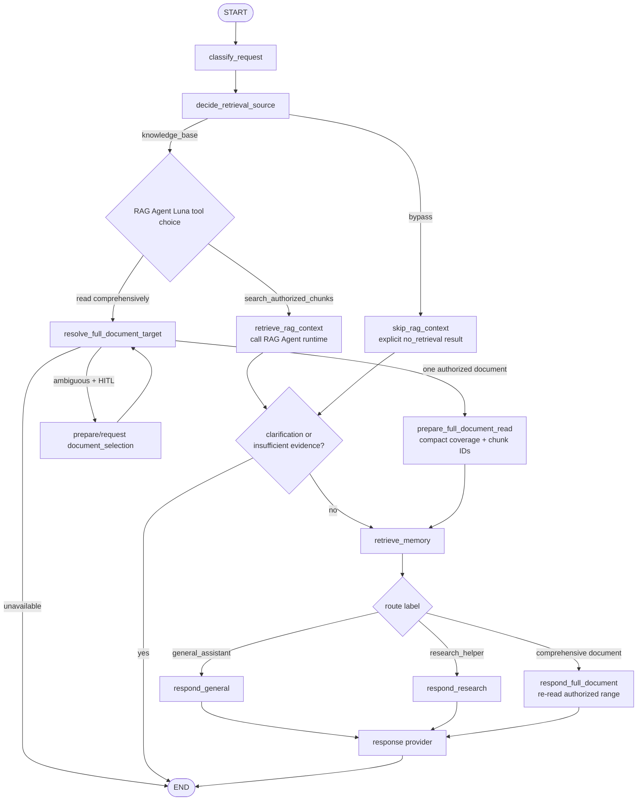
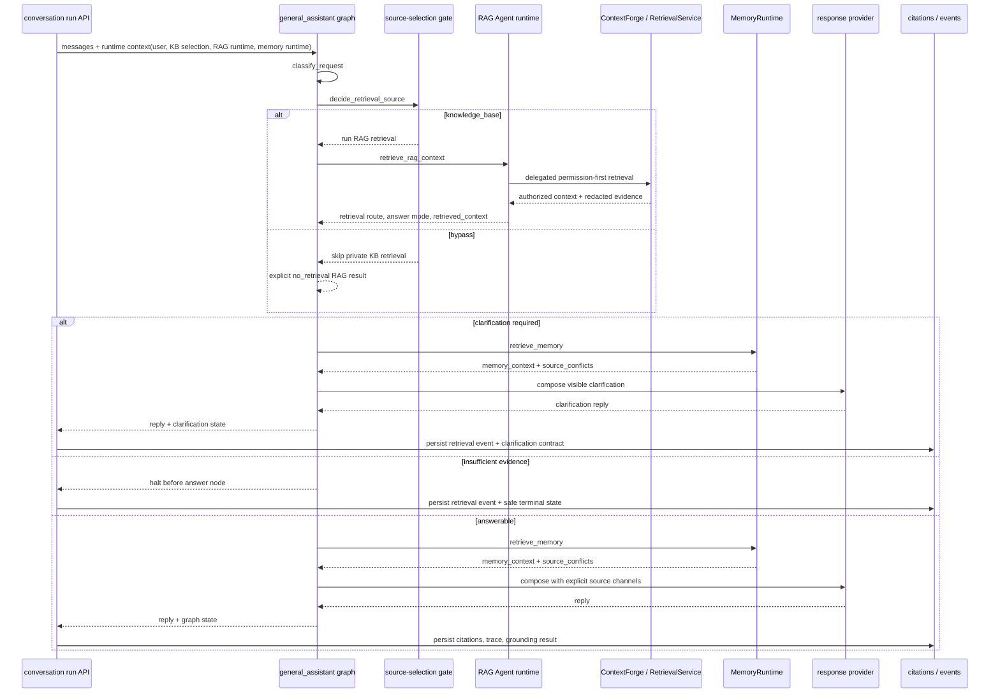

# general_assistant agent

[한국어](./README.md) | English

`general_assistant` is the default LangGraph assistant/controller in this repository. It classifies the user's message into a route label, decides whether private knowledge-base retrieval should run, optionally calls the RAG Agent inside the graph for focused or explicit comprehensive document context, recalls opt-in memory, and then lets the selected response node compose a reply through the shared response provider.

## Current role

- `build_graph()` is the retrieval-enabled product graph used by conversation runs.
- `build_legacy_chat_graph()` is the no-KB graph used by legacy FastAPI `/assistant/chat` and the terminal CLI.
- In product conversation runs it acts as the top-level controller and uses `decide_retrieval_source` before calling the `rag_agent` retrieval runtime through `retrieve_rag_context`.
- After private-knowledge delegation, the RAG Agent's fixed Luna standard/low planner chooses focused chunk search or comprehensive document read; deterministic mode and provider failures retain the same local fallback. Comprehensive choices route through `resolve_full_document_target -> prepare_full_document_read -> retrieve_memory -> respond_full_document`.
- Route labels are metadata for choosing response behavior.
- Route labels are paired with `AgentCapability` metadata so replies can honestly reflect available tools, data sources, and side effects.
- Current route-specific response nodes do not mean separate hosted specialist agents executed.
- OpenAI reply generation goes through `langchain-openai` `ChatOpenAI`.
- The always-present responder system prompt identifies the assistant as part of
  `my-agents` at `https://my-agents.dev`; changing product facts still come from
  authorized context instead of being guessed or frozen into that identity prompt.
- deterministic mode remains available for tests and offline smoke checks.

## File structure

| File | Responsibility |
| --- | --- |
| `graph.py` | LangGraph `StateGraph`, RAG/memory/response nodes, conditional routing, graph state definition |
| `classifier.py` | Reads LangChain messages and produces deterministic `RouteDecision` values |
| `retrieval_gate.py` | Thin deterministic/OpenAI source-selection gate that decides whether to run private KB retrieval or bypass to general/web answering |
| `rag_retrieval.py` | Graph-owned RAG Agent invocation and full-document target/read preparation nodes; converts RAG results into checkpoint-safe assistant state and decides halt behavior |
| `memory_recall.py` | Graph-owned memory recall node helpers and source-conflict detection |
| `context.py` | Assembles explicit provider source context from Product DB conversation messages, authorized document context, stored memory context, and material source conflicts |
| `responders.py` | deterministic/OpenAI response providers, OpenAI call boundary, future hosted tool policy location |
| `__init__.py` | Package boundary |

## Graph flow

## Route label meaning

| Label | Current meaning |
| --- | --- |
| `general_assistant` | General requests, organization, learning/planning/career help, practical next-step suggestions |
| `research_helper` | Research questions, source discovery, source-oriented answer direction |

## Capability metadata

`my_agents/agents/capabilities.py` records the route capability name, purpose, tools, data sources, and side effects. The graph attaches this metadata after classification, and `responders.py` includes it in deterministic replies and OpenAI prompts.

This keeps the API honest: OpenAI mode may expose hosted `web_search` to both `general_assistant` and `research_helper`, while the assistant still must not claim task-database or external project-management side effects.

## Relationship to the product service layer

The `general_assistant` folder owns the graph/classifier/RAG invocation/memory recall/responder boundary. Auth, group/document permissions, server-owned conversations, knowledge ingestion, source selection, citations, and agent-event persistence are owned by service-layer modules such as `my_agents/api/`, `my_agents/knowledge/`, and `my_agents/conversations/`.

Product conversation runs pass a DB-backed `SqlAlchemyRagAgentRuntime` and resolved `KnowledgeBaseSelectionContext` through LangGraph runtime context. Before writing prose, `general_assistant` runs its broad source-selection gate. If that gate delegates to `knowledge_base`, the RAG-owned fixed Luna standard/low planner chooses a typed focused or comprehensive operation; `general_assistant` routes the compact choice without owning retrieval policy or authorization. The RAG Agent is the public retrieval boundary and ContextForge is the internal focused-retrieval engine. If the source gate selects `bypass`, the graph still emits an explicit `no_retrieval` result. If the RAG result is `clarification_required`, the graph continues to visible clarification composition while the API persists the structured contract. Required retrieval with insufficient evidence stops before answer nodes; otherwise the graph recalls memory and the shared Sol response provider composes the final answer.

The comprehensive branch is narrower than ordinary retrieval. Luna selects it for explicit or clearly implied exhaustive document work, including a named document plus “without missing anything,” while a normal “Summarize this document” stays focused. The deterministic fallback composes the same decision from document reference, exhaustive-coverage language, and a task verb. The branch resolves exactly one currently authorized user-controllable document by resumed selection, sole eligible target, or unique title/filename match. Ambiguity reuses the existing typed document-selection interrupt. Ambient system documents are excluded from target resolution, options, resume values, and range reads.

`prepare_full_document_read` validates coverage and overlapping citation chunks but writes no raw document body to state. For normalized extracted text at or below `MY_AGENTS_FULL_DOCUMENT_MAX_CHARS` (24,000 by default), coverage is `complete`. Larger documents currently prepare only `[0, MY_AGENTS_FULL_DOCUMENT_RANGE_CHARS)` (12,000 characters by default), coverage is `partial`, and the response begins with an unavoidable localized partial-review notice. After memory recall, `respond_full_document` revalidates and re-reads that same range inside the node, calls the provider with LangSmith tracing disabled, and returns only the reply. A changed, deleted, or newly unauthorized document falls back to safe insufficient evidence instead of silently choosing a different source.

The authorized document context may include ambient system/project knowledge. It is internal retrieval context, not user memory or a user-visible source: system chunks keep only their snippet when entering provider context, and the prompt forbids inferring or disclosing omitted provenance. The source-selection gate is latest-turn-first but multi-turn-aware: explicit latest-turn instructions such as “do not use saved docs” or “use my uploaded document” win, while follow-up-like turns can inherit recent web/current intent and bypass private KB retrieval when they do not introduce a new document/KB need. The memory node receives a runtime-only `MemoryRuntime` adapter through LangGraph `context`, searches active user-scoped memory after opt-in/governance filtering, and writes compact `memory_context` plus `source_conflicts` into graph state. Provider prompt construction goes through an explicit `SourceContextBundle`: recent Product DB conversation messages, opt-in stored memory, authorized document context, and material source conflicts are separate channels instead of an implicit hidden message slice. Permission decisions remain inside RetrievalService/ContextForge/API layers; memory governance remains under `my_agents/memory/`.

This separation matters for the product: LangGraph shows assistant control flow, the RAG Agent shows the assistant-callable retrieval boundary, and ContextForge/RetrievalService/API layers show production auth, permission, and provenance boundaries. Ingestion (upload/parse/chunk/embed) remains a separate pipeline from retrieval routing.

## Conversation and source context assembly

`context.py` keeps provider context selection explicit. Product conversation runs load the server-owned SQL transcript before graph invocation, but the provider receives a bounded recent conversation window through `SourceContextBundle` rather than directly depending on a hidden `messages[-6:]` slice in prompt construction.

Current channels are:

| Channel | Current source | Notes |
| --- | --- | --- |
| recent conversation | Product DB transcript passed into graph state | Product DB remains the visible transcript source of truth |
| authorized documents | graph-owned focused retrieval or explicit comprehensive-document calls into the RAG Agent runtime | Focused retrieval supplies prompt-safe compact context. Comprehensive retrieval supplies one revalidated personal/group extracted-text range only inside the response node; ambient system documents cannot enter that path. |
| stored memory | graph-owned `retrieve_memory` node using runtime `MemoryRuntime` | Disabled, sensitive, stale, inactive, deleted, invalid stable-preference-shaped, and query-irrelevant non-preference memories are excluded by the current Product DB-backed adapter |
| material conflicts | graph-owned `source_conflicts` from `memory_recall.py` | Recent conversation is preferred over conflicting stored memory; authorized documents are preferred for document-grounded claims |

The memory service lives outside this agent folder under `my_agents/memory/` and `my_agents/api/memories.py`. Public memory writes do not accept client-asserted provenance IDs; service-owned paths must provide provenance when they create document-derived memories. The agent graph owns recall orchestration, but persistence/governance still stays behind `MemoryRuntime`; graph state receives only serialized active memory context and conflict metadata, with memory/document snippets encoded as untrusted JSON prompt data. Replay/regeneration uses current active memory context rather than historical memory content. Completed and failed runs can retain an internal redacted memory-source audit snapshot, but frontend-visible run events expose only memory counts/categories/provenance types.

See [`docs/product-chat-service/en/19-langgraph-native-memory-migration.md`](../../../docs/product-chat-service/en/19-langgraph-native-memory-migration.md) for the LangGraph-native memory migration. The optional production graph now compiles with PostgresSaver using `run_id` as its thread boundary and with PostgresStore as a governed memory-search projection. Checkpoints retain only bounded, serializable execution state while a run waits for document selection; Product DB remains the transcript, run, citation, permission, and memory-governance source of truth.

When document-selection HITL is enabled, `clarification_required` routes through `prepare_document_selection -> request_document_selection`. The interrupt exposes only safe document metadata. Resume supplies an exact document ID, revalidates current authorization, and runs selected-document retrieval before the normal memory and response nodes. Runtime DB sessions, provider clients, ORM models, and document-workspace adapters are never checkpointed.

The comprehensive branch bumps the run compatibility marker to `general-assistant-checkpoint-v2`. Only compact document IDs, offsets, coverage, retrieval snapshots, and the internal next cursor may be checkpointed; raw extracted text must not be. Waiting runs created with an older graph version cannot resume after rollout and should be drained or cancelled before deployment; the existing version-mismatch path otherwise fails them safely.

The public waiting payload and its typed resume answer use the versioned, protocol-neutral contract in [`docs/product-chat-service/en/27-agent-frontend-interaction-contract.md`](../../../docs/product-chat-service/en/27-agent-frontend-interaction-contract.md). Add future user-input states through that semantic interaction boundary; graph nodes must not prescribe frontend components or layout.

Document-selection options include only user-controllable personal/group documents. Ambient system knowledge remains automatically injected internal context, never a visible or selectable source, and the resume boundary rejects a system document ID even if a client submits one directly.

## Where to add OpenAI hosted tools

General-answer OpenAI Responses API tools such as `web_search` belong at the **OpenAI provider boundary in `responders.py`, not directly inside graph nodes**. Full-document retrieval is an application-executed typed graph path, not a hosted provider tool. A run with selected temporary files is the deliberate provider exception: it receives `document_workspace_runtime` through LangGraph runtime context, and the final response node invokes the isolated document-workspace adapter. That adapter is needed because `ChatOpenAI` does not yet expose the required Files, Containers, Hosted Shell, and Skills surfaces.

The same runtime context carries the run's persisted effective `reasoning_mode` and `reasoning_effort` into the final response node. Ordinary answers pass them through `ChatOpenAI.invoke(..., reasoning={...})`; attachment answers pass the same values to the document-workspace Responses API adapter. The source-selection gate deliberately stays on server-default effort and `standard` mode so a client preference cannot alter internal routing cost or behavior. Guest override enforcement and GPT-5.6 `pro` validation happen at the API boundary before graph execution.

Reasons:

- `graph.py` can stay focused on route decisions, RAG/memory orchestration, and flow control.
- Nodes such as `respond_general` and `respond_research` do not need to know provider-specific details.
- OpenAI-specific behavior stays inside `OpenAIResponseProvider`, making replacement and testing easier.
- route-specific tool policy can be tested in one place.
- Attachment turns bypass private-KB retrieval unless the client explicitly selects KBs, making the temporary attachments the turn's source while still allowing permission-filtered RAG context when deliberately requested.

## Web search policy

OpenAI mode binds hosted `web_search` at the provider boundary for both response routes. The app does not use language-specific keyword heuristics to decide whether a general-assistant request needs the web; multilingual and multi-turn intent detection is left to the model after the tool is exposed.

| Route | Default web search policy |
| --- | --- |
| `general_assistant` | Tool is available; provider prompt tells the model to call it only for current/recent/web-backed/source-backed/externally verifiable requests, including follow-ups that inherit the same source need |
| `research_helper` | Tool is available by default |

Tool binding currently does not change the API response schema. Add citations and tool metadata to `ChatResponse` only after confirming the real response shape.

## Change checklist

- If graph flow changes, check `tests/test_graph.py`.
- If the RAG retrieval boundary changes, check `tests/test_conversations_api.py`, `tests/test_permission_aware_rag.py`, and `tests/test_rag_agent_contracts.py`.
- If comprehensive intent, target resolution, coverage, replay, or checkpoint safety changes, check `tests/test_full_document_retrieval.py` and `tests/test_settings.py`.
- If routing keywords change, check `tests/test_classifier.py` and representative prompt fixtures.
- If response provider behavior changes, check `tests/test_responders.py`.
- OpenAI mode must remain testable without a real API key.
- When updating this README, update [`README.md`](./README.md) and this English file together.
