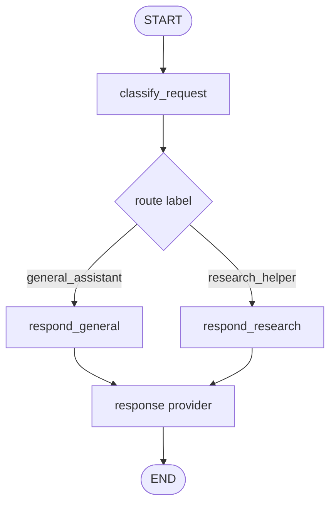
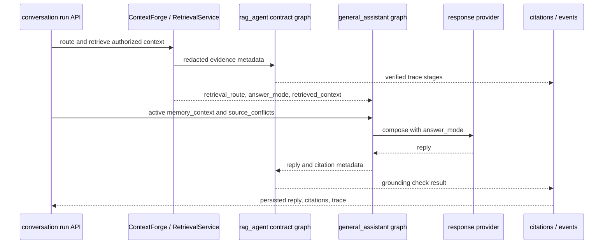

# general_assistant agent

[한국어](./README.md) | English

`general_assistant` is the current default LangGraph assistant/router implementation in this repository. It classifies the user's message into a deterministic route label, then the selected response node composes a reply through a shared response provider.

## Current role

- It is the single LangGraph reply path invoked by legacy FastAPI `/assistant/chat`, the terminal CLI, and product conversation runs.
- Route labels are metadata for choosing response behavior.
- Route labels are paired with `AgentCapability` metadata so replies can honestly reflect available tools, data sources, and side effects.
- Current route-specific nodes do not mean separate specialized agents executed.
- OpenAI reply generation goes through `langchain-openai` `ChatOpenAI`.
- deterministic mode remains available for tests and offline smoke checks.

## File structure

| File | Responsibility |
| --- | --- |
| `graph.py` | LangGraph `StateGraph`, nodes, conditional routing, graph state definition |
| `classifier.py` | Reads LangChain messages and produces deterministic `RouteDecision` values |
| `context.py` | Assembles explicit provider source context from Product DB conversation messages, authorized document context, stored memory context, and material source conflicts |
| `responders.py` | deterministic/OpenAI response providers, OpenAI call boundary, future hosted tool policy location |
| `__init__.py` | Package boundary |

## Graph flow



## Route label meaning

| Label | Current meaning |
| --- | --- |
| `general_assistant` | General requests, organization, learning/planning/career help, practical next-step suggestions |
| `research_helper` | Research questions, source discovery, source-oriented answer direction |


## Capability metadata

`my_agents/agents/capabilities.py` records the route capability name, purpose, tools, data sources, and side effects. The graph attaches this metadata after classification, and `responders.py` includes it in deterministic replies and OpenAI prompts.

This keeps the API honest: `research_helper` may use hosted `web_search` in OpenAI mode, while `general_assistant` does not claim task-database or external project-management side effects.

## Relationship to the product service layer

The `general_assistant` folder owns the graph/classifier/responder boundary. Auth, group/document permissions, server-owned conversations, knowledge ingestion, retrieval selection, citations, and agent events are owned by service-layer modules such as `my_agents/api/`, `my_agents/knowledge/`, and `my_agents/conversations/`.

Product conversation runs now execute retrieval and RAG contract work before `general_assistant` writes prose. ContextForge retrieves authorized evidence, and `rag_agent` verifies compact trace/grounding contracts. `general_assistant` receives only `retrieval_route`, `answer_mode`, `document_scope`, compact `retrieved_context`, relevance-minimized active user-scoped `memory_context`, and `source_conflicts` that have already passed service-layer authorization and opt-in checks. The graph/provider can adjust answer framing from that metadata, but it does not query vector or document storage directly. Provider prompt construction now goes through an explicit `SourceContextBundle`: recent Product DB conversation messages, opt-in stored memory, authorized document context, and material source conflicts are separate channels instead of an implicit hidden message slice. Permission decisions remain inside `RetrievalService` and the API/service layer.



This separation matters for the product: LangGraph demonstrates AI reply flow, while the RetrievalService/API layer demonstrates production boundaries such as auth, permissions, and provenance. Ingestion (upload/parse/chunk/embed) remains a separate pipeline from retrieval routing.

A future ContextForge `RetrievalGraph` can be added when retrieval itself needs graph/tool orchestration beyond the current RAG Agent contract graph, such as query rewrite, metadata planning, hybrid/vector search, reranking, or context compression. Even then, the hard authorization filter should remain inside `RetrievalService`, not in graph prompts.

## Conversation and source context assembly

`context.py` keeps provider context selection explicit. Product conversation runs still load the server-owned SQL transcript before graph invocation, but the provider receives a bounded recent conversation window through `SourceContextBundle` rather than directly depending on a hidden `messages[-6:]` slice in prompt construction.

Current channels are:

| Channel | Current source | Notes |
| --- | --- | --- |
| recent conversation | Product DB transcript passed into graph state | Product DB remains the visible transcript source of truth |
| stored memory | service-layer `memory_context` from active opt-in user memories | Disabled, sensitive, stale, inactive, deleted, invalid stable-preference-shaped, and query-irrelevant non-preference memories are excluded |
| authorized documents | service-layer `retrieved_context` | Already permission-filtered before entering the graph |
| material conflicts | service-layer `source_conflicts` | Recent conversation is preferred over conflicting stored memory; authorized documents are preferred for document-grounded claims |

The memory service lives outside this agent folder under `my_agents/memory/` and `my_agents/api/memories.py`. Public memory writes do not accept client-asserted provenance IDs; service-owned paths must provide provenance when they create document-derived memories. The agent receives only serialized active memory context and conflict metadata, with memory/document snippets encoded as untrusted JSON prompt data; it does not query or mutate memory tables directly. Replay/regeneration uses current active memory context rather than historical memory content, while completed runs retain a redacted memory-source snapshot for audit.

That service-layer injection is the current safe V1 shape, not the final LangGraph-native memory target. The migration direction is to add a graph-owned `retrieve_memory` node, a separate `memory_graph` extraction/suggest-confirm workflow, and LangGraph Store-backed active memory search while preserving Product DB governance for opt-in, provenance, source invalidation, and delete/deactivate. See [`docs/product-chat-service/en/19-langgraph-native-memory-migration.md`](../../../docs/product-chat-service/en/19-langgraph-native-memory-migration.md).

This is also the guardrail for future LangGraph checkpoint work: the current full-message graph should not be checkpointer-enabled as-is because Product DB transcript data would become duplicated in checkpoint state. Checkpointers should be run-scoped execution/HITL state, not conversation history or long-term memory.

## Where to add OpenAI hosted tools

OpenAI Responses API built-in tools such as `web_search` should be added at the **OpenAI provider boundary in `responders.py`, not directly inside graph nodes**.

Reasons:

- `graph.py` can stay focused on route decisions and flow control.
- Nodes such as `respond_general` and `respond_research` do not need to know provider-specific details.
- OpenAI-specific behavior stays inside `OpenAIResponseProvider`, making replacement and testing easier.
- route-specific tool policy can be tested in one place.

Recommended structure:

```text
graph.py
  -> decide route
  -> select response node
  -> pass route + guidance to provider

responders.py
  -> inspect route and choose OpenAI hosted tools
  -> apply ChatOpenAI.bind_tools([...]) when needed
  -> invoke model
  -> extract reply
  -> later extract citation/tool metadata
```

## Draft web search policy

This is not implemented yet. When implemented, start with a small step.

| Route | Default web search policy |
| --- | --- |
| `general_assistant` | Allow only when the user asks for current/recent/source-backed/web-searched information or current facts are required |
| `research_helper` | Allow by default |

The first implementation milestone should verify tool binding inside the provider without changing the API response schema. Add citations and tool metadata to `ChatResponse` only after confirming the real response shape.

## Change checklist

- If graph flow changes, check `tests/test_graph.py`.
- If routing keywords change, check `tests/test_classifier.py` and representative prompt fixtures.
- If response provider behavior changes, check `tests/test_responders.py`.
- OpenAI mode must remain testable without a real API key.
- When updating this README, update [`README.md`](./README.md) and this English file together.
