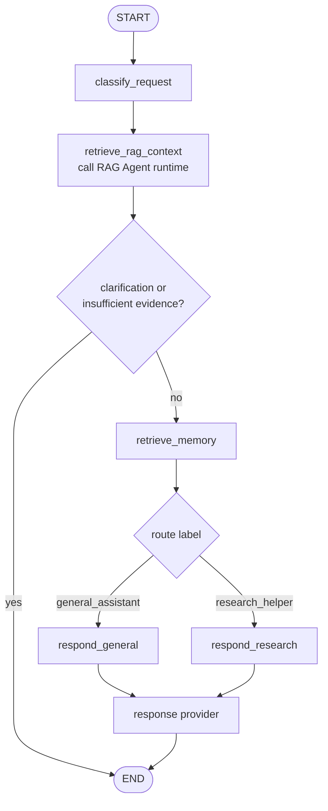
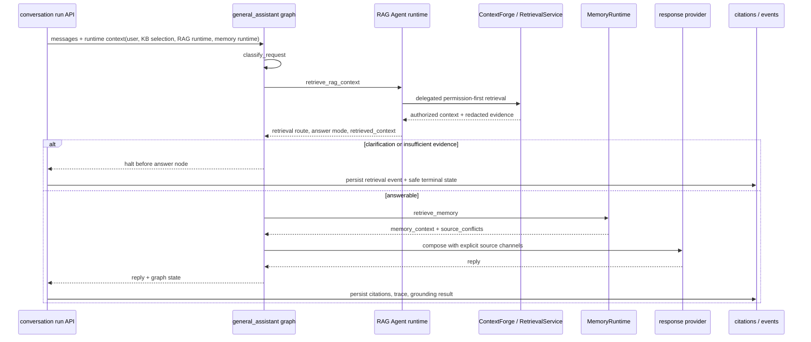

# general_assistant 에이전트

한국어 | [English](./README.en.md)

`general_assistant`는 이 저장소의 기본 LangGraph assistant/controller입니다. 사용자의 메시지를 route label로 분류한 뒤, 필요하면 graph 안에서 RAG Agent를 호출해 authorized document context를 검색하고, opt-in memory를 recall한 다음, 선택된 response node가 공통 response provider로 답변을 구성합니다.

## 현재 역할

- `build_graph()`는 conversation run이 사용하는 retrieval-enabled product graph입니다.
- `build_legacy_chat_graph()`는 FastAPI legacy `/assistant/chat`와 터미널 CLI가 사용하는 no-KB graph입니다.
- Product conversation run에서는 top-level controller처럼 동작하며 `retrieve_rag_context` node를 통해 `rag_agent` retrieval runtime을 호출합니다.
- 라우트 라벨은 응답 방식을 고르는 메타데이터입니다.
- 라우트 라벨은 `AgentCapability` metadata와 연결되어 사용 가능한 tool, data source, side effect를 정직하게 전달합니다.
- 현재 라우트별 response node는 별도의 hosted 전문 에이전트 실행을 의미하지 않습니다.
- OpenAI 응답 생성은 `langchain-openai`의 `ChatOpenAI`를 통해 수행합니다.
- deterministic 모드는 테스트와 오프라인 smoke check를 위해 유지합니다.

## 파일 구조

| 파일 | 책임 |
| --- | --- |
| `graph.py` | LangGraph `StateGraph`, RAG/memory/response 노드, 조건부 라우팅, graph state 정의 |
| `classifier.py` | LangChain messages를 읽고 결정론적 `RouteDecision` 생성 |
| `rag_retrieval.py` | graph-owned RAG Agent invocation node; RAG 결과를 assistant state로 변환하고 halt 여부를 결정 |
| `memory_recall.py` | graph-owned memory recall node helper와 source-conflict 감지 |
| `context.py` | Product DB conversation message, authorized document context, stored memory context, material source conflict를 명시적인 provider source context로 조립 |
| `responders.py` | deterministic/OpenAI response provider, OpenAI 호출 경계, 향후 hosted tool policy 위치 |
| `__init__.py` | 패키지 경계 |

## 그래프 흐름

## Route label 의미

| 라벨 | 현재 의미 |
| --- | --- |
| `general_assistant` | 일반 요청, 정리, 학습/계획/커리어 도움, 다음 단계 제안 |
| `research_helper` | 리서치 질문, 자료 탐색, 출처 중심 답변 방향 |

## Capability metadata

`my_agents/agents/capabilities.py`는 route capability name, purpose, tool, data source, side effect를 기록합니다. 그래프는 classification 뒤에 이 metadata를 붙이고, `responders.py`는 deterministic reply와 OpenAI prompt에 이를 포함합니다.

이 구조는 API를 정직하게 유지합니다. 예를 들어 `research_helper` route는 OpenAI mode에서 hosted `web_search`를 사용할 수 있지만, `general_assistant` route는 별도 task database나 외부 project-management tool side effect를 주장하지 않습니다.

## Product service layer와의 관계

`general_assistant` 폴더는 graph/classifier/RAG invocation/memory recall/responder 경계를 소유합니다. Auth, group/document permission, server-owned conversation, knowledge ingestion, source selection, citation, agent event persistence는 `my_agents/api/`, `my_agents/knowledge/`, `my_agents/conversations/` 같은 service layer에서 소유합니다.

제품용 conversation run은 DB-backed `SqlAlchemyRagAgentRuntime`과 resolved `KnowledgeBaseSelectionContext`를 LangGraph runtime context로 전달합니다. `general_assistant`는 답변을 쓰기 전에 graph 안에서 RAG Agent를 호출합니다. RAG Agent는 public retrieval boundary이고, ContextForge는 내부 delegated retrieval engine입니다. RAG 결과가 `clarification_required`이거나 required retrieval에 충분한 evidence가 없으면 graph는 answer node 전에 멈추고 API layer가 structured clarification 또는 insufficient-evidence reply를 persist합니다. 그 외에는 graph가 자체 `retrieve_memory` node를 실행한 뒤 response provider를 호출합니다.

Authorized document context에는 authenticated chat user에게 공개되는 ambient system/project knowledge가 포함될 수 있지만, 이는 user memory가 아니라 retrieval context입니다. Memory node는 LangGraph `context`로 전달된 runtime-only `MemoryRuntime` adapter를 사용해 opt-in/governance filter가 적용된 active user memory를 검색하고, compact `memory_context`와 `source_conflicts`를 graph state에 기록합니다. Provider prompt 구성은 명시적인 `SourceContextBundle`을 거칩니다. 최근 Product DB conversation message, opt-in stored memory, authorized document context, material source conflict는 암묵적인 message slice가 아니라 분리된 channel로 전달됩니다. 보안 결정과 permission filter는 계속 `RetrievalService`/ContextForge/API layer에 남고, memory governance는 `my_agents/memory/`가 계속 소유합니다.

이 분리는 제품 설명에서 중요합니다. LangGraph는 assistant control flow를 보여주고, RAG Agent는 assistant-callable retrieval boundary를 보여주며, ContextForge/RetrievalService/API 레이어는 실제 제품에 필요한 auth/permission/provenance 경계를 보여줍니다. Ingestion(upload/parse/chunk/embed)은 retrieval routing과 분리된 별도 pipeline입니다.

## Conversation / source context assembly

`context.py`는 provider context 선택을 명시적으로 관리합니다. Product conversation run은 graph invocation 전에 server-owned SQL transcript를 로드하지만, provider는 prompt 구성 내부의 숨겨진 `messages[-6:]` slice에 직접 의존하지 않고 `SourceContextBundle`을 통해 제한된 최근 conversation window를 받습니다.

현재 channel은 다음과 같습니다.

| Channel | 현재 source | 비고 |
| --- | --- | --- |
| recent conversation | graph state로 전달된 Product DB transcript | Product DB가 visible transcript source of truth입니다 |
| authorized documents | graph-owned `retrieve_rag_context`가 호출한 RAG Agent runtime | ContextForge/RetrievalService permission filter를 통과한 prompt-safe context이며, authenticated user를 위한 ambient system/project knowledge를 포함할 수 있습니다. |
| stored memory | runtime `MemoryRuntime`을 사용하는 graph-owned `retrieve_memory` node | disabled, sensitive, stale, inactive, deleted, stable-preference shape이 아닌 memory, query-irrelevant non-preference memory는 현재 Product DB-backed adapter에서 제외됩니다 |
| material conflicts | `memory_recall.py`의 graph-owned `source_conflicts` | stored memory와 충돌하면 최신 conversation을 우선하고, document-grounded claim은 authorized document를 우선합니다 |

Memory service는 이 agent folder 밖의 `my_agents/memory/`와 `my_agents/api/memories.py`에 있습니다. Public memory write는 client가 주장하는 provenance ID를 받지 않으며, service-owned path가 document-derived memory를 만들 때 provenance를 제공해야 합니다. Agent graph는 recall orchestration을 소유하지만 persistence/governance는 `MemoryRuntime` 뒤에 유지합니다. Graph state는 untrusted JSON prompt data로 직렬화된 active memory context와 conflict metadata만 받습니다. Replay/regeneration은 historical memory content가 아니라 현재 active memory context를 사용합니다. Completed/failed run에는 내부 audit용 redacted memory-source snapshot을 남길 수 있지만, frontend-visible run event에는 memory count/category/provenance type만 노출합니다.

자세한 LangGraph-native memory migration 내용은 [`docs/product-chat-service/ko/19-langgraph-native-memory-migration.md`](../../../docs/product-chat-service/ko/19-langgraph-native-memory-migration.md)를 봅니다. Checkpointer는 conversation history나 long-term memory가 아니라 run-scoped execution/HITL state로만 사용해야 합니다.

## OpenAI hosted tools를 추가할 위치

OpenAI Responses API의 `web_search` 같은 built-in tool은 **그래프 노드가 아니라 `responders.py`의 OpenAI provider 경계**에 추가하는 것이 가장 좋습니다.

이유:

- `graph.py`는 라우트 결정, RAG/memory orchestration, 흐름 제어만 담당하게 유지할 수 있습니다.
- `respond_general`, `respond_research` 같은 노드는 provider 세부사항을 몰라도 됩니다.
- OpenAI 전용 기능은 `OpenAIResponseProvider` 안에 모아 provider 교체/테스트가 쉬워집니다.
- route-specific tool policy를 한 곳에서 테스트할 수 있습니다.

## Web search policy 초안

현재는 아직 구현되지 않았습니다. 구현한다면 작은 단계로 시작합니다.

| 라우트 | web search 기본 정책 |
| --- | --- |
| `general_assistant` | 사용자가 최신/최근/출처/웹 검색을 명시하거나 현재 정보가 필요한 경우에만 허용 |
| `research_helper` | 기본 허용 |

첫 구현 milestone은 API 응답 스키마를 바꾸지 않고 provider 내부에서만 tool binding을 검증하는 것입니다. Citation과 tool metadata는 실제 응답 형태를 확인한 뒤 `ChatResponse`에 추가하는 것이 안전합니다.

## 변경 시 확인할 것

- 그래프 흐름을 바꾸면 `tests/test_graph.py`를 확인합니다.
- RAG retrieval boundary를 바꾸면 `tests/test_conversations_api.py`, `tests/test_permission_aware_rag.py`, `tests/test_rag_agent_contracts.py`를 확인합니다.
- 라우팅 키워드를 바꾸면 `tests/test_classifier.py`와 대표 prompt fixture를 확인합니다.
- response provider 동작을 바꾸면 `tests/test_responders.py`를 확인합니다.
- OpenAI mode는 실제 API 키 없이 테스트 가능해야 합니다.
- README 변경 시 이 파일과 [`README.en.md`](./README.en.md)를 함께 갱신합니다.
