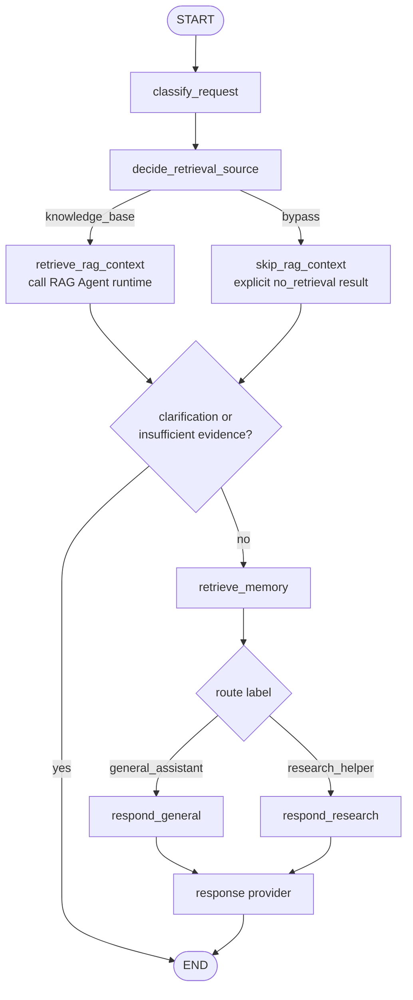
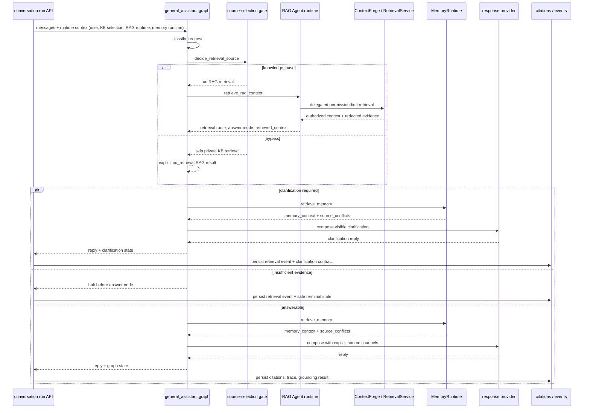

# general_assistant 에이전트

한국어 | [English](./README.en.md)

`general_assistant`는 이 저장소의 기본 LangGraph assistant/controller입니다. 사용자의 메시지를 route label로 분류한 뒤, private knowledge-base retrieval을 실행할지 먼저 결정하고, 필요하면 graph 안에서 RAG Agent를 호출해 authorized document context를 검색하고, opt-in memory를 recall한 다음, 선택된 response node가 공통 response provider로 답변을 구성합니다.

## 현재 역할

- `build_graph()`는 conversation run이 사용하는 retrieval-enabled product graph입니다.
- `build_legacy_chat_graph()`는 FastAPI legacy `/assistant/chat`와 터미널 CLI가 사용하는 no-KB graph입니다.
- Product conversation run에서는 top-level controller처럼 동작하며 `decide_retrieval_source`를 거친 뒤 필요할 때 `retrieve_rag_context` node로 `rag_agent` retrieval runtime을 호출합니다.
- 라우트 라벨은 응답 방식을 고르는 메타데이터입니다.
- 라우트 라벨은 `AgentCapability` metadata와 연결되어 사용 가능한 tool, data source, side effect를 정직하게 전달합니다.
- 현재 라우트별 response node는 별도의 hosted 전문 에이전트 실행을 의미하지 않습니다.
- OpenAI 응답 생성은 `langchain-openai`의 `ChatOpenAI`를 통해 수행합니다.
- 항상 포함되는 responder system prompt는 어시스턴트를 `https://my-agents.dev`의
  `my-agents` 내부 어시스턴트로 식별합니다. 바뀔 수 있는 제품 정보는 이 정체성
  prompt에 고정하거나 추측하지 않고, 권한이 확인된 context에서 가져옵니다.
- deterministic 모드는 테스트와 오프라인 smoke check를 위해 유지합니다.

## 파일 구조

| 파일 | 책임 |
| --- | --- |
| `graph.py` | LangGraph `StateGraph`, RAG/memory/response 노드, 조건부 라우팅, graph state 정의 |
| `classifier.py` | LangChain messages를 읽고 결정론적 `RouteDecision` 생성 |
| `retrieval_gate.py` | Private KB retrieval을 실행할지, general/web 답변으로 bypass할지 결정하는 얇은 deterministic/OpenAI source-selection gate |
| `rag_retrieval.py` | graph-owned RAG Agent invocation node; RAG 결과를 assistant state로 변환하고 halt 여부를 결정 |
| `memory_recall.py` | graph-owned memory recall node helper와 source-conflict 감지 |
| `context.py` | Product DB conversation message, authorized document context, stored memory context, material source conflict를 명시적인 provider source context로 조립 |
| `responders.py` | deterministic/OpenAI response provider, OpenAI 호출 경계, 향후 hosted tool policy 위치 |
| `__init__.py` | 패키지 경계 |

## 그래프 흐름

## Route label 의미

| 라벨 | 현재 의미 |
| --- | --- |
| `general_assistant` | 일반 요청, 정리, 학습/계획/커리어 도움, 다음 단계 제안 |
| `research_helper` | 리서치 질문, 자료 탐색, 출처 중심 답변 방향 |

## Capability metadata

`my_agents/agents/capabilities.py`는 route capability name, purpose, tool, data source, side effect를 기록합니다. 그래프는 classification 뒤에 이 metadata를 붙이고, `responders.py`는 deterministic reply와 OpenAI prompt에 이를 포함합니다.

이 구조는 API를 정직하게 유지합니다. OpenAI mode에서는 hosted `web_search`를 `general_assistant`와 `research_helper` 모두에 노출할 수 있지만, assistant가 별도 task database나 외부 project-management tool side effect를 주장하지는 않아야 합니다.

## Product service layer와의 관계

`general_assistant` 폴더는 graph/classifier/RAG invocation/memory recall/responder 경계를 소유합니다. Auth, group/document permission, server-owned conversation, knowledge ingestion, source selection, citation, agent event persistence는 `my_agents/api/`, `my_agents/knowledge/`, `my_agents/conversations/` 같은 service layer에서 소유합니다.

제품용 conversation run은 DB-backed `SqlAlchemyRagAgentRuntime`과 resolved `KnowledgeBaseSelectionContext`를 LangGraph runtime context로 전달합니다. `general_assistant`는 답변을 쓰기 전에 source-selection gate를 실행합니다. OpenAI mode에서는 이 gate가 얇은 LLM decision을 사용할 수 있으므로 “저장 문서를 사용해”와 “지식베이스 쓰지 말고 웹에서 찾아줘” 같은 다국어 요청을 영어 keyword list에 의존하지 않고 구분할 수 있습니다. Deterministic mode는 test와 smoke check를 위해 offline fallback을 유지합니다. Gate가 `knowledge_base`를 선택하면 graph가 RAG Agent를 호출합니다. RAG Agent는 public retrieval boundary이고, ContextForge는 내부 delegated retrieval engine입니다. Gate가 `bypass`를 선택하면 ContextForge를 건너뛰되 API/event code가 같은 contract를 유지하도록 explicit `no_retrieval` RAG result를 graph state에 남깁니다. RAG 결과가 `clarification_required`이면 graph는 memory/response composition까지 계속 진행해 assistant가 사용자에게 보이는 clarification question을 작성하고, API layer는 structured clarification contract를 함께 persist합니다. Required retrieval에 충분한 evidence가 없을 때만 graph가 answer node 전에 멈추고 safe insufficient-evidence reply를 persist합니다. 그 외에는 graph가 자체 `retrieve_memory` node를 실행한 뒤 response provider를 호출합니다.

Authorized document context에는 ambient system/project knowledge가 포함될 수 있습니다. 이는 user memory도 user-visible source도 아닌 internal retrieval context입니다. System chunk가 provider context에 들어갈 때는 snippet만 남기고, prompt는 생략된 provenance를 추론하거나 공개하지 않도록 지시합니다. Source-selection gate는 latest turn을 우선하지만 multi-turn context도 봅니다. “저장된 문서 쓰지 마”나 “업로드한 문서를 써” 같은 최신 turn의 명시적 지시는 우선하고, follow-up처럼 보이는 turn은 새로운 document/KB 의도가 없으면 최근 web/current 의도를 이어받아 private KB retrieval을 bypass할 수 있습니다. Memory node는 LangGraph `context`로 전달된 runtime-only `MemoryRuntime` adapter를 사용해 opt-in/governance filter가 적용된 active user memory를 검색하고, compact `memory_context`와 `source_conflicts`를 graph state에 기록합니다. Provider prompt 구성은 명시적인 `SourceContextBundle`을 거칩니다. 최근 Product DB conversation message, opt-in stored memory, authorized document context, material source conflict는 암묵적인 message slice가 아니라 분리된 channel로 전달됩니다. 보안 결정과 permission filter는 계속 `RetrievalService`/ContextForge/API layer에 남고, memory governance는 `my_agents/memory/`가 계속 소유합니다.

이 분리는 제품 설명에서 중요합니다. LangGraph는 assistant control flow를 보여주고, RAG Agent는 assistant-callable retrieval boundary를 보여주며, ContextForge/RetrievalService/API 레이어는 실제 제품에 필요한 auth/permission/provenance 경계를 보여줍니다. Ingestion(upload/parse/chunk/embed)은 retrieval routing과 분리된 별도 pipeline입니다.

## Conversation / source context assembly

`context.py`는 provider context 선택을 명시적으로 관리합니다. Product conversation run은 graph invocation 전에 server-owned SQL transcript를 로드하지만, provider는 prompt 구성 내부의 숨겨진 `messages[-6:]` slice에 직접 의존하지 않고 `SourceContextBundle`을 통해 제한된 최근 conversation window를 받습니다.

현재 channel은 다음과 같습니다.

| Channel | 현재 source | 비고 |
| --- | --- | --- |
| recent conversation | graph state로 전달된 Product DB transcript | Product DB가 visible transcript source of truth입니다 |
| authorized documents | graph-owned `retrieve_rag_context`가 호출한 RAG Agent runtime | Permission filter를 통과한 prompt-safe context입니다. Ambient system/project entry는 snippet만 포함하고, personal/group entry는 일반 provenance를 유지할 수 있습니다. |
| stored memory | runtime `MemoryRuntime`을 사용하는 graph-owned `retrieve_memory` node | disabled, sensitive, stale, inactive, deleted, stable-preference shape이 아닌 memory, query-irrelevant non-preference memory는 현재 Product DB-backed adapter에서 제외됩니다 |
| material conflicts | `memory_recall.py`의 graph-owned `source_conflicts` | stored memory와 충돌하면 최신 conversation을 우선하고, document-grounded claim은 authorized document를 우선합니다 |

Memory service는 이 agent folder 밖의 `my_agents/memory/`와 `my_agents/api/memories.py`에 있습니다. Public memory write는 client가 주장하는 provenance ID를 받지 않으며, service-owned path가 document-derived memory를 만들 때 provenance를 제공해야 합니다. Agent graph는 recall orchestration을 소유하지만 persistence/governance는 `MemoryRuntime` 뒤에 유지합니다. Graph state는 untrusted JSON prompt data로 직렬화된 active memory context와 conflict metadata만 받습니다. Replay/regeneration은 historical memory content가 아니라 현재 active memory context를 사용합니다. Completed/failed run에는 내부 audit용 redacted memory-source snapshot을 남길 수 있지만, frontend-visible run event에는 memory count/category/provenance type만 노출합니다.

자세한 LangGraph-native memory migration 내용은 [`docs/product-chat-service/ko/19-langgraph-native-memory-migration.md`](../../../docs/product-chat-service/ko/19-langgraph-native-memory-migration.md)를 봅니다. 선택적으로 켜는 production graph는 이제 `run_id`를 thread boundary로 쓰는 PostgresSaver와, governance 검증을 거치는 memory-search projection인 PostgresStore로 compile됩니다. Checkpoint는 document selection을 기다리는 동안 제한된 serializable execution state만 보관하고, Product DB는 transcript/run/citation/permission/memory governance source of truth로 유지됩니다.

Document-selection HITL을 켜면 `clarification_required`가 `prepare_document_selection -> request_document_selection`으로 이어집니다. Interrupt에는 안전한 document metadata만 담습니다. Resume은 정확한 document ID를 받아 현재 권한을 다시 확인한 뒤 selected-document retrieval을 실행하고 기존 memory/response node로 진행합니다. Runtime DB session, provider client, ORM model, document-workspace adapter는 checkpoint에 넣지 않습니다.

Public waiting payload와 typed resume answer는 [`docs/product-chat-service/ko/27-agent-frontend-interaction-contract.md`](../../../docs/product-chat-service/ko/27-agent-frontend-interaction-contract.md)의 versioned protocol-neutral 계약을 따릅니다. 앞으로 사용자 입력이 필요한 state도 이 semantic interaction boundary로 추가하고, graph node가 frontend component나 layout을 지정해서는 안 됩니다.

## OpenAI hosted tools를 추가할 위치

OpenAI Responses API의 `web_search` 같은 일반 답변 built-in tool은 **그래프 노드가 아니라 `responders.py`의 OpenAI provider 경계**에 둡니다. 단, 임시 파일이 선택된 run은 `document_workspace_runtime`을 LangGraph runtime context로 받아 마지막 응답 node에서 격리된 document workspace adapter를 호출합니다. 이 adapter는 `ChatOpenAI`가 아직 노출하지 않는 Files, Containers, Hosted Shell, Skills API 때문에 필요한 의도적인 예외입니다.

같은 runtime context는 run에 저장된 effective `reasoning_mode`와 `reasoning_effort`도 마지막 response node로 전달합니다. 일반 답변은 `ChatOpenAI.invoke(..., reasoning={...})`, attachment 답변은 document-workspace Responses API adapter에 같은 값을 전달합니다. Source-selection gate는 비용과 routing 안정성을 위해 client override를 받지 않고 server default effort와 `standard` mode를 사용합니다. Guest override 차단과 GPT-5.6 `pro` 검증은 graph 진입 전 API boundary에서 수행합니다.

이유:

- `graph.py`는 라우트 결정, RAG/memory orchestration, 흐름 제어만 담당하게 유지할 수 있습니다.
- `respond_general`, `respond_research` 같은 노드는 provider 세부사항을 몰라도 됩니다.
- OpenAI 전용 기능은 `OpenAIResponseProvider` 안에 모아 provider 교체/테스트가 쉬워집니다.
- route-specific tool policy를 한 곳에서 테스트할 수 있습니다.
- 첨부가 있는 turn은 명시적으로 선택된 KB가 없으면 private KB retrieval을 우회하고 임시 첨부를 source로 사용합니다. 명시적 KB 선택이 있으면 기존 permission-first RAG context도 함께 전달합니다.

## Web search policy

OpenAI mode는 두 response route 모두에서 provider boundary에 hosted `web_search`를 bind합니다. General-assistant 요청이 웹을 필요로 하는지는 앱의 언어별 keyword heuristic으로 판단하지 않고, tool이 노출된 뒤 model이 multilingual 및 multi-turn intent를 판단하게 둡니다.

| 라우트 | web search 기본 정책 |
| --- | --- |
| `general_assistant` | Tool은 사용 가능하지만, provider prompt는 최신/최근/웹 기반/출처 기반/외부 검증 정보가 필요할 때와 같은 source need를 이어받은 follow-up일 때만 호출하라고 지시 |
| `research_helper` | 기본적으로 tool 사용 가능 |

현재 tool binding은 API 응답 스키마를 바꾸지 않습니다. Citation과 tool metadata는 실제 응답 형태를 확인한 뒤 `ChatResponse`에 추가하는 것이 안전합니다.

## 변경 시 확인할 것

- 그래프 흐름을 바꾸면 `tests/test_graph.py`를 확인합니다.
- RAG retrieval boundary를 바꾸면 `tests/test_conversations_api.py`, `tests/test_permission_aware_rag.py`, `tests/test_rag_agent_contracts.py`를 확인합니다.
- 라우팅 키워드를 바꾸면 `tests/test_classifier.py`와 대표 prompt fixture를 확인합니다.
- response provider 동작을 바꾸면 `tests/test_responders.py`를 확인합니다.
- OpenAI mode는 실제 API 키 없이 테스트 가능해야 합니다.
- README 변경 시 이 파일과 [`README.en.md`](./README.en.md)를 함께 갱신합니다.
