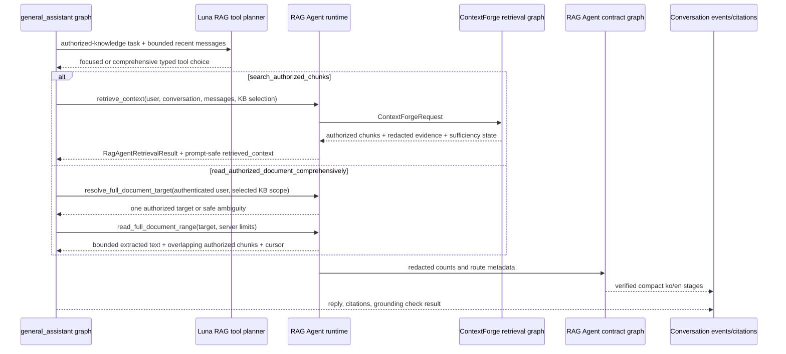

# RAG Agent workflow

[한국어](./README.md) | English

`rag_agent` is the production-facing RAG Agent boundary that `general_assistant` calls for document-grounded conversation runs. In this codebase, **agentic RAG** names the broader pattern/milestone, while **RAG Agent** names the concrete retrieval subgraph/tool contract available to the assistant. The RAG Agent now owns the public boundary and delegates the low-level retrieval implementation to ContextForge, the permission-first retrieval engine.

## Current role

- Provides the runtime-only `RagAgentRuntime` contract invoked by the `retrieve_rag_context` node inside the `general_assistant` graph.
- After the General Assistant delegates to private knowledge, uses a fixed `gpt-5.6-luna` standard/low planner to choose exactly one typed retrieval operation: `search_authorized_chunks` or `read_authorized_document_comprehensively`. The same strict tool call returns an optional bounded user-facing approach summary, kept separate from the trusted tool choice.
- Keeps deterministic mode, invalid-output handling, and provider failures on a credential-free semantic fallback with the same two-tool contract.
- Returns `RagAgentRetrievalResult` with route, answer mode, authorized chunks, redacted retrieval evidence, and retry/sufficiency state.
- Provides typed `resolve_full_document_target` and `read_full_document_range` runtime methods for explicit comprehensive-document tasks without making raw text part of the checkpointed RAG result.
- Delegates to ContextForge for query planning, source-boundary handoff, authorized candidate search, reranking, and context packing.
- Keeps the Query Cartographer, Source Warden, Candidate Scouts, Evidence Judge, Context Curator, Assistant Graph, and Answer Composer stage contract plus the compact trace graph (`plan_workflow -> verify_workflow`).
- Verifies stage order, bilingual copy, public RAG Agent ownership, and redacted evidence keys.
- Does not directly own database authorization policy, ingestion, raw SQL tuning, provider-secret handling, or final-answer persistence.

## File structure

| File | Responsibility |
| --- | --- |
| `contracts.py` | Dataclass contracts, stage identifiers, public/internal role names, and expected stage order. |
| `retrieval.py` | Public RAG Agent runtime called by `general_assistant`; wraps focused ContextForge retrieval and permission-first full-document target/range reads. |
| `graph.py` | Dedicated LangGraph form that plans and verifies the RAG Agent trace/grounding contract. |
| `planner.py` | Deterministic stage planner for compact run traces. |
| `tool_selection.py` | Luna-backed focused/comprehensive retrieval-tool selection plus deterministic fallback; never executes authorization or returns raw document text. |
| `verifier.py` | Deterministic safety/shape and grounding-boundary verifier. |
| `README.md` / `README.en.md` | Korean/English behavior and boundary docs. |
| `CHANGELOG.md` | Why this agent folder changed. |

## Graph or execution flow

## Route/tool/state meaning

- The public retrieval-agent name is `RAG Agent`.
- The internal delegated implementation name is `ContextForge`.
- `gpt-5.6-luna` in standard mode with low reasoning effort owns semantic tool choice plus a bounded display explanation. The explanation is model-authored, not a verified execution record. Luna cannot select trusted document IDs, authorize access, change server budgets, or compose the final answer. User-selected reasoning controls apply to the final response model, not this internal planner.
- `search_authorized_chunks` means focused ContextForge retrieval. `read_authorized_document_comprehensively` means bounded target resolution/range reading for explicit or clearly implied exhaustive intent. Weak focused evidence alone must not escalate to the comprehensive tool.
- `rag_retrieval_result` is a graph runtime object; do not expose it directly to frontend clients or checkpoints.
- `retrieved_context` is already-authorized, prompt-safe compact context. Ambient system
  entries contain only answerable snippet text; their KB/document/chunk/title/filename/page
  and retrieval-source provenance is omitted before provider invocation.
- `FullDocumentTargetResolution` contains only safe target metadata and an option count. `FullDocumentReadResult` carries one half-open extracted-text range, offsets, total characters, an internal decimal cursor, a complete flag, and overlapping authorized chunks.
- Target resolution and every range read reuse the user-selectable permission boundary: owner/group/explicit-document access can qualify, while ambient system KB documents and hidden staging documents cannot.
- Overlapping chunks are all validated against the current extracted text. Up to 2,000 may be scanned; when more than 100 are valid, the runtime keeps 100 evenly distributed provenance chunks, including the first and last, so citation volume stays bounded without discarding whole-document evidence. Those retained chunks enter the internal grounding/citation path with `source="full_document"` and score `1.0`. Public citation responses keep their existing schema and do not expose that internal source/score pair.
- Product responses distinguish consultation from attribution. `consulted_sources` is the complete user-visible source set admitted to answer composition; `citations` is the conservative post-hoc answer-supported subset. Both arrays serialize the same persisted evidence rows, so an overlapping item has the identical `id` and `chunk_id`. Legacy runs use `consulted_sources=null`; newly attributed runs use a list, including `[]` when no source was consulted or matched.
- Chunk-level rows remain the persistence/audit contract, but the public shape also includes nullable `document_title` and `knowledge_base_name`. Product UIs should group rows by `document_id`, display one document entry with its knowledge-base name and optional unique page numbers, and keep chunk IDs/snippets out of ordinary citation details.
- The default complete-read threshold is 24,000 characters. Larger documents currently return only the first 12,000-character range to the graph path; continuation cursors exist at the runtime seam but automatic multi-range traversal/synthesis is not implemented.
- `clarification_required` and required retrieval with insufficient evidence stop the `general_assistant` graph before answer nodes.
- `completed`, `skipped`, and `waiting` are frontend trace states, not hidden chain-of-thought.
- The `agent_trace` stage IDs, event types, statuses, bilingual copy, and evidence fields are a stable typed API contract.
- Trace descriptions use semantic display copy; deployment-specific values such as the active reranker remain in structured evidence instead of being interpolated into user-facing prose.
- Every non-skipped stage also emits a version-1 `operational_summary` discriminated by a closed semantic message key. Each key has its own allowlisted parameter schema; skipped stages emit none, and a waiting answer uses `agent_trace.clarification_requested`. Frontends localize these keys rather than trusting arbitrary backend prose.
- Evidence is limited to allowlisted routes/modes, counts, bounded labels, and booleans; raw prompts, snippets, provider errors, and message content are rejected by both the verifier and API response serializer.

## Capability or boundary metadata

This package is the production RAG Agent boundary. It exposes a graph/tool seam for retrieval and now performs one bounded Luna tool-choice call in OpenAI mode, while hard authorization and low-level candidate SQL stay in ContextForge/RetrievalService. It is not an autonomous hosted agent service and has no external side effects; provider credentials remain application settings and are never persisted in agent state.

## Relationship to service layers

Conversation APIs pass user/conversation/knowledge-base selection plus a DB-backed `SqlAlchemyRagAgentRuntime` through LangGraph runtime context. After the General Assistant's source gate delegates to private knowledge, the RAG-owned planner chooses the retrieval tool; `general_assistant` routes that compact choice and invokes the RAG runtime. The API layer reads retrieval results from graph state to persist consulted evidence, conservative answer-use attribution, `retrieval_completed`, grounding events, and optional `document_coverage`/`full_document_read` metadata. System evidence rows remain internal audit data; public serializers remove their provenance. Raw full-document text is consumed only inside graph nodes and is excluded from checkpoints, events, application traces, and API coverage objects. Auth, broad source selection, ingestion, persistence, evidence rows, and final Sol response composition remain outside the RAG Agent.

## Extension guidance

If a new retrieval tool or deeper graph node is needed, add it first to the public `rag_agent.retrieval.RagAgentRuntime` seam. Keep ContextForge internals as the permission-first focused-retrieval engine, and keep full-document authorization/range reads behind the same runtime boundary. Expose only compact/redacted evidence that the verifier can allow. Do not leak provider secrets, raw prompt transcripts, unauthorized candidates, raw full-document text, or raw ContextForge graph state out of this package.

## Change checklist

- Update `tests/test_conversations_api.py` and `tests/test_permission_aware_rag.py` for retrieval-boundary changes.
- Update `tests/test_rag_agent_contracts.py` for contract/trace changes.
- Update `tests/test_rag_agent_tool_selection.py` for Luna model policy, tool descriptions, multilingual intent, and deterministic/provider-failure fallback changes.
- Update `tests/test_full_document_retrieval.py` for full-document resolution, range, authorization, citation, replay, and checkpoint-safety changes.
- Run `tests/test_context_forge_contracts.py`, `tests/test_context_forge_reranking.py`, and `tests/test_context_forge_structured_retrieval.py` when the delegated ContextForge path changes.
- Keep this README pair and `CHANGELOG.md` aligned.
