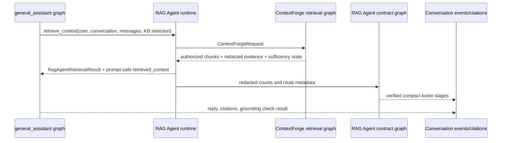

# RAG Agent workflow

[한국어](./README.md) | English

`rag_agent` is the production-facing RAG Agent boundary that `general_assistant` calls for document-grounded conversation runs. In this codebase, **agentic RAG** names the broader pattern/milestone, while **RAG Agent** names the concrete retrieval subgraph/tool contract available to the assistant. The RAG Agent now owns the public boundary and delegates the low-level retrieval implementation to ContextForge, the permission-first retrieval engine.

## Current role

- Provides the runtime-only `RagAgentRuntime` contract invoked by the `retrieve_rag_context` node inside the `general_assistant` graph.
- Returns `RagAgentRetrievalResult` with route, answer mode, authorized chunks, redacted retrieval evidence, and retry/sufficiency state.
- Delegates to ContextForge for query planning, source-boundary handoff, authorized candidate search, reranking, and context packing.
- Keeps the Query Cartographer, Source Warden, Candidate Scouts, Evidence Judge, Context Curator, Assistant Graph, and Answer Composer stage contract plus the compact trace graph (`plan_workflow -> verify_workflow`).
- Verifies stage order, bilingual copy, public RAG Agent ownership, and redacted evidence keys.
- Does not directly own database authorization policy, ingestion, raw SQL tuning, provider-secret handling, or final-answer persistence.

## File structure

| File | Responsibility |
| --- | --- |
| `contracts.py` | Dataclass contracts, stage identifiers, public/internal role names, and expected stage order. |
| `retrieval.py` | Public RAG Agent retrieval runtime called by `general_assistant`; wraps the delegated ContextForge implementation. |
| `graph.py` | Dedicated LangGraph form that plans and verifies the RAG Agent trace/grounding contract. |
| `planner.py` | Deterministic stage planner for compact run traces. |
| `verifier.py` | Deterministic safety/shape and grounding-boundary verifier. |
| `README.md` / `README.en.md` | Korean/English behavior and boundary docs. |
| `CHANGELOG.md` | Why this agent folder changed. |

## Graph or execution flow

## Route/tool/state meaning

- The public retrieval-agent name is `RAG Agent`.
- The internal delegated implementation name is `ContextForge`.
- `rag_retrieval_result` is a graph runtime object; do not expose it directly to frontend clients or checkpoints.
- `retrieved_context` is already-authorized, prompt-safe compact context.
- `clarification_required` and required retrieval with insufficient evidence stop the `general_assistant` graph before answer nodes.
- `completed`, `skipped`, and `waiting` are frontend trace states, not hidden chain-of-thought.
- The `agent_trace` stage IDs, event types, statuses, bilingual copy, and evidence fields are a stable typed API contract.
- Evidence is limited to allowlisted routes/modes, counts, bounded labels, and booleans; raw prompts, snippets, provider errors, and message content are rejected by both the verifier and API response serializer.

## Capability or boundary metadata

This package is the production RAG Agent boundary. It exposes a graph/tool seam for retrieval, while hard authorization and low-level candidate SQL stay in ContextForge/RetrievalService. It is not an autonomous hosted agent runtime and has no provider credentials or external side effects.

## Relationship to service layers

Conversation APIs pass user/conversation/knowledge-base selection plus a DB-backed `SqlAlchemyRagAgentRuntime` through LangGraph runtime context. `general_assistant` invokes the RAG Agent inside the graph, and the API layer reads retrieval results from graph state to persist `retrieval_completed`, citations, and grounding events. Auth, source selection, ingestion, persistence, citation rows, and provider execution remain in service modules.

## Extension guidance

If a new retrieval tool or deeper graph node is needed, add it first to the public `rag_agent.retrieval.RagAgentRuntime` seam. Keep ContextForge internals as the permission-first retrieval engine, and expose only compact/redacted evidence that the verifier can allow. Do not leak provider secrets, raw prompt transcripts, unauthorized candidates, or raw ContextForge graph state out of this package.

## Change checklist

- Update `tests/test_conversations_api.py` and `tests/test_permission_aware_rag.py` for retrieval-boundary changes.
- Update `tests/test_rag_agent_contracts.py` for contract/trace changes.
- Run `tests/test_context_forge_contracts.py`, `tests/test_context_forge_reranking.py`, and `tests/test_context_forge_structured_retrieval.py` when the delegated ContextForge path changes.
- Keep this README pair and `CHANGELOG.md` aligned.
