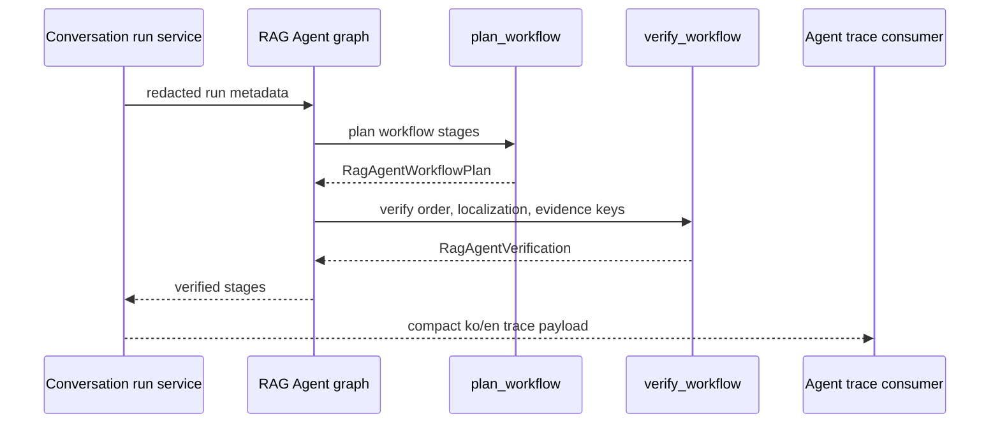

# RAG Agent workflow

[한국어](./README.md) | English

`rag_agent` defines the production-facing RAG Agent contract for document-grounded conversation runs. In this codebase, **agentic RAG** names the broader pattern/milestone, while **RAG Agent** names this concrete agent-facing contract. This package does not replace ContextForge; it names ContextForge as the Retrieval Agent and provides deterministic planning/verification for compact frontend trace state.

## Current role

- Defines typed workflow stages for Query Cartographer, Source Warden, Candidate Scouts, Evidence Judge, Context Curator, Assistant Graph, and Answer Composer.
- Exposes a dedicated LangGraph form (`plan_workflow -> verify_workflow`) for this contract surface.
- Plans stage status from already-redacted service-layer counts.
- Verifies stage order, bilingual copy, ContextForge retrieval ownership, and redacted evidence keys.
- Does not perform database retrieval, authorization, ingestion, reranking, LLM calls, or provider-side reasoning.

## File structure

| File | Responsibility |
| --- | --- |
| `contracts.py` | Dataclass contracts, stage identifiers, role names, and expected stage order. |
| `graph.py` | Dedicated LangGraph form that plans and verifies the RAG Agent contract. |
| `planner.py` | Deterministic stage planner for compact run traces. |
| `verifier.py` | Deterministic safety/shape verifier for trace contracts. |
| `README.md` / `README.en.md` | Korean/English behavior and boundary docs. |
| `CHANGELOG.md` | Why this agent folder changed. |

## Graph or execution flow

## Route/tool/state meaning

- Retrieval-agent stages are owned by `ContextForge`.
- Assistant stages are owned by `GeneralAssistantGraph`.
- `completed`, `skipped`, and `waiting` are frontend trace states, not hidden chain-of-thought.
- Evidence values are counts, labels, and booleans only; raw prompts, snippets, provider errors, and message content are rejected by the verifier.

## Capability or boundary metadata

This is a production contract layer with deterministic behavior and a dedicated LangGraph shape. It is one component of the agentic RAG workflow, not a synonym for the whole pattern. It is not an autonomous agent runtime and has no provider credentials or external side effects.

## Relationship to service layers

API and conversation services pass already-authorized counts and route metadata into this package. Authorization, source selection, retrieval SQL, ingestion, persistence, citations, and provider execution stay in their existing service modules.

## Extension guidance

Add new workflow stages here only when the API can expose them with redacted evidence and tests. Do not move ContextForge retrieval internals, permissions, or provider-secret handling into this package.

## Change checklist

- Update `tests/test_rag_agent_contracts.py` for contract changes.
- Run conversation API tests when trace payloads change.
- Keep this README pair and `CHANGELOG.md` aligned.
