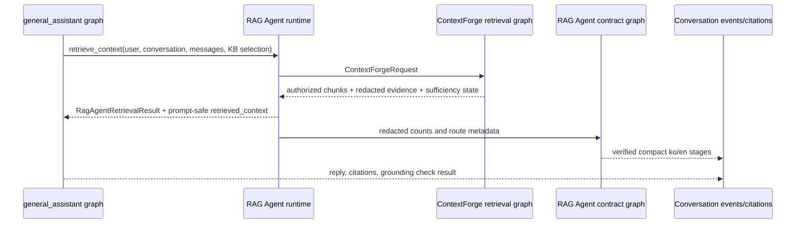

# RAG Agent workflow

[English](./README.en.md) | 한국어

`rag_agent`는 문서 기반 conversation run에서 `general_assistant`가 호출하는 production-facing RAG Agent boundary입니다. 이 코드베이스에서 **agentic RAG**는 더 넓은 architecture pattern / milestone을 뜻하고, **RAG Agent**는 그 안에서 assistant가 사용할 수 있는 구체적인 retrieval subgraph/tool contract를 뜻합니다. 현재 RAG Agent는 공개 boundary를 소유하고, low-level 검색 구현은 permission-first engine인 ContextForge에 위임합니다.

## 현재 역할

- `general_assistant` graph 안의 `retrieve_rag_context` node가 호출하는 runtime-only `RagAgentRuntime` contract를 제공합니다.
- `RagAgentRetrievalResult`로 route, answer mode, authorized chunks, redacted retrieval evidence, retry/sufficiency state를 반환합니다.
- ContextForge를 내부 retrieval implementation으로 위임 호출해 query planning, source-boundary handoff, authorized candidate search, reranking, context packing을 수행합니다.
- Query Cartographer, Source Warden, Candidate Scouts, Evidence Judge, Context Curator, Assistant Graph, Answer Composer 단계 contract와 compact trace graph(`plan_workflow -> verify_workflow`)를 유지합니다.
- stage 순서, 한/영 copy, public RAG Agent ownership, redacted evidence key를 검증합니다.
- database authorization policy, ingestion, raw SQL tuning, provider secret handling, final answer persistence는 직접 소유하지 않습니다.

## 파일 구조

| 파일 | 책임 |
| --- | --- |
| `contracts.py` | dataclass contract, stage identifier, public/internal role name, expected stage order. |
| `retrieval.py` | `general_assistant`가 호출하는 public RAG Agent retrieval runtime; ContextForge delegated implementation을 감쌉니다. |
| `graph.py` | RAG Agent trace/grounding contract를 계획하고 검증하는 전용 LangGraph form. |
| `planner.py` | compact run trace를 위한 deterministic stage planner. |
| `verifier.py` | trace contract의 shape/safety와 grounding boundary를 검증하는 deterministic verifier. |
| `README.md` / `README.en.md` | 한국어/영어 behavior 및 boundary 문서. |
| `CHANGELOG.md` | agent folder 변경 이유 기록. |

## Graph 또는 실행 흐름

## Route/tool/state 의미

- Public retrieval-agent 이름은 `RAG Agent`입니다.
- Internal delegated implementation 이름은 `ContextForge`입니다.
- `rag_retrieval_result`는 graph runtime object이며 그대로 frontend나 checkpoint에 노출하지 않습니다.
- `retrieved_context`는 이미 권한 확인이 끝난 prompt-safe compact context입니다. Ambient
  system entry는 답변에 쓸 snippet만 포함하며, KB/document/chunk/title/filename/page와
  retrieval-source provenance는 provider invocation 전에 생략합니다.
- `clarification_required` 또는 required retrieval의 insufficient evidence는 `general_assistant` graph를 answer node 전에 멈추게 합니다.
- `completed`, `skipped`, `waiting`은 frontend trace state이며 hidden chain-of-thought가 아닙니다.
- `agent_trace`의 stage ID, event type, status, 한/영 copy, evidence field는 stable typed API contract입니다.
- Evidence는 allowlist된 route/mode, count, bounded label, boolean 중심입니다. Raw prompt, snippet, provider error, message content는 verifier와 API response serializer가 거부합니다.

## Capability / boundary metadata

이 패키지는 production RAG Agent boundary입니다. Retrieval을 호출할 수 있는 graph/tool seam을 제공하지만, hard authorization과 low-level candidate SQL은 ContextForge/RetrievalService 안에 남습니다. Autonomous hosted agent runtime이 아니며 provider credential이나 external side effect가 없습니다.

## Service layer와의 관계

Conversation API는 user/conversation/knowledge-base selection과 DB-backed `SqlAlchemyRagAgentRuntime`을 LangGraph runtime context로 전달합니다. `general_assistant`가 graph 안에서 RAG Agent를 호출하고, API layer는 graph state에서 retrieval result를 읽어 `retrieval_completed`, citation, grounding event를 persist합니다. System citation row는 internal audit data로 유지하고 public run/event/citation serializer에서는 provenance를 제거합니다. Auth, source selection, ingestion, persistence, citation rows, provider execution은 계속 service module에 남습니다.

## 확장 가이드

새 retrieval tool이나 deeper graph node가 필요하면 public seam은 먼저 `rag_agent.retrieval.RagAgentRuntime`에 추가합니다. ContextForge internals는 permission-first retrieval engine으로 유지하고, verifier가 허용할 수 있는 compact/redacted evidence만 trace surface로 올립니다. Provider secret, raw prompt transcript, unauthorized candidate, raw ContextForge graph state를 이 패키지 밖으로 노출하지 마세요.

## 변경 체크리스트

- Retrieval boundary 변경 시 `tests/test_conversations_api.py`와 `tests/test_permission_aware_rag.py`를 업데이트합니다.
- Contract/trace 변경 시 `tests/test_rag_agent_contracts.py`를 업데이트합니다.
- ContextForge 위임 경로 변경 시 `tests/test_context_forge_contracts.py`, `tests/test_context_forge_reranking.py`, `tests/test_context_forge_structured_retrieval.py`를 실행합니다.
- README pair와 `CHANGELOG.md`를 함께 유지합니다.
