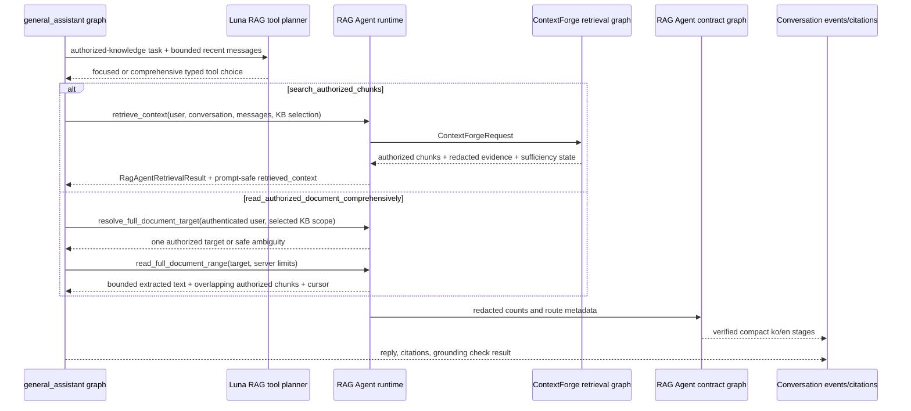

# RAG Agent workflow

[English](./README.en.md) | 한국어

`rag_agent`는 문서 기반 conversation run에서 `general_assistant`가 호출하는 production-facing RAG Agent boundary입니다. 이 코드베이스에서 **agentic RAG**는 더 넓은 architecture pattern / milestone을 뜻하고, **RAG Agent**는 그 안에서 assistant가 사용할 수 있는 구체적인 retrieval subgraph/tool contract를 뜻합니다. 현재 RAG Agent는 공개 boundary를 소유하고, low-level 검색 구현은 permission-first engine인 ContextForge에 위임합니다.

## 현재 역할

- `general_assistant` graph 안의 `retrieve_rag_context` node가 호출하는 runtime-only `RagAgentRuntime` contract를 제공합니다.
- General Assistant가 private knowledge로 위임한 뒤 고정된 `gpt-5.6-luna` standard/low planner가 `search_authorized_chunks`와 `read_authorized_document_comprehensively` 중 typed retrieval operation 하나를 선택합니다.
- Deterministic mode, invalid output, provider failure는 같은 two-tool contract의 credential-free semantic fallback을 사용합니다.
- `RagAgentRetrievalResult`로 route, answer mode, authorized chunks, redacted retrieval evidence, retry/sufficiency state를 반환합니다.
- 명시적인 comprehensive-document task를 위해 typed `resolve_full_document_target`, `read_full_document_range` runtime method를 제공하되 raw text는 checkpoint되는 RAG result에 넣지 않습니다.
- ContextForge를 내부 retrieval implementation으로 위임 호출해 query planning, source-boundary handoff, authorized candidate search, reranking, context packing을 수행합니다.
- Query Cartographer, Source Warden, Candidate Scouts, Evidence Judge, Context Curator, Assistant Graph, Answer Composer 단계 contract와 compact trace graph(`plan_workflow -> verify_workflow`)를 유지합니다.
- stage 순서, 한/영 copy, public RAG Agent ownership, redacted evidence key를 검증합니다.
- database authorization policy, ingestion, raw SQL tuning, provider secret handling, final answer persistence는 직접 소유하지 않습니다.

## 파일 구조

| 파일 | 책임 |
| --- | --- |
| `contracts.py` | dataclass contract, stage identifier, public/internal role name, expected stage order. |
| `retrieval.py` | `general_assistant`가 호출하는 public RAG Agent runtime; focused ContextForge retrieval과 permission-first full-document target/range read를 감쌉니다. |
| `graph.py` | RAG Agent trace/grounding contract를 계획하고 검증하는 전용 LangGraph form. |
| `planner.py` | compact run trace를 위한 deterministic stage planner. |
| `tool_selection.py` | Luna 기반 focused/comprehensive retrieval-tool 선택과 deterministic fallback. Authorization을 실행하거나 raw document text를 반환하지 않습니다. |
| `verifier.py` | trace contract의 shape/safety와 grounding boundary를 검증하는 deterministic verifier. |
| `README.md` / `README.en.md` | 한국어/영어 behavior 및 boundary 문서. |
| `CHANGELOG.md` | agent folder 변경 이유 기록. |

## Graph 또는 실행 흐름

## Route/tool/state 의미

- Public retrieval-agent 이름은 `RAG Agent`입니다.
- Internal delegated implementation 이름은 `ContextForge`입니다.
- Standard mode / low reasoning effort의 `gpt-5.6-luna`는 semantic tool choice만 소유합니다. Trusted document ID, authorization, server budget, final answer를 결정하지 않으며 user reasoning control은 internal planner가 아니라 final response model에 적용됩니다.
- `search_authorized_chunks`는 focused ContextForge retrieval이고 `read_authorized_document_comprehensively`는 explicit 또는 의미상 분명한 exhaustive intent를 위한 bounded target/range read입니다. Focused evidence가 약하다는 이유만으로 comprehensive tool로 승격하지 않습니다.
- `rag_retrieval_result`는 graph runtime object이며 그대로 frontend나 checkpoint에 노출하지 않습니다.
- `retrieved_context`는 이미 권한 확인이 끝난 prompt-safe compact context입니다. Ambient
  system entry는 답변에 쓸 snippet만 포함하며, KB/document/chunk/title/filename/page와
  retrieval-source provenance는 provider invocation 전에 생략합니다.
- `FullDocumentTargetResolution`은 safe target metadata와 option count만 담습니다. `FullDocumentReadResult`는 half-open extracted-text range 한 개, offset, 전체 문자 수, 내부 decimal cursor, complete flag, 겹치는 authorized chunk를 담습니다.
- Target resolution과 모든 range read는 user-selectable permission boundary를 재사용합니다. Owner/group/explicit-document access는 허용될 수 있지만 ambient system KB document와 hidden staging document는 대상이 될 수 없습니다.
- 겹치는 chunk는 현재 extracted text와 모두 검증합니다. 최대 2,000개까지 scan하며, valid chunk가 100개보다 많으면 첫/마지막을 포함해 문서 범위 전체에 고르게 분산된 provenance chunk 100개만 유지합니다. 따라서 citation 양은 bounded 상태를 유지하면서 전체 문서 evidence를 버리지 않습니다. 유지된 chunk는 internal grounding/citation path에 `source="full_document"`, score `1.0`으로 들어갑니다. Public citation response는 기존 schema를 유지하며 이 내부 source/score pair를 노출하지 않습니다.
- Product response는 consultation과 attribution을 구분합니다. `consulted_sources`는 answer composition에 들어간 user-visible source 전체이고, `citations`는 답변 text가 보수적인 post-hoc selector로 지원을 확인한 subset입니다. 두 배열의 겹치는 항목은 같은 persisted evidence row를 serialize하므로 `id`와 `chunk_id`가 동일합니다. Legacy run은 `consulted_sources=null`, 새 attribution run은 source나 match가 없어도 `[]`을 반환합니다.
- Chunk-level row는 persistence/audit contract로 유지하지만 public shape에는 nullable `document_title`과 `knowledge_base_name`도 포함합니다. Product UI는 `document_id`로 row를 묶고, document 하나당 이름/knowledge-base 이름/optional unique page number만 표시하며 일반 citation 상세에서 chunk ID와 snippet을 숨겨야 합니다.
- 기본 complete-read threshold는 24,000자입니다. 큰 문서는 현재 첫 12,000자 range만 graph path에 반환합니다. Runtime seam에는 continuation cursor가 있지만 automatic multi-range traversal/synthesis는 아직 없습니다.
- `clarification_required` 또는 required retrieval의 insufficient evidence는 `general_assistant` graph를 answer node 전에 멈추게 합니다.
- `completed`, `skipped`, `waiting`은 frontend trace state이며 hidden chain-of-thought가 아닙니다.
- `agent_trace`의 stage ID, event type, status, 한/영 copy, evidence field는 stable typed API contract입니다.
- Evidence는 allowlist된 route/mode, count, bounded label, boolean 중심입니다. Raw prompt, snippet, provider error, message content는 verifier와 API response serializer가 거부합니다.

## Capability / boundary metadata

이 패키지는 production RAG Agent boundary입니다. Retrieval graph/tool seam을 제공하고 OpenAI mode에서 bounded Luna tool-choice call 한 번을 수행하지만, hard authorization과 low-level candidate SQL은 ContextForge/RetrievalService 안에 남습니다. Autonomous hosted agent service가 아니고 external side effect가 없으며 provider credential은 application setting에 머물고 agent state에 persist되지 않습니다.

## Service layer와의 관계

Conversation API는 user/conversation/knowledge-base selection과 DB-backed `SqlAlchemyRagAgentRuntime`을 LangGraph runtime context로 전달합니다. General Assistant source gate가 private knowledge로 위임한 뒤 RAG-owned planner가 retrieval tool을 고르고, `general_assistant`는 그 compact choice를 routing해 RAG runtime을 호출합니다. API layer는 graph state에서 retrieval result를 읽어 consulted evidence, 보수적인 answer-use attribution, `retrieval_completed`, grounding event, optional `document_coverage`/`full_document_read` metadata를 persist합니다. System evidence row는 internal audit data로 유지하고 public serializer에서 provenance를 제거합니다. Raw full-document text는 graph node 안에서만 소비하며 checkpoint, event, application trace, API coverage object에 넣지 않습니다. Auth, broad source selection, ingestion, persistence, evidence row, final Sol response composition은 RAG Agent 밖에 남습니다.

## 확장 가이드

새 retrieval tool이나 deeper graph node가 필요하면 public seam은 먼저 `rag_agent.retrieval.RagAgentRuntime`에 추가합니다. ContextForge internals는 permission-first focused-retrieval engine으로 유지하고 full-document authorization/range read도 같은 runtime boundary 뒤에 둡니다. Verifier가 허용할 수 있는 compact/redacted evidence만 trace surface로 올립니다. Provider secret, raw prompt transcript, unauthorized candidate, raw full-document text, raw ContextForge graph state를 이 패키지 밖으로 노출하지 마세요.

## 변경 체크리스트

- Retrieval boundary 변경 시 `tests/test_conversations_api.py`와 `tests/test_permission_aware_rag.py`를 업데이트합니다.
- Contract/trace 변경 시 `tests/test_rag_agent_contracts.py`를 업데이트합니다.
- Luna model policy, tool description, multilingual intent, deterministic/provider-failure fallback 변경 시 `tests/test_rag_agent_tool_selection.py`를 업데이트합니다.
- Full-document resolution, range, authorization, citation, replay, checkpoint safety 변경 시 `tests/test_full_document_retrieval.py`를 업데이트합니다.
- ContextForge 위임 경로 변경 시 `tests/test_context_forge_contracts.py`, `tests/test_context_forge_reranking.py`, `tests/test_context_forge_structured_retrieval.py`를 실행합니다.
- README pair와 `CHANGELOG.md`를 함께 유지합니다.
