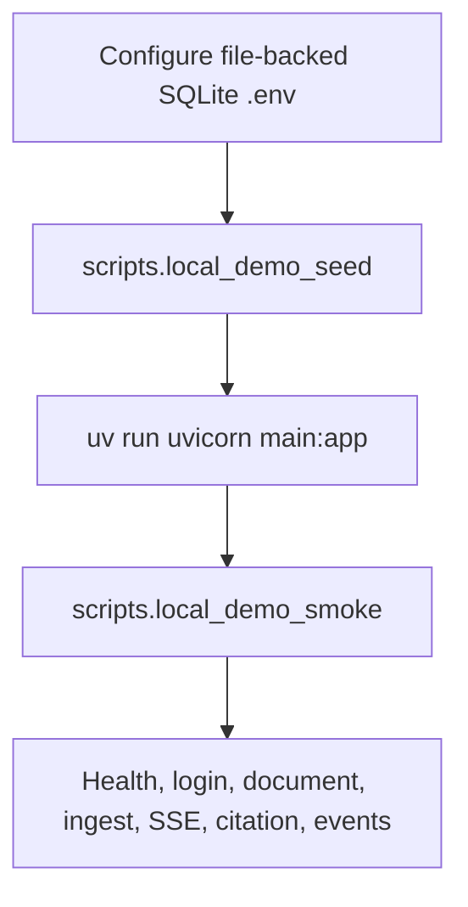

# Scripts guide

This directory contains repository-local command modules for development, demo
seeding, smoke verification, guest-demo operations, and learning-note creation.
They are Python modules, not executable-bit shell files, so run them from the
repository root with `uv run python -m scripts.<name>`.

## Quick reference

| Command module | Purpose | Typical use |
| --- | --- | --- |
| `scripts.dev_pgvector` | Start and wire a disposable local Docker pgvector/Postgres database. | Local Postgres/pgvector development and migration smoke checks. |
| `scripts.ops` | Interactive operational dispatcher that collects options and delegates to focused scripts. | Operator-friendly account/guest maintenance. |
| `scripts.migrate_database` | Check or run Alembic `upgrade head` against the selected env database. | Production/staging migration status and upgrades after backup/snapshot. |
| `scripts.langgraph_persistence` | Set up/check framework-owned Postgres tables and dry-run/apply memory Store reconciliation. | Provision or audit baseline PostgreSQL LangGraph persistence. |
| `scripts.wipe_database` | Dangerously wipe the selected SQLite/Postgres database after explicit confirmations. | Rebuild a local/staging/production database from migrations after a backup/snapshot. |
| `scripts.approve_account_signup` | Approve a pending account signup and print/send verification or mark email verified. | Manual signup approval and verification bypass. |
| `scripts.resend_account_verification` | Refresh an expired/missing verification token for an approved unverified account. | Recover signups blocked by expired verification links. |
| `scripts.reject_account_signup` | Reject a pending account signup. | Manual signup rejection. |
| `scripts.set_user_type` | Set a registered account's platform `user_type` (`normal`, `root`, `system`) with safe dry-run output. | Operator-only system knowledge manager assignment. |
| `scripts.local_demo_seed` | Seed a file-backed SQLite demo user, knowledge base, document, and extraction run. | Prepare a local demo database before starting the backend. |
| `scripts.local_demo_smoke` | Smoke-test a running backend over HTTP only. | Verify the local V1 API path after seeding and starting the server. |
| `scripts/measure_ingestion_performance.py` | Measure parse/ingest/retrieval-smoke timing in an isolated deterministic database. | Before/after ingestion optimization comparisons. |
| `scripts.backfill_kb_publication_copies` | Copy legacy approved whole-KB publications into group-owned KB copies with dry-run output. | Migrate historical publication rows after the publish-copy contract change. |
| `scripts.issue_guest_access_code` | Issue a one-time guest access code for print-first operator delivery. | Guest-code workflows. |
| `scripts.auth_approval` | Backward-compatible alias for `scripts.ops`. | Existing auth approval workflows. |
| `scripts.learning_log` | Create numbered personal learning notes and update the learning index. | Add a new `docs/learning/` note without hand-numbering files. |

## How scripts are run

Use module execution so imports resolve from the repository root:

```bash
uv run python -m scripts.local_demo_seed --help
uv run python -m scripts.local_demo_smoke --help
uv run python -m scripts.dev_pgvector --help
uv run python -m scripts.langgraph_persistence --help
uv run python scripts/measure_ingestion_performance.py --help
```

Do not run these commands from inside `scripts/`; several of them assume the
current working directory is the repository root. `measure_ingestion_performance.py`
is intentionally run by path rather than `-m` so it can be copied into ad hoc
performance worktrees without package-name assumptions.

## `scripts.langgraph_persistence`

Run `setup` and `status` for every PostgreSQL deployment after the application Alembic
migration and before serving traffic. Reconciliation is needed before enabling per-user
experimental memory or after repairing projection drift:

```bash
uv run python -m scripts.langgraph_persistence setup
uv run python -m scripts.langgraph_persistence status
uv run python -m scripts.langgraph_persistence prune-checkpoints
uv run python -m scripts.langgraph_persistence reconcile-memory
uv run python -m scripts.langgraph_persistence reconcile-memory --apply
uv run python -m scripts.langgraph_persistence reconcile-memory
```

`reconcile-memory` is a dry run unless `--apply` is present. A clean second dry run
reports zero missing, stale, and orphaned projection records. The command never prints
memory content.

If you are in another directory, either `cd` into the repo first or use
`uv --directory`:

```bash
cd /Users/heecheonpark/Git/Portfolio/my-agents
uv run python -m scripts.ops --env pgvector.production guest issue --email guest@example.com

# Equivalent from any working directory:
uv --directory /Users/heecheonpark/Git/Portfolio/my-agents \
  run python -m scripts.ops \
  --env pgvector.production \
  guest issue \
  --email guest@example.com
```

## Local demo workflow



Minimal local-demo sequence:

```bash
# 1. Configure .env with a file-backed SQLite database, for example:
# MY_AGENTS_DATABASE_URL=sqlite+pysqlite:////tmp/my-agents-local-demo.db
# MY_AGENTS_AUTO_CREATE_TABLES=true
# MY_AGENTS_RESPONSE_MODE=deterministic
# MY_AGENTS_SESSION_COOKIE_SECURE=false

# 2. Seed demo data.
uv run python -m scripts.local_demo_seed

# 3. Start the backend in another terminal.
MY_AGENTS_RESPONSE_MODE=deterministic uv run uvicorn main:app --host 127.0.0.1 --port 8000

# 4. Verify the HTTP API path.
uv run python -m scripts.local_demo_smoke --base-url http://127.0.0.1:8000
```

## `scripts.dev_pgvector`

Starts and wires a local Docker pgvector database for backend development. The
script intentionally manages only a disposable local Docker container. It does
not contact hosted providers or deploy anything.

The checked-in VS Code tasks launch this helper with the Python extension's
selected interpreter and the helper reuses that interpreter for Alembic and
pytest. This avoids depending on whether a GUI-launched VS Code process inherited
the shell path containing `uv`. Select this repository's `.venv` interpreter in
VS Code before using the `FastAPI: uvicorn main:app (local pgvector)` profile.

Common commands:

```bash
# Pull/start pgvector, create the Docker volume, and write .env.pgvector.local.
uv run python -m scripts.dev_pgvector up

# Start without pulling the image first.
uv run python -m scripts.dev_pgvector up --no-pull

# Start and immediately run Alembic migrations.
uv run python -m scripts.dev_pgvector up --migrate

# Write or refresh only the ignored local env file.
uv run python -m scripts.dev_pgvector env

# Run migrations against the local pgvector database.
uv run python -m scripts.dev_pgvector migrate

# Run the gated Postgres migration smoke test.
uv run python -m scripts.dev_pgvector test

# Stop the local container. This does not delete the Docker volume.
uv run python -m scripts.dev_pgvector down
```

Defaults:

| Setting | Default |
| --- | --- |
| Image | `pgvector/pgvector:pg17` |
| Container | `my-agents-pgvector` |
| Volume | `my_agents_pgvector_data` |
| Host/port | `127.0.0.1:5433` |
| Database/user | `my_agents` / `my_agents` |
| Generated env file | `.env.pgvector.local` |

Useful overrides are available as flags and matching environment variables:

```bash
uv run python -m scripts.dev_pgvector up \
  --container my-agents-pgvector-alt \
  --port 55432 \
  --database my_agents_dev
```

The generated `.env.pgvector.local` is git-ignored and includes local backend
wiring such as `MY_AGENTS_DATABASE_URL`, `MY_AGENTS_TEST_DATABASE_URL`, local
auth email mode, and local CORS origins. Load it manually when needed:

```bash
set -a; source .env.pgvector.local; set +a
```

## `scripts.local_demo_seed`

Seeds a local demo user, personal knowledge base, demo document, and extraction
run into a file-backed SQLite database. It refuses in-memory and non-SQLite URLs
so it cannot accidentally mutate hosted or production-like databases.

Default seeded account:

| Field | Value |
| --- | --- |
| Email | `test@test.com` |
| Password | `correct horse battery staple` |
| Knowledge base | `V1 Demo Knowledge Base` |
| Document | `V1 Product Chat Service Demo` |

Commands:

```bash
# Seed or refresh the configured file-backed SQLite demo data.
uv run python -m scripts.local_demo_seed

# Use a different local demo login.
uv run python -m scripts.local_demo_seed \
  --email demo@example.com \
  --password 'correct horse battery staple'

# Delete and recreate the configured SQLite DB before seeding.
# Stop the dev server first.
uv run python -m scripts.local_demo_seed --reset-database
```

Expected output includes the database path, demo login, user ID, knowledge base
ID, document ID, extraction-run ID, and chunk/entity counts.

## `scripts.local_demo_smoke`

Smoke-tests a running backend through HTTP only. It assumes `scripts.local_demo_seed`
has already prepared a file-backed SQLite database and the backend is running
against that same database.

What it verifies:

1. `GET /health` returns `status=ok`.
2. The seeded user can log in and restore `/auth/me`.
3. The seeded document exists and can be ingested.
4. A conversation can be created.
5. `POST /conversations/{id}/runs/stream` emits `answer_delta` events.
6. The completed run has persisted citations.
7. Run events are present and do not leak the raw prompt text.

Commands:

```bash
uv run python -m scripts.local_demo_smoke

uv run python -m scripts.local_demo_smoke \
  --base-url http://127.0.0.1:8000 \
  --email test@test.com \
  --password 'correct horse battery staple' \
  --timeout 90

uv run python -m scripts.local_demo_smoke \
  --prompt 'How does the product chat service stream answers and persist app state?'
```

A successful run prints `Local V1 API smoke passed` plus the conversation/run
IDs, answer-delta count, citation count, and event count.

## `scripts/measure_ingestion_performance.py`

Runs a local ingestion benchmark against an isolated temporary SQLite database. It
does not contact hosted services, mutate configured app data, or require OpenAI
credentials. The script forces deterministic response, embedding, and metadata modes
so before/after runs compare ingestion code-path changes instead of network variance.

Example:

```bash
uv run python scripts/measure_ingestion_performance.py \
  --scenario pdf \
  --repeat 3 \
  --repeat-units 80 \
  --output /tmp/my-agents-ingestion-pdf.json
```

The JSON output includes:

- parse, persist, ingest, retrieval-smoke, and total wall time;
- RSS before/after/delta for the benchmark process;
- parser/source metadata and page/byte/character counts;
- chunk, entity, relationship, structured-entity, and metadata-profile counts;
- retrieval hit count/top source; and
- a redacted quality signature for before/after comparison.

Use the same `--scenario`, `--repeat`, and `--repeat-units` before and after an
optimization. Treat parser/source changes, missing metadata profiles, missing retrieval
hits, or unexpected entity loss as quality guard failures unless the optimization
explicitly intends to change those contracts.

## `scripts.backfill_kb_publication_copies`

Backfills legacy approved whole-knowledge-base publication rows that still point
at a requester-owned personal KB. The script copies those legacy publications into
group-owned KBs so retrieval and future lifecycle management use the approved
group copy as the source of record.

Run a dry run first and inspect the JSON summary:

```bash
uv run python -m scripts.backfill_kb_publication_copies --dry-run
```

Apply only after the dry-run summary matches expectations and the target
environment has an appropriate backup or snapshot:

```bash
uv run python -m scripts.backfill_kb_publication_copies --apply
```

The default mode is dry-run, so omitting both flags does not mutate data.

## `scripts.ops`

Interactive operational dispatcher. It gathers options and delegates to focused
script modules such as `scripts.approve_account_signup`,
`scripts.resend_account_verification`, `scripts.reject_account_signup`, and
`scripts.issue_guest_access_code`. It also delegates database maintenance to
focused modules such as `scripts.migrate_database` and `scripts.wipe_database`. It loads
`.env.pgvector.local` by default; pass `--env pgvector.production` only when
intentionally operating on production.

Current behavior:

- `--interactive` shows numbered menus for operation, yes/no choices, and language,
  so operators can choose common paths with minimal typing. Enter `q`, `quit`, or
  `exit` at any interactive prompt to cancel gracefully. It still prompts for
  values that cannot be inferred, such as email and optional guest-code fields.
- `account approve` delegates to `scripts.approve_account_signup`.
- `account resend-verification` delegates to `scripts.resend_account_verification`.
- `account reject` delegates to `scripts.reject_account_signup`.
- `account set-user-type` delegates to `scripts.set_user_type`. This is the only
  supported role mutation path for `root`/`system` system-knowledge managers.
- `guest issue` delegates to `scripts.issue_guest_access_code`.
- `database migrate` delegates to `scripts.migrate_database`; status-only is the
  default, and `--upgrade --confirm-upgrade --database-name <name>` is required
  before Alembic applies schema changes.
- `database wipe` delegates to `scripts.wipe_database` and prints a strong destructive-operation warning before it does anything.
- Email content defaults to Korean; use `--lang en` for English.

Commands:

```bash
# Show a numbered account/guest operation menu and prompt for required values.
uv run python -m scripts.ops --interactive

# Approve a pending signup and print the verification token/link.
uv run python -m scripts.ops account approve \
  --email user@example.com

# Approve and also send the Korean verification email.
uv run python -m scripts.ops --env pgvector.production account approve \
  --email user@example.com \
  --send-email

# Approve and mark the user's email verified immediately, without issuing a link.
uv run python -m scripts.ops --env pgvector.production account approve \
  --email user@example.com \
  --mark-verified

# Resend a fresh verification token/link after an old signup verification expired.
uv run python -m scripts.ops account resend-verification \
  --email user@example.com \
  --send-email

# Reject a pending signup.
uv run python -m scripts.ops account reject \
  --email user@example.com

# Preview a root promotion without writing.
uv run python -m scripts.ops account set-user-type \
  --email user@example.com \
  --user-type root \
  --dry-run

# Promote a registered user to system-knowledge manager.
uv run python -m scripts.ops --env pgvector.production account set-user-type \
  --email user@example.com \
  --user-type system

# Issue a guest code and print it.
uv run python -m scripts.ops guest issue \
  --email guest@example.com

# Issue a guest code and also send English email copy.
uv run python -m scripts.ops --env pgvector.production guest issue \
  --email guest@example.com \
  --send-email \
  --lang en

# Check production migration status without applying schema changes.
uv run python -m scripts.ops --env pgvector.production database migrate

# Apply Alembic upgrade head after a provider snapshot/backup and exact target check.
uv run python -m scripts.ops --env pgvector.production database migrate \
  --upgrade \
  --confirm-upgrade \
  --database-name my_agents_prod \
  --allow-remote-postgres

# DANGER: print a dry-run wipe plan for the selected database.
uv run python -m scripts.ops --env pgvector.production database wipe

# DANGER: execute the wipe only after backup/snapshot and exact database-name confirmation.
uv run python -m scripts.ops --env pgvector.production database wipe \
  --execute \
  --confirm-wipe \
  --database-name my_agents_prod \
  --allow-remote-postgres
```

`scripts.auth_approval` remains a compatibility alias for the same dispatcher.

## `scripts.migrate_database`

Production-safe Alembic migration helper for the selected operator env file.

Current behavior:

- Reads `MY_AGENTS_DATABASE_URL` from the selected env file and never prints the
  full URL or password.
- Prints the selected dialect, database name, redacted target, current revision,
  and repo head revision.
- Status-only by default; no schema changes happen unless `--upgrade` is passed.
- `--upgrade` also requires `--confirm-upgrade` and an exact `--database-name`
  match. Non-local Postgres targets additionally require `--allow-remote-postgres`.
- Runs Alembic `upgrade head`, then verifies the database is at all repo heads.

Commands:

```bash
# Check the default local pgvector env target.
uv run python -m scripts.migrate_database

# Check production migration status without applying schema changes.
uv run python -m scripts.migrate_database --env pgvector.production

# Apply production migrations only after a provider snapshot/backup.
uv run python -m scripts.migrate_database \
  --env pgvector.production \
  --upgrade \
  --confirm-upgrade \
  --database-name my_agents_prod \
  --allow-remote-postgres
```

Safety notes:

- Take a Neon/provider snapshot or equivalent backup before production/staging
  upgrades.
- Stop or redeploy app/worker processes as needed so code and schema roll forward
  together.
- Confirm the printed `database_name`, `dialect`, and redacted `target` before
  using `--upgrade`.
- Use `database migrate` rather than pasting raw production URLs into shell
  history or chat.

## `scripts.wipe_database`

Dangerous database wipe helper for intentionally rebuilding an environment.

> **!!! DANGER: DATABASE WIPE PERMANENTLY DELETES ALL APP DATA AND SCHEMA IN THE SELECTED DATABASE. BACK UP THE DATABASE FIRST, STOP RUNNING APP PROCESSES, AND VERIFY THE ENV FILE AND DATABASE NAME BEFORE EXECUTING.**

Current behavior:

- Dry-run by default: prints the selected target and object count without deleting anything.
- SQLite file-backed URLs are wiped by deleting the configured database file.
- Postgres URLs are wiped by dropping and recreating the selected database's `public` schema.
- `--execute` is required to delete anything.
- `--confirm-wipe` is required with `--execute`.
- `--database-name` must exactly match the selected SQLite filename or Postgres database name.
- Non-local Postgres hosts require `--allow-remote-postgres` in addition to all other confirmations.
- The script does **not** run migrations after wiping; run `scripts.migrate_database`
  as a separate audited step.

Commands:

```bash
# Safe default: inspect the selected local pgvector database and print the wipe plan.
uv run python -m scripts.wipe_database

# Inspect a production target without deleting anything.
uv run python -m scripts.wipe_database --env pgvector.production --allow-remote-postgres

# Delete a local SQLite file-backed database after exact filename confirmation.
uv run python -m scripts.wipe_database \
  --env-file .env \
  --execute \
  --confirm-wipe \
  --database-name local-dev.sqlite3

# Delete a remote Postgres public schema after backup/snapshot and exact DB-name confirmation.
uv run python -m scripts.wipe_database \
  --env pgvector.production \
  --execute \
  --confirm-wipe \
  --database-name my_agents_prod \
  --allow-remote-postgres

# Recreate schema after a wipe.
uv run python -m scripts.migrate_database \
  --env pgvector.production \
  --upgrade \
  --confirm-upgrade \
  --database-name my_agents_prod \
  --allow-remote-postgres
```

Safety notes:

- Take a provider-level snapshot/backup before production or staging wipes.
- Stop application workers first so they do not keep using dropped tables or recreate SQLite files.
- Prefer running the dry-run command immediately before the execute command and compare `database_name`.
- Do not use this as a migration substitute when preserving data matters; use Alembic data migrations instead.

## `scripts.approve_account_signup`

Focused non-interactive script for account approval. It marks a pending registered user
approved, then either prints/sends a verification token or directly marks the email
verified with `--mark-verified`:

```bash
uv run python -m scripts.approve_account_signup \
  --email user@example.com \
  --send-email

uv run python -m scripts.approve_account_signup \
  --email user@example.com \
  --mark-verified
```

## `scripts.resend_account_verification`

Focused non-interactive script for approved accounts whose email verification
link expired or was lost. It does not approve pending accounts; use
`scripts.approve_account_signup` first for pending signups.

```bash
uv run python -m scripts.resend_account_verification \
  --email user@example.com \
  --send-email
```

## `scripts.reject_account_signup`

Focused non-interactive script for account rejection:

```bash
uv run python -m scripts.reject_account_signup --email user@example.com
```

## `scripts.issue_guest_access_code`

Focused guest-only command for print-first operator delivery. The public API records an
email request but does not return a code to the browser unless guest auto-approval is
enabled. `scripts.ops guest issue` delegates to this script.

Current behavior:

- Loads settings from `.env.pgvector.local` by default.
- Can intentionally target `.env.pgvector.production` with `--env pgvector.production`.
- Can target an exact operator-provided file with `--env-file <path>`.
- Requires `MY_AGENTS_GUEST_ACCESS_ENABLED=true` in the selected environment.
- Initializes the configured database and creates a one-time guest code.
- Prints the selected env file path and guest code to stdout.
- Always prints the guest code, even when email delivery is enabled.
- Can also send the code with `--send-email` through the selected env's configured auth
  email provider.
- Sends Korean email content by default; use `--lang en` for English email content.

Commands:

```bash
# Issue a code using the safe default local pgvector env file.
uv run python -m scripts.issue_guest_access_code --email guest@example.com

# Issue a code against the production pgvector env file.
uv run python -m scripts.issue_guest_access_code \
  --env pgvector.production \
  --email guest@example.com

# Print the code and also email it in the default Korean copy.
uv run python -m scripts.issue_guest_access_code \
  --env pgvector.production \
  --email guest@example.com \
  --send-email

# Print the code and also email it in English.
uv run python -m scripts.issue_guest_access_code \
  --env pgvector.production \
  --email guest@example.com \
  --send-email \
  --lang en

# Link the code to a specific pending guest_access_requests.id.
uv run python -m scripts.issue_guest_access_code \
  --email guest@example.com \
  --request-id <guest_access_request_id>

# Override the code TTL for this issue operation.
uv run python -m scripts.issue_guest_access_code \
  --email guest@example.com \
  --ttl-seconds 1800

# Use an exact env file path instead of a named profile.
uv run python -m scripts.issue_guest_access_code \
  --env-file .env.pgvector.production \
  --email guest@example.com
```

Safety notes:

- Treat the printed code as sensitive. Do not paste it into public logs or docs.
- `--send-email` sends a real email when the selected env uses SMTP or Resend HTTP; the
  code is still printed for operator audit/recovery.
- If email sending fails, the script exits non-zero after printing the issued code so the
  operator can still deliver or revoke it manually.
- Confirm the selected env file points at the intended database before issuing a code.
- Keep `pgvector.local` as the default for routine local testing; use production only deliberately.
- Guest access is disabled by default unless explicitly enabled in environment.

## `scripts.learning_log`

Creates a numbered personal learning note under `docs/learning/` and updates the
learning index. Use it when adding owner learning notes so filenames, front
matter, revision history, and index ordering stay consistent.

Commands:

```bash
uv run python -m scripts.learning_log \
  --title 'FastAPI dependency injection boundary' \
  --body 'Short Markdown body for the learning note.' \
  --topic fastapi \
  --topic dependencies \
  --related-code my_agents/api/auth.py

uv run python -m scripts.learning_log \
  --title 'Postgres migration smoke' \
  --body-file /tmp/learning-note-body.md \
  --topic postgres \
  --related-code tests/test_migrations.py
```

Useful options:

| Option | Meaning |
| --- | --- |
| `--title` | Required human-readable note title. |
| `--body` | Inline Markdown body. Mutually exclusive with `--body-file`. |
| `--body-file` | Markdown file to use as the body. |
| `--topic` | Repeatable topic tag. Defaults to `learning-log` when omitted. |
| `--related-code` | Repeatable repo path related to the note. |
| `--docs-dir` | Alternate learning-note directory. Defaults to `docs/learning`. |
| `--date` | Override created/updated date in `YYYY-MM-DD` format. |

## Adding new scripts

When adding a new command module:

1. Put it under `scripts/` and keep it runnable with `uv run python -m scripts.<name>`.
2. Add a `main()` function and `if __name__ == "__main__"` guard.
3. Use `argparse` with helpful `--help` text.
4. Keep unsafe operations explicit through flags such as `--reset-*`.
5. Do not print secrets or unredacted provider credentials.
6. Add focused tests under `tests/` that do not require hosted credentials.
7. Update this README with purpose, examples, prerequisites, and safety notes.
