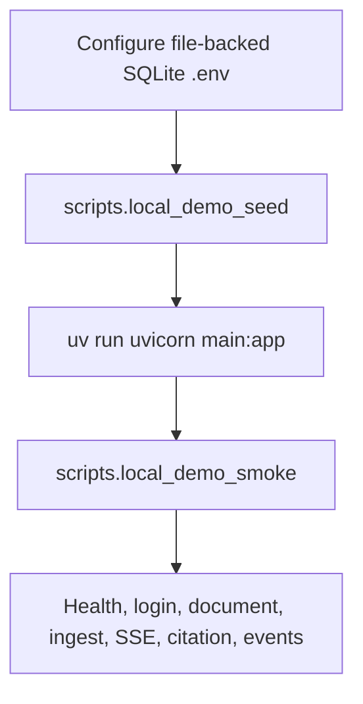

# Scripts guide

This directory contains repository-local command modules for development, demo
seeding, smoke verification, guest-demo operations, and learning-note creation.
They are Python modules, not executable-bit shell files, so run them from the
repository root with `uv run python -m scripts.<name>`.

## Quick reference

| Command module | Purpose | Typical use |
| --- | --- | --- |
| `scripts.dev_pgvector` | Start and wire a disposable local Docker pgvector/Postgres database. | Local Postgres/pgvector development and migration smoke checks. |
| `scripts.ops` | Interactive operational dispatcher that collects options and delegates to focused scripts. | Operator-friendly account/guest maintenance. |
| `scripts.approve_account_signup` | Approve a pending account signup and print/send verification or mark email verified. | Manual signup approval and verification bypass. |
| `scripts.resend_account_verification` | Refresh an expired/missing verification token for an approved unverified account. | Recover signups blocked by expired verification links. |
| `scripts.reject_account_signup` | Reject a pending account signup. | Manual signup rejection. |
| `scripts.local_demo_seed` | Seed a file-backed SQLite demo user, knowledge base, document, and extraction run. | Prepare a local demo database before starting the backend. |
| `scripts.local_demo_smoke` | Smoke-test a running backend over HTTP only. | Verify the local V1 API path after seeding and starting the server. |
| `scripts.issue_guest_access_code` | Issue a one-time guest access code for print-first operator delivery. | Guest-code workflows. |
| `scripts.auth_approval` | Backward-compatible alias for `scripts.ops`. | Existing auth approval workflows. |
| `scripts.learning_log` | Create numbered personal learning notes and update the learning index. | Add a new `docs/learning/` note without hand-numbering files. |

## How scripts are run

Use module execution so imports resolve from the repository root:

```bash
uv run python -m scripts.local_demo_seed --help
uv run python -m scripts.local_demo_smoke --help
uv run python -m scripts.dev_pgvector --help
```

Do not run these commands from inside `scripts/`; several of them assume the
current working directory is the repository root.

If you are in another directory, either `cd` into the repo first or use
`uv --directory`:

```bash
cd /Users/heecheonpark/Git/Portfolio/my-agents
uv run python -m scripts.ops --env pgvector.production guest issue --email guest@example.com

# Equivalent from any working directory:
uv --directory /Users/heecheonpark/Git/Portfolio/my-agents \
  run python -m scripts.ops \
  --env pgvector.production \
  guest issue \
  --email guest@example.com
```

## Local demo workflow



Minimal local-demo sequence:

```bash
# 1. Configure .env with a file-backed SQLite database, for example:
# MY_AGENTS_DATABASE_URL=sqlite+pysqlite:////tmp/my-agents-local-demo.db
# MY_AGENTS_AUTO_CREATE_TABLES=true
# MY_AGENTS_RESPONSE_MODE=deterministic
# MY_AGENTS_SESSION_COOKIE_SECURE=false

# 2. Seed demo data.
uv run python -m scripts.local_demo_seed

# 3. Start the backend in another terminal.
MY_AGENTS_RESPONSE_MODE=deterministic uv run uvicorn main:app --host 127.0.0.1 --port 8000

# 4. Verify the HTTP API path.
uv run python -m scripts.local_demo_smoke --base-url http://127.0.0.1:8000
```

## `scripts.dev_pgvector`

Starts and wires a local Docker pgvector database for backend development. The
script intentionally manages only a disposable local Docker container. It does
not contact hosted providers or deploy anything.

Common commands:

```bash
# Pull/start pgvector, create the Docker volume, and write .env.pgvector.local.
uv run python -m scripts.dev_pgvector up

# Start without pulling the image first.
uv run python -m scripts.dev_pgvector up --no-pull

# Start and immediately run Alembic migrations.
uv run python -m scripts.dev_pgvector up --migrate

# Write or refresh only the ignored local env file.
uv run python -m scripts.dev_pgvector env

# Run migrations against the local pgvector database.
uv run python -m scripts.dev_pgvector migrate

# Run the gated Postgres migration smoke test.
uv run python -m scripts.dev_pgvector test

# Stop the local container. This does not delete the Docker volume.
uv run python -m scripts.dev_pgvector down
```

Defaults:

| Setting | Default |
| --- | --- |
| Image | `pgvector/pgvector:pg17` |
| Container | `my-agents-pgvector` |
| Volume | `my_agents_pgvector_data` |
| Host/port | `127.0.0.1:5433` |
| Database/user | `my_agents` / `my_agents` |
| Generated env file | `.env.pgvector.local` |

Useful overrides are available as flags and matching environment variables:

```bash
uv run python -m scripts.dev_pgvector up \
  --container my-agents-pgvector-alt \
  --port 55432 \
  --database my_agents_dev
```

The generated `.env.pgvector.local` is git-ignored and includes local backend
wiring such as `MY_AGENTS_DATABASE_URL`, `MY_AGENTS_TEST_DATABASE_URL`, local
auth email mode, and local CORS origins. Load it manually when needed:

```bash
set -a; source .env.pgvector.local; set +a
```

## `scripts.local_demo_seed`

Seeds a local demo user, personal knowledge base, demo document, and extraction
run into a file-backed SQLite database. It refuses in-memory and non-SQLite URLs
so it cannot accidentally mutate hosted or production-like databases.

Default seeded account:

| Field | Value |
| --- | --- |
| Email | `test@test.com` |
| Password | `correct horse battery staple` |
| Knowledge base | `V1 Demo Knowledge Base` |
| Document | `V1 Product Chat Service Demo` |

Commands:

```bash
# Seed or refresh the configured file-backed SQLite demo data.
uv run python -m scripts.local_demo_seed

# Use a different local demo login.
uv run python -m scripts.local_demo_seed \
  --email demo@example.com \
  --password 'correct horse battery staple'

# Delete and recreate the configured SQLite DB before seeding.
# Stop the dev server first.
uv run python -m scripts.local_demo_seed --reset-database
```

Expected output includes the database path, demo login, user ID, knowledge base
ID, document ID, extraction-run ID, and chunk/entity counts.

## `scripts.local_demo_smoke`

Smoke-tests a running backend through HTTP only. It assumes `scripts.local_demo_seed`
has already prepared a file-backed SQLite database and the backend is running
against that same database.

What it verifies:

1. `GET /health` returns `status=ok`.
2. The seeded user can log in and restore `/auth/me`.
3. The seeded document exists and can be ingested.
4. A conversation can be created.
5. `POST /conversations/{id}/runs/stream` emits `answer_delta` events.
6. The completed run has persisted citations.
7. Run events are present and do not leak the raw prompt text.

Commands:

```bash
uv run python -m scripts.local_demo_smoke

uv run python -m scripts.local_demo_smoke \
  --base-url http://127.0.0.1:8000 \
  --email test@test.com \
  --password 'correct horse battery staple' \
  --timeout 90

uv run python -m scripts.local_demo_smoke \
  --prompt 'How does the product chat service stream answers and persist app state?'
```

A successful run prints `Local V1 API smoke passed` plus the conversation/run
IDs, answer-delta count, citation count, and event count.

## `scripts.ops`

Interactive operational dispatcher. It gathers options and delegates to focused
script modules such as `scripts.approve_account_signup`,
`scripts.resend_account_verification`, `scripts.reject_account_signup`, and
`scripts.issue_guest_access_code`. It loads
`.env.pgvector.local` by default; pass `--env pgvector.production` only when
intentionally operating on production.

Current behavior:

- `--interactive` shows numbered menus for operation, yes/no choices, and language,
  so operators can choose common paths with minimal typing. Enter `q`, `quit`, or
  `exit` at any interactive prompt to cancel gracefully. It still prompts for
  values that cannot be inferred, such as email and optional guest-code fields.
- `account approve` delegates to `scripts.approve_account_signup`.
- `account resend-verification` delegates to `scripts.resend_account_verification`.
- `account reject` delegates to `scripts.reject_account_signup`.
- `guest issue` delegates to `scripts.issue_guest_access_code`.
- Email content defaults to Korean; use `--lang en` for English.

Commands:

```bash
# Show a numbered account/guest operation menu and prompt for required values.
uv run python -m scripts.ops --interactive

# Approve a pending signup and print the verification token/link.
uv run python -m scripts.ops account approve \
  --email user@example.com

# Approve and also send the Korean verification email.
uv run python -m scripts.ops --env pgvector.production account approve \
  --email user@example.com \
  --send-email

# Approve and mark the user's email verified immediately, without issuing a link.
uv run python -m scripts.ops --env pgvector.production account approve \
  --email user@example.com \
  --mark-verified

# Resend a fresh verification token/link after an old signup verification expired.
uv run python -m scripts.ops account resend-verification \
  --email user@example.com \
  --send-email

# Reject a pending signup.
uv run python -m scripts.ops account reject \
  --email user@example.com

# Issue a guest code and print it.
uv run python -m scripts.ops guest issue \
  --email guest@example.com

# Issue a guest code and also send English email copy.
uv run python -m scripts.ops --env pgvector.production guest issue \
  --email guest@example.com \
  --send-email \
  --lang en
```

`scripts.auth_approval` remains a compatibility alias for the same dispatcher.

## `scripts.approve_account_signup`

Focused non-interactive script for account approval. It marks a pending registered user
approved, then either prints/sends a verification token or directly marks the email
verified with `--mark-verified`:

```bash
uv run python -m scripts.approve_account_signup \
  --email user@example.com \
  --send-email

uv run python -m scripts.approve_account_signup \
  --email user@example.com \
  --mark-verified
```

## `scripts.resend_account_verification`

Focused non-interactive script for approved accounts whose email verification
link expired or was lost. It does not approve pending accounts; use
`scripts.approve_account_signup` first for pending signups.

```bash
uv run python -m scripts.resend_account_verification \
  --email user@example.com \
  --send-email
```

## `scripts.reject_account_signup`

Focused non-interactive script for account rejection:

```bash
uv run python -m scripts.reject_account_signup --email user@example.com
```

## `scripts.issue_guest_access_code`

Focused guest-only command for print-first operator delivery. The public API records an
email request but does not return a code to the browser unless guest auto-approval is
enabled. `scripts.ops guest issue` delegates to this script.

Current behavior:

- Loads settings from `.env.pgvector.local` by default.
- Can intentionally target `.env.pgvector.production` with `--env pgvector.production`.
- Can target an exact operator-provided file with `--env-file <path>`.
- Requires `MY_AGENTS_GUEST_ACCESS_ENABLED=true` in the selected environment.
- Initializes the configured database and creates a one-time guest code.
- Prints the selected env file path and guest code to stdout.
- Always prints the guest code, even when email delivery is enabled.
- Can also send the code with `--send-email` through the selected env's configured auth
  email provider.
- Sends Korean email content by default; use `--lang en` for English email content.

Commands:

```bash
# Issue a code using the safe default local pgvector env file.
uv run python -m scripts.issue_guest_access_code --email guest@example.com

# Issue a code against the production pgvector env file.
uv run python -m scripts.issue_guest_access_code \
  --env pgvector.production \
  --email guest@example.com

# Print the code and also email it in the default Korean copy.
uv run python -m scripts.issue_guest_access_code \
  --env pgvector.production \
  --email guest@example.com \
  --send-email

# Print the code and also email it in English.
uv run python -m scripts.issue_guest_access_code \
  --env pgvector.production \
  --email guest@example.com \
  --send-email \
  --lang en

# Link the code to a specific pending guest_access_requests.id.
uv run python -m scripts.issue_guest_access_code \
  --email guest@example.com \
  --request-id <guest_access_request_id>

# Override the code TTL for this issue operation.
uv run python -m scripts.issue_guest_access_code \
  --email guest@example.com \
  --ttl-seconds 1800

# Use an exact env file path instead of a named profile.
uv run python -m scripts.issue_guest_access_code \
  --env-file .env.pgvector.production \
  --email guest@example.com
```

Safety notes:

- Treat the printed code as sensitive. Do not paste it into public logs or docs.
- `--send-email` sends a real email when the selected env uses SMTP or Resend HTTP; the
  code is still printed for operator audit/recovery.
- If email sending fails, the script exits non-zero after printing the issued code so the
  operator can still deliver or revoke it manually.
- Confirm the selected env file points at the intended database before issuing a code.
- Keep `pgvector.local` as the default for routine local testing; use production only deliberately.
- Guest access is disabled by default unless explicitly enabled in environment.

## `scripts.learning_log`

Creates a numbered personal learning note under `docs/learning/` and updates the
learning index. Use it when adding owner learning notes so filenames, front
matter, revision history, and index ordering stay consistent.

Commands:

```bash
uv run python -m scripts.learning_log \
  --title 'FastAPI dependency injection boundary' \
  --body 'Short Markdown body for the learning note.' \
  --topic fastapi \
  --topic dependencies \
  --related-code my_agents/api/auth.py

uv run python -m scripts.learning_log \
  --title 'Postgres migration smoke' \
  --body-file /tmp/learning-note-body.md \
  --topic postgres \
  --related-code tests/test_migrations.py
```

Useful options:

| Option | Meaning |
| --- | --- |
| `--title` | Required human-readable note title. |
| `--body` | Inline Markdown body. Mutually exclusive with `--body-file`. |
| `--body-file` | Markdown file to use as the body. |
| `--topic` | Repeatable topic tag. Defaults to `learning-log` when omitted. |
| `--related-code` | Repeatable repo path related to the note. |
| `--docs-dir` | Alternate learning-note directory. Defaults to `docs/learning`. |
| `--date` | Override created/updated date in `YYYY-MM-DD` format. |

## Adding new scripts

When adding a new command module:

1. Put it under `scripts/` and keep it runnable with `uv run python -m scripts.<name>`.
2. Add a `main()` function and `if __name__ == "__main__"` guard.
3. Use `argparse` with helpful `--help` text.
4. Keep unsafe operations explicit through flags such as `--reset-*`.
5. Do not print secrets or unredacted provider credentials.
6. Add focused tests under `tests/` that do not require hosted credentials.
7. Update this README with purpose, examples, prerequisites, and safety notes.
